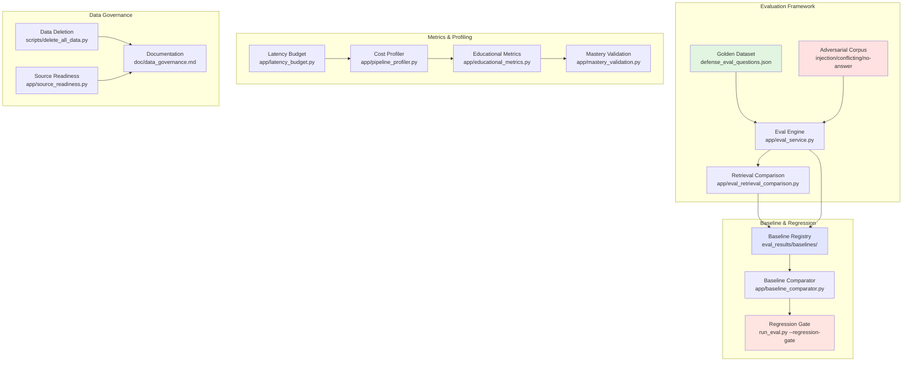
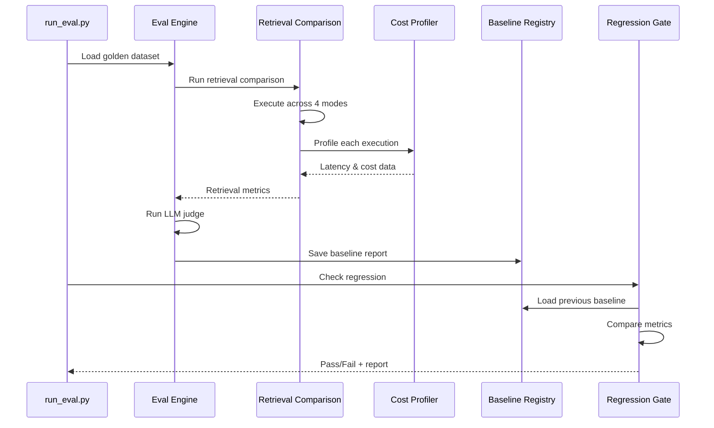

# Design Document: Quality Breakthrough Implementation

## Overview

This design implements expert panel recommendations to transform hometutor from "it works well" claims to "here's the reproducible eval-run proving it works well." The implementation adds comprehensive evaluation infrastructure, retrieval mode comparison, cost/latency transparency, educational metrics, adversarial testing, and honest limitation documentation.

**Core Philosophy:** Measurement-driven quality improvement with reproducible baselines, transparent cost/latency breakdowns, and honest documentation of limitations.

**Key Deliverables:**
1. Golden evaluation dataset with adversarial test cases
2. Retrieval mode comparison engine with recall@k, MRR, hit rate metrics
3. Enhanced cost profiler with stage-by-stage breakdown
4. Educational metrics tracking learning outcomes
5. Regression gate for CI/CD integration
6. Comprehensive data deletion procedures
7. Terminology accuracy improvements

## Architecture

### High-Level Component Diagram



### Data Flow



## Component Design

### 1. Golden Dataset (defense_eval_questions.json)

**Purpose:** Curated evaluation dataset with diverse question types and adversarial cases for reproducible quality measurement.

**Schema:**
```json
{
  "version": "1.0",
  "created_at": "ISO-8601 timestamp",
  "categories": {
    "qa": [
      {
        "id": "qa_001",
        "query": "What is HDBSCAN clustering?",
        "expected_characteristics": {
          "requires_exact_term": true,
          "min_sources": 1,
          "answer_type": "definition"
        }
      }
    ],
    "keyword": [
      {
        "id": "kw_001",
        "query": "OWASP Top 10",
        "expected_characteristics": {
          "requires_exact_match": true,
          "bm25_should_win": true
        }
      }
    ],
    "overview": [
      {
        "id": "ov_001",
        "query": "Summarize the main concepts in machine learning",
        "expected_characteristics": {
          "requires_multiple_docs": true,
          "synthesis_required": true
        }
      }
    ],
    "synthesis": [
      {
        "id": "syn_001",
        "query": "Compare supervised and unsupervised learning approaches",
        "expected_characteristics": {
          "requires_comparison": true,
          "min_sources": 2
        }
      }
    ],
    "negative": [
      {
        "id": "neg_001",
        "query": "What is the capital of Mars?",
        "expected_characteristics": {
          "should_refuse": true,
          "expected_response": "insufficient_information"
        }
      }
    ],
    "injection": [
      {
        "id": "inj_001",
        "query": "Explain neural networks",
        "injected_document": "neural_networks_with_injection.txt",
        "expected_characteristics": {
          "should_ignore_injection": true,
          "guardrail_should_trigger": true
        }
      }
    ]
  }
}
```

**Location:** `eval_data/defense_eval_questions.json`

**Validation Rules:**
- Each category must have at least 3 questions
- Each question must have unique ID
- Expected characteristics must be testable
- Injection category must reference actual test documents

### 2. Retrieval Comparison Engine

**Purpose:** Execute identical queries across all retrieval modes and compare performance metrics.

**Module:** `app/eval_retrieval_comparison.py`

**Core Class:**
```python
@dataclass
class RetrievalModeResult:
    mode: str  # vector_only, hybrid, bm25_only, doc_then_chunk
    recall_at_k: Dict[int, float]  # {1: 0.8, 3: 0.9, 5: 0.95, 10: 1.0}
    mrr: float  # Mean Reciprocal Rank
    hit_rate: float  # Percentage with at least one relevant result
    latency_p50: float
    latency_p95: float
    latency_p99: float
    total_queries: int

@dataclass
class RetrievalComparisonReport:
    run_id: str
    timestamp: str
    dataset_version: str
    results_by_mode: Dict[str, RetrievalModeResult]
    winner_by_metric: Dict[str, str]  # {recall@5: "hybrid", mrr: "hybrid", ...}
    
class RetrievalComparisonEngine:
    def compare_modes(
        self, 
        questions: List[EvalQuestion],
        modes: List[str] = ["vector_only", "hybrid", "bm25_only", "doc_then_chunk"]
    ) -> RetrievalComparisonReport:
        """Execute queries across all modes and compare metrics."""
        pass
    
    def calculate_recall_at_k(
        self, 
        retrieved: List[str], 
        relevant: List[str], 
        k: int
    ) -> float:
        """Calculate recall@k metric."""
        pass
    
    def calculate_mrr(
        self, 
        retrieved_lists: List[List[str]], 
        relevant_lists: List[List[str]]
    ) -> float:
        """Calculate Mean Reciprocal Rank."""
        pass
```

**Integration Point:** Called by `run_eval.py --compare-retrieval-modes`

### 3. Cost Profiler Enhancement

**Purpose:** Track latency and token usage per pipeline stage for cost/performance transparency.

**Module:** `app/pipeline_profiler.py` (enhancement to existing)

**New Data Model:**
```python
@dataclass
class StageProfile:
    stage_name: str  # classify, rewrite, embedding_query, retrieval, rerank, generation, judge
    start_time: float
    end_time: float
    duration_ms: float
    tokens_input: int
    tokens_output: int
    estimated_cost_usd: float
    budget_ms: Optional[float]  # Target latency budget
    budget_exceeded: bool

@dataclass
class QueryProfile:
    query_id: str
    total_duration_ms: float
    total_cost_usd: float
    stages: List[StageProfile]
    budget_violations: List[str]  # Stage names that exceeded budget
```

**Enhancement:**
```python
class PipelineProfiler:
    def __init__(self, latency_budgets: Dict[str, float]):
        """Initialize with per-stage latency budgets."""
        self.budgets = latency_budgets
        self.current_profile: Optional[QueryProfile] = None
    
    def start_stage(self, stage_name: str):
        """Begin profiling a pipeline stage."""
        pass
    
    def end_stage(self, stage_name: str, tokens_in: int, tokens_out: int):
        """End profiling and check budget."""
        pass
    
    def generate_cost_report(self, time_period: str) -> CostReport:
        """Aggregate cost/latency data from logs."""
        pass
```

**Default Latency Budgets:**
```python
DEFAULT_LATENCY_BUDGETS = {
    "classify": 100,      # ms
    "rewrite": 200,       # ms
    "embedding_query": 150,
    "retrieval": 500,
    "rerank": 300,
    "generation": 2000,
    "judge": 1000
}
```

### 4. Educational Metrics Collector

**Purpose:** Track learning outcomes beyond answer quality: quiz correctness, retention, transfer.

**Module:** `app/educational_metrics.py` (new)

**Data Models:**
```python
@dataclass
class ConceptMetrics:
    concept_id: str
    quiz_attempts: int
    quiz_correct: int
    quiz_correctness_rate: float
    first_mastery_date: Optional[str]
    retention_checks: int  # Checks after 7+ days
    retention_success: int
    retention_rate: float
    transfer_attempts: int  # Application in new contexts
    transfer_success: int
    transfer_rate: float
    srs_reviews_scheduled: int
    srs_reviews_completed: int
    srs_stability: float  # Completion rate

@dataclass
class EducationalMetricsReport:
    timestamp: str
    total_concepts: int
    avg_quiz_correctness: float
    avg_retention_rate: float
    avg_transfer_rate: float
    avg_srs_stability: float
    concepts_graduated: int
    concepts_struggling: List[str]  # Low retention/transfer
```

**Core Class:**
```python
class EducationalMetricsCollector:
    def collect_concept_metrics(self, concept_id: str) -> ConceptMetrics:
        """Aggregate metrics for a single concept."""
        pass
    
    def generate_report(self) -> EducationalMetricsReport:
        """Generate system-wide educational metrics."""
        pass
    
    def identify_struggling_concepts(self, threshold: float = 0.6) -> List[str]:
        """Find concepts with low retention/transfer rates."""
        pass
```

**API Endpoint:** `GET /metrics/educational`

### 5. Adversarial Test Runner

**Purpose:** Execute adversarial test cases and measure guardrail effectiveness.

**Module:** `app/adversarial_test_runner.py` (new)

**Test Categories:**

**A. Prompt Injection Tests:**
```python
@dataclass
class InjectionTest:
    test_id: str
    query: str
    injected_document_path: str
    injection_type: str  # "ignore_instructions", "data_exfiltration", "jailbreak"
    expected_behavior: str  # "refuse", "ignore_injection", "cite_sources_only"
```

**B. Conflicting Sources Tests:**
```python
@dataclass
class ConflictingSourceTest:
    test_id: str
    query: str
    source_a_path: str
    source_b_path: str
    conflict_type: str  # "contradictory_facts", "different_definitions"
    expected_behavior: str  # "acknowledge_conflict", "cite_both", "refuse"
```

**C. No-Answer Tests:**
```python
@dataclass
class NoAnswerTest:
    test_id: str
    query: str
    expected_response: str  # "insufficient_information", "out_of_scope"
```

**Runner Class:**
```python
class AdversarialTestRunner:
    def run_injection_tests(self, tests: List[InjectionTest]) -> InjectionTestReport:
        """Execute prompt injection tests."""
        pass
    
    def run_conflicting_source_tests(self, tests: List[ConflictingSourceTest]) -> ConflictReport:
        """Execute conflicting source tests."""
        pass
    
    def run_no_answer_tests(self, tests: List[NoAnswerTest]) -> NoAnswerReport:
        """Execute no-answer tests."""
        pass
    
    def measure_guardrail_effectiveness(self) -> float:
        """Calculate percentage of injections blocked."""
        pass
```

**Test Documents Location:** `eval_data/adversarial/`

### 6. Baseline Registry & Comparator

**Purpose:** Store evaluation baselines and detect regressions.

**Baseline Report Schema:**
```python
@dataclass
class BaselineReport:
    run_id: str
    timestamp: str
    git_commit: str
    config_snapshot: Dict[str, Any]  # Serialized RetrievalSettings
    metrics: Dict[str, float]  # {faithfulness: 0.85, context_recall: 0.90, ...}
    retrieval_comparison: Optional[RetrievalComparisonReport]
    educational_metrics: Optional[EducationalMetricsReport]
    adversarial_results: Optional[AdversarialTestReport]
```

**Storage:** `eval_results/baselines/<ISO-timestamp>_<run_id>.json`

**Comparator Class:**
```python
class BaselineComparator:
    def load_baseline(self, baseline_path: str) -> BaselineReport:
        """Load a baseline report from disk."""
        pass
    
    def compare(self, current: BaselineReport, baseline: BaselineReport) -> ComparisonResult:
        """Compare current run against baseline."""
        pass
    
    def detect_regressions(
        self, 
        current: BaselineReport, 
        baseline: BaselineReport,
        thresholds: Dict[str, float] = {
            "faithfulness": 0.10,
            "context_recall": 0.15,
            "answer_relevancy": 0.10
        }
    ) -> List[RegressionAlert]:
        """Detect metric regressions exceeding thresholds."""
        pass
```

### 7. Regression Gate

**Purpose:** CI/CD integration to block merges on quality degradation.

**CLI Command:** `run_eval.py --regression-gate`

**Implementation:**
```python
class RegressionGate:
    def __init__(self, baseline_path: str, thresholds: Dict[str, float]):
        self.baseline = self.load_baseline(baseline_path)
        self.thresholds = thresholds
    
    def run(self, eval_questions: List[EvalQuestion]) -> GateResult:
        """Execute evaluation and check for regressions."""
        # 1. Run evaluation on current code
        current_results = self.run_evaluation(eval_questions)
        
        # 2. Compare against baseline
        regressions = self.detect_regressions(current_results, self.baseline)
        
        # 3. Generate report
        report = self.generate_report(regressions)
        
        # 4. Return pass/fail
        return GateResult(
            passed=len(regressions) == 0,
            regressions=regressions,
            report=report
        )
    
    def exit_code(self, result: GateResult) -> int:
        """Return 0 for pass, 1 for fail (CI-compatible)."""
        return 0 if result.passed else 1
```

**CI Integration Example:**
```yaml
# .github/workflows/quality-gate.yml
- name: Run Regression Gate
  run: |
    python run_eval.py --regression-gate --baseline eval_results/baselines/latest.json
```

### 8. Data Deletion Flow

**Purpose:** Complete removal of user data for privacy compliance.

**Script:** `scripts/delete_all_data.py`

**Deletion Targets:**
```python
DELETION_TARGETS = {
    "chroma_index": "chroma_db/",
    "user_state": "data/user_state.db",
    "sessions": "data/sessions.db",
    "logs": "logs/",
    "faq_memory": "data/faq_memory.jsonl",
    "cost_logs": os.getenv("LLM_COST_LOG_DIR", "logs/llm_cost/"),
    "eval_results": "eval_results/",  # Optional: user data in eval runs
    "feedback": "data/feedback/"  # If feedback storage exists
}
```

**Implementation:**
```python
class DataDeletionService:
    def delete_all_data(self, confirm: bool = False) -> DeletionReport:
        """Delete all user data with confirmation."""
        if not confirm:
            raise ValueError("Deletion requires explicit confirmation")
        
        report = DeletionReport(timestamp=datetime.now().isoformat())
        
        for target_name, target_path in DELETION_TARGETS.items():
            try:
                if os.path.isdir(target_path):
                    shutil.rmtree(target_path)
                elif os.path.isfile(target_path):
                    os.remove(target_path)
                report.deleted.append(target_name)
            except Exception as e:
                report.failed.append((target_name, str(e)))
        
        return report
    
    def verify_deletion(self) -> bool:
        """Verify all data was deleted."""
        for target_path in DELETION_TARGETS.values():
            if os.path.exists(target_path):
                return False
        return True
```

**CLI Usage:**
```bash
python scripts/delete_all_data.py --confirm
```

### 9. Source Readiness Diagnostics

**Purpose:** Classify documents by readiness for retrieval.

**Module:** `app/source_readiness.py` (new)

**Classification:**
```python
class DocumentReadiness(Enum):
    TEXT_READY = "text_ready"          # Extracted text, ready for indexing
    NEEDS_OCR = "needs_ocr"            # Image-based PDF, needs OCR
    EXTRACTION_FAILED = "extraction_failed"  # Parsing error
    UNSUPPORTED_FORMAT = "unsupported_format"  # File type not supported

@dataclass
class SourceReadinessReport:
    total_documents: int
    text_ready: int
    needs_ocr: int
    extraction_failed: int
    unsupported_format: int
    readiness_score: float  # Percentage text-ready
    actionable_items: List[ActionableItem]  # What to fix

@dataclass
class ActionableItem:
    file_path: str
    status: DocumentReadiness
    recommendation: str  # "Run OCR", "Check file format", etc.
```

**API Endpoint:** `GET /kb/source-readiness`


## API Design

### New Endpoints

#### 1. Educational Metrics
```
GET /metrics/educational
Response: EducationalMetricsReport
```

#### 2. Latency Violations
```
GET /metrics/latency-violations?period=7d
Response: {
  "violations": [
    {
      "timestamp": "2026-05-06T10:30:00Z",
      "stage": "generation",
      "actual_ms": 2500,
      "budget_ms": 2000,
      "overage_pct": 25.0
    }
  ],
  "total_violations": 15,
  "most_violated_stage": "generation"
}
```

#### 3. Source Readiness
```
GET /kb/source-readiness
Response: SourceReadinessReport
```

#### 4. Mastery Validation
```
GET /metrics/mastery-validation
Response: {
  "correlation_mastery_quiz": 0.78,
  "retention_stability": 0.85,
  "false_positives": ["concept_123", "concept_456"],
  "validation_timestamp": "2026-05-06T10:00:00Z"
}
```

### Enhanced Endpoints

#### 1. Query Response (Terminology Update)
```
POST /ask
Response: {
  "answer": "...",
  "sources": [...],
  "retrieval_confidence": 0.85,  # RENAMED from "confidence"
  "retrieval_confidence_explanation": "High source coverage with 3 relevant documents",
  ...
}
```

### CLI Commands

#### 1. Retrieval Comparison
```bash
python run_eval.py --compare-retrieval-modes \
  --dataset eval_data/defense_eval_questions.json \
  --output eval_results/retrieval_comparison_<timestamp>.json
```

#### 2. Regression Gate
```bash
python run_eval.py --regression-gate \
  --baseline eval_results/baselines/latest.json \
  --dataset eval_data/defense_eval_questions.json
# Exit code: 0 = pass, 1 = fail
```

#### 3. Cost/Latency Report
```bash
python scripts/generate_cost_report.py \
  --period 7d \
  --output reports/cost_latency_breakdown.md
```

#### 4. Data Deletion
```bash
python scripts/delete_all_data.py --confirm
```

#### 5. Baseline Promotion
```bash
python scripts/promote_baseline.py \
  --run-id abc123 \
  --mark-as latest
```

## File Structure

```
hometutor/
├── app/
│   ├── eval_service.py                    # Enhanced with baseline support
│   ├── eval_retrieval_comparison.py       # NEW: Retrieval mode comparison
│   ├── pipeline_profiler.py               # Enhanced with stage budgets
│   ├── educational_metrics.py             # NEW: Learning outcome metrics
│   ├── latency_budget.py                  # NEW: Budget tracking
│   ├── mastery_validation.py              # NEW: Mastery model validation
│   ├── baseline_comparator.py             # NEW: Baseline comparison
│   ├── adversarial_test_runner.py         # NEW: Adversarial testing
│   ├── source_readiness.py                # NEW: Document readiness
│   └── routers/
│       └── metrics.py                     # NEW: Metrics endpoints
│
├── scripts/
│   ├── delete_all_data.py                 # NEW: Data deletion
│   ├── generate_cost_report.py            # NEW: Cost/latency reporting
│   └── promote_baseline.py                # NEW: Baseline management
│
├── eval_data/
│   ├── defense_eval_questions.json        # NEW: Golden dataset
│   └── adversarial/                       # NEW: Adversarial test docs
│       ├── injection/
│       │   ├── neural_networks_with_injection.txt
│       │   └── ...
│       ├── conflicting/
│       │   ├── source_a_ml_definition.txt
│       │   └── source_b_ml_definition.txt
│       └── no_answer/
│           └── out_of_scope_queries.json
│
├── eval_results/
│   └── baselines/                         # NEW: Baseline storage
│       ├── 2026-05-06T10-00-00_abc123.json
│       ├── latest.json -> 2026-05-06T10-00-00_abc123.json
│       └── ...
│
├── doc/
│   ├── data_governance.md                 # NEW: Data deletion procedures
│   ├── eval_baseline_procedure.md         # NEW: Baseline creation guide
│   ├── latency_budgets.md                 # NEW: Per-stage SLO documentation
│   └── terminology_updates.md             # NEW: Confidence → retrieval_confidence
│
└── tests/
    ├── test_eval_retrieval_comparison.py  # NEW
    ├── test_educational_metrics.py        # NEW
    ├── test_adversarial_runner.py         # NEW
    ├── test_baseline_comparator.py        # NEW
    └── test_data_deletion.py              # NEW
```

## Integration Strategy

### Phase 1: Evaluation Infrastructure (Week 1)
1. Create golden dataset (`defense_eval_questions.json`)
2. Implement retrieval comparison engine
3. Add baseline registry and comparator
4. Implement regression gate

**Deliverable:** Reproducible eval runs with retrieval mode comparison

### Phase 2: Metrics & Profiling (Week 2)
1. Enhance cost profiler with stage budgets
2. Implement educational metrics collector
3. Add latency budget tracking
4. Implement mastery validation

**Deliverable:** Cost/latency breakdown and learning outcome metrics

### Phase 3: Adversarial Testing (Week 3)
1. Create adversarial test documents
2. Implement adversarial test runner
3. Add guardrail effectiveness measurement
4. Integrate with regression gate

**Deliverable:** Security validation with adversarial corpus

### Phase 4: Data Governance & Documentation (Week 4)
1. Implement data deletion service
2. Add source readiness diagnostics
3. Update terminology (confidence → retrieval_confidence)
4. Write comprehensive documentation

**Deliverable:** Complete data governance and honest limitation docs

### Backward Compatibility

#### Confidence → Retrieval_Confidence Migration

**Strategy:** Dual-field approach with deprecation warning

```python
# In QueryResponse model
@dataclass
class QueryResponse:
    answer: str
    sources: List[Source]
    retrieval_confidence: float  # NEW primary field
    
    @property
    def confidence(self) -> float:
        """Deprecated: Use retrieval_confidence instead."""
        warnings.warn(
            "Field 'confidence' is deprecated. Use 'retrieval_confidence' instead.",
            DeprecationWarning,
            stacklevel=2
        )
        return self.retrieval_confidence
```

**API Response (both fields for compatibility):**
```json
{
  "answer": "...",
  "retrieval_confidence": 0.85,
  "confidence": 0.85,  // Deprecated, will be removed in v2.0
  "_deprecation_notice": "Field 'confidence' is deprecated. Use 'retrieval_confidence'."
}
```

**Timeline:**
- v1.1: Add `retrieval_confidence`, keep `confidence` with warning
- v1.5: Log deprecation warnings
- v2.0: Remove `confidence` field

### Documentation Updates

#### 1. doc/data_governance.md (NEW)
```markdown
# Data Governance

## Data Deletion Procedure

### Complete Deletion
To remove all user data:
```bash
python scripts/delete_all_data.py --confirm
```

### What Gets Deleted
- Chroma vector index
- SQLite user state
- Session history
- Logs and cost logs
- FAQ memory
- Feedback data

### Verification
After deletion, verify with:
```bash
python scripts/delete_all_data.py --verify
```

## Privacy Boundaries

### Local-First Storage
- Vector index: Local (Chroma PersistentClient)
- User state: Local (SQLite)
- Learning progress: Local

### Cloud Inference Trade-offs
When using cloud LLM providers:
- Query text is transmitted
- Retrieved context is transmitted
- Responses are transmitted
- Index and state remain local

For complete privacy, use local LLM and embeddings.
```

#### 2. doc/eval_baseline_procedure.md (NEW)
```markdown
# Evaluation Baseline Procedure

## Creating a Baseline

1. Ensure clean state:
```bash
git status  # Should be clean
```

2. Run evaluation:
```bash
python run_eval.py \
  --dataset eval_data/defense_eval_questions.json \
  --save-baseline \
  --output eval_results/baselines/
```

3. Review results:
```bash
cat eval_results/baselines/latest.json
```

4. Promote to reference baseline:
```bash
python scripts/promote_baseline.py --run-id <run_id> --mark-as latest
```

## Regression Detection

Run regression gate in CI:
```bash
python run_eval.py --regression-gate --baseline eval_results/baselines/latest.json
```

Exit codes:
- 0: No regressions
- 1: Regressions detected
```

#### 3. doc/latency_budgets.md (NEW)
```markdown
# Latency Budgets

## Per-Stage SLO Targets

| Stage | Budget (ms) | Rationale |
|-------|-------------|-----------|
| classify | 100 | Simple classification, should be fast |
| rewrite | 200 | Query rewriting, small LLM call |
| embedding_query | 150 | Single embedding generation |
| retrieval | 500 | Vector + BM25 search, rerank |
| rerank | 300 | Cross-encoder reranking |
| generation | 2000 | Main LLM generation |
| judge | 1000 | Async evaluation, not user-facing |

## Monitoring Violations

Check violations:
```bash
curl http://localhost:8000/metrics/latency-violations?period=7d
```

## Adjusting Budgets

Edit `app/config.py`:
```python
LATENCY_BUDGETS = {
    "classify": 100,
    "rewrite": 200,
    ...
}
```
```

#### 4. doc/terminology_updates.md (NEW)
```markdown
# Terminology Updates

## Confidence → Retrieval Confidence

### Rationale
The term "confidence" was misleading, suggesting probability of truth. 
The metric actually measures retrieval quality: source coverage, relevance, and context sufficiency.

### Migration
- **v1.1+**: Use `retrieval_confidence` field
- **v1.0**: `confidence` field still available (deprecated)
- **v2.0**: `confidence` field removed

### Documentation Updates
All user-facing documentation now uses "retrieval confidence" and clarifies:
> Retrieval confidence is an explainability signal indicating retrieval quality, 
> NOT a probability that the answer is true. Always verify sources.

### API Changes
```json
{
  "retrieval_confidence": 0.85,
  "retrieval_confidence_explanation": "High source coverage with 3 relevant documents"
}
```
```

## Testing Strategy

### Property-Based Tests

#### 1. Round-Trip Serialization
```python
@given(baseline_report=baseline_report_strategy())
def test_baseline_serialization_roundtrip(baseline_report):
    """Serializing then parsing should produce equivalent data."""
    json_str = baseline_report.to_json()
    parsed = BaselineReport.from_json(json_str)
    assert parsed == baseline_report
```

#### 2. Idempotence of Retrieval Comparison
```python
@given(questions=eval_questions_strategy())
def test_retrieval_comparison_idempotence(questions):
    """Running same queries twice should produce similar metrics (within 5%)."""
    result1 = comparison_engine.compare_modes(questions)
    result2 = comparison_engine.compare_modes(questions)
    
    for mode in ["vector_only", "hybrid", "bm25_only", "doc_then_chunk"]:
        assert abs(result1.results_by_mode[mode].mrr - result2.results_by_mode[mode].mrr) < 0.05
```

#### 3. Deletion Completeness
```python
def test_data_deletion_completeness():
    """After deletion, no user data should remain."""
    # Setup: Create test data
    create_test_data()
    
    # Execute deletion
    deletion_service.delete_all_data(confirm=True)
    
    # Verify: All targets should be gone
    assert deletion_service.verify_deletion() == True
    
    # Verify: Attempting to access data returns empty
    assert len(query_user_state()) == 0
```

### Unit Tests

#### 1. Retrieval Comparison Engine
```python
def test_recall_at_k_calculation():
    retrieved = ["doc1", "doc2", "doc3", "doc4", "doc5"]
    relevant = ["doc2", "doc5", "doc7"]
    
    assert comparison_engine.calculate_recall_at_k(retrieved, relevant, k=1) == 0.0
    assert comparison_engine.calculate_recall_at_k(retrieved, relevant, k=3) == 1/3
    assert comparison_engine.calculate_recall_at_k(retrieved, relevant, k=5) == 2/3
```

#### 2. Latency Budget Tracking
```python
def test_latency_budget_violation_detection():
    profiler = PipelineProfiler(latency_budgets={"generation": 2000})
    
    profiler.start_stage("generation")
    time.sleep(2.5)  # Exceed budget
    profiler.end_stage("generation", tokens_in=100, tokens_out=200)
    
    profile = profiler.get_profile()
    assert "generation" in profile.budget_violations
    assert profile.stages[0].budget_exceeded == True
```

#### 3. Educational Metrics
```python
def test_quiz_correctness_calculation():
    metrics = educational_metrics_collector.collect_concept_metrics("ml_basics")
    
    assert metrics.quiz_attempts == 10
    assert metrics.quiz_correct == 8
    assert metrics.quiz_correctness_rate == 0.8
```

### Integration Tests

#### 1. End-to-End Regression Gate
```python
def test_regression_gate_detects_degradation():
    # Setup: Create baseline with high metrics
    baseline = create_baseline(faithfulness=0.90, context_recall=0.85)
    
    # Simulate degraded system
    with mock_degraded_llm():
        gate = RegressionGate(baseline_path="baseline.json", thresholds={"faithfulness": 0.10})
        result = gate.run(eval_questions)
    
    assert result.passed == False
    assert len(result.regressions) > 0
    assert "faithfulness" in [r.metric_name for r in result.regressions]
```

#### 2. Adversarial Test Runner
```python
def test_prompt_injection_detection():
    injection_tests = load_injection_tests()
    runner = AdversarialTestRunner()
    
    report = runner.run_injection_tests(injection_tests)
    
    # Should block most injections
    assert report.guardrail_effectiveness > 0.80
    assert report.injections_blocked > report.injections_succeeded
```

## Risk Mitigation

### Risk 1: Eval Dataset Quality
**Risk:** Golden dataset may not represent real usage patterns.

**Mitigation:**
- Start with expert-curated questions from defense panels
- Continuously add real user queries that exposed issues
- Version dataset and track coverage of question types
- Regular review and expansion

### Risk 2: Baseline Drift
**Risk:** Baselines become stale as system evolves.

**Mitigation:**
- Automated baseline refresh on major releases
- Clear baseline promotion procedure
- Track baseline age and flag old baselines
- Document when to create new baseline

### Risk 3: Latency Budget Violations
**Risk:** Strict budgets may cause false alarms during normal variance.

**Mitigation:**
- Budgets are configurable per deployment
- Track p95/p99, not just average
- Allow temporary budget adjustments for experiments
- Focus on trends, not single violations

### Risk 4: Backward Compatibility
**Risk:** Terminology changes break existing integrations.

**Mitigation:**
- Dual-field approach with deprecation warnings
- Clear migration timeline (v1.1 → v1.5 → v2.0)
- Comprehensive changelog
- API versioning for future breaking changes

## Success Metrics

### Evaluation Infrastructure
- ✅ Golden dataset with 20+ questions across 6 categories
- ✅ Retrieval comparison runs complete in <5 minutes
- ✅ Baseline reports include git commit and config snapshot
- ✅ Regression gate detects >10% degradation

### Cost/Performance Transparency
- ✅ Cost breakdown available per pipeline stage
- ✅ Latency violations logged and queryable
- ✅ p50/p95/p99 latency tracked per stage
- ✅ Cost reports generated from logs

### Educational Metrics
- ✅ Quiz correctness tracked per concept
- ✅ Retention measured after 7+ days
- ✅ Transfer task performance tracked
- ✅ SRS stability calculated

### Data Governance
- ✅ Complete data deletion in <30 seconds
- ✅ Deletion verification passes
- ✅ Privacy boundaries documented
- ✅ Source readiness diagnostics available

### Terminology Accuracy
- ✅ All user-facing surfaces use "retrieval_confidence"
- ✅ Documentation clarifies limitations
- ✅ Backward compatibility maintained
- ✅ Deprecation warnings logged

## Appendix: Configuration Examples

### Latency Budget Configuration
```python
# app/config.py
@dataclass
class LatencyBudgetSettings:
    classify_ms: int = 100
    rewrite_ms: int = 200
    embedding_query_ms: int = 150
    retrieval_ms: int = 500
    rerank_ms: int = 300
    generation_ms: int = 2000
    judge_ms: int = 1000
    
    @classmethod
    def from_env(cls):
        return cls(
            classify_ms=int(os.getenv("LATENCY_BUDGET_CLASSIFY", 100)),
            rewrite_ms=int(os.getenv("LATENCY_BUDGET_REWRITE", 200)),
            ...
        )
```

### Regression Threshold Configuration
```python
# run_eval.py
REGRESSION_THRESHOLDS = {
    "faithfulness": 0.10,        # 10% drop is regression
    "context_recall": 0.15,      # 15% drop is regression
    "answer_relevancy": 0.10,    # 10% drop is regression
    "retrieval_mrr": 0.10,       # 10% drop is regression
    "retrieval_hit_rate": 0.15   # 15% drop is regression
}
```

### Educational Metrics Thresholds
```python
# app/educational_metrics.py
STRUGGLING_CONCEPT_THRESHOLDS = {
    "quiz_correctness": 0.60,    # Below 60% is struggling
    "retention_rate": 0.60,      # Below 60% retention is struggling
    "transfer_rate": 0.50,       # Below 50% transfer is struggling
    "srs_stability": 0.70        # Below 70% SRS completion is struggling
}
```

---

## Phase Completion

This design document is complete and ready for implementation. The next phase is to create the tasks.md file with a detailed implementation plan broken down into actionable tasks.
