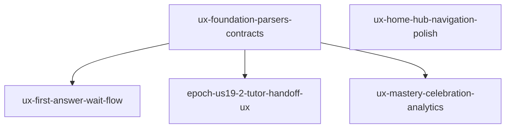
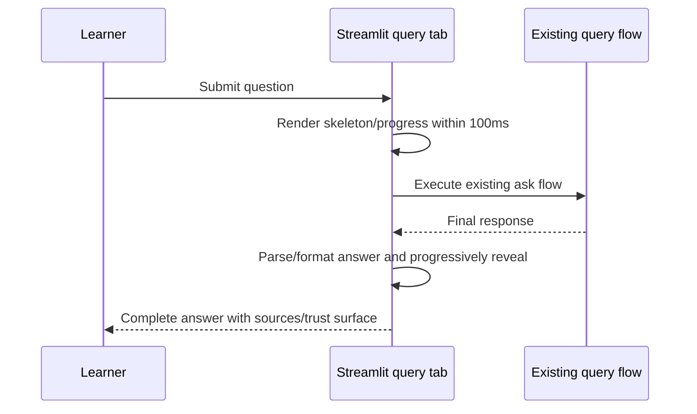
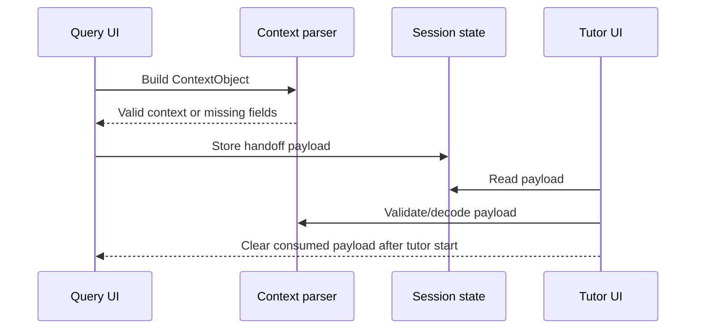

# Design Document — UX Breakthrough Wave

## Overview

The UX Breakthrough Wave turns a feature-complete local learning assistant into a product that feels fast, continuous and motivating. The design keeps the existing FastAPI + Streamlit architecture and uses small, typed contracts so visual improvements do not become stringly-typed UI glue.

The original draft contained one very large package. This revision intentionally splits the wave into five execution packages so each agent can work with a small write-set, a narrow read-set and targeted tests.

## Design Principles

1. **Perceived speed before raw speed.** Always show useful feedback quickly, then reveal richer content.
2. **Continuity over navigation.** Moving from answer to tutor should feel like continuing the same thought.
3. **Evidence builds trust.** Sources, confidence and next-step reasons should stay visible at decision points.
4. **Celebration must be earned and skippable.** Motivation without blocking the learner.
5. **Streamlit-native first.** Prefer stable native Streamlit primitives; use CSS sparingly and consistently.
6. **Typed contracts before UI polish.** Parser/serializer boundaries come first, then surfaces consume them.

## Package Architecture



### Package 1: `ux-foundation-parsers-contracts`

Creates the data contracts consumed by later UI packages.

**Primary files**

- `app/answer_parser.py`
- `app/tutor_context_parser.py`
- `app/session_analytics_parser.py`
- `tests/test_answer_parser.py`
- `tests/test_tutor_context_parser.py`
- `tests/test_session_analytics_parser.py`

**Key interfaces**

```python
class AnswerObject(BaseModel):
    text: str
    sources: list[dict[str, str]] = Field(default_factory=list)
    confidence: float | None = Field(default=None, ge=0.0, le=100.0)
    metadata: dict[str, Any] = Field(default_factory=dict)

class ContextObject(BaseModel):
    question: str
    topic: str
    sources: list[dict[str, str]] = Field(default_factory=list)
    confidence: float | None = Field(default=None, ge=0.0, le=100.0)
    learner_state: dict[str, Any] = Field(default_factory=dict)

class SessionStatsObject(BaseModel):
    session_id: str
    deck_id: int | None = None
    grades_distribution: GradesDistribution
    start_time: datetime
    end_time: datetime
    retention_predictions: list[RetentionPrediction] = Field(default_factory=list)
    insufficient_data: bool = False
```

**Design constraints**

- Use Pydantic models already compatible with the project version.
- Preserve semantic round-trip, not byte-for-byte markdown identity.
- Invalid input should produce actionable messages for tests and UI fallback.
- Analytics persistence is exposed as serializable dict/JSON, but actual DB writes remain behind `user_state.py`.

### Package 2: `ux-first-answer-wait-flow`

Improves MoT #2 by adding immediate feedback while an answer is being produced.

**Primary files**

- `app/ui/qa_wait_ux.py`
- `app/ui/query_tab.py`
- `tests/test_ui_wait_ux.py`

**Flow**



**Fallback**

If progressive reveal cannot run smoothly, render the complete answer immediately after the progress state. The fallback is acceptable if tests still prove first visible feedback and no layout jump.

### Package 3: `epoch-us19-2-tutor-handoff-ux`

Improves MoT #3 by converting "answer → tutor" into a context-preserving continuation.

**Primary files**

- `app/ui/query_tab.py`
- `app/ui/tutor_chat.py`
- `app/tutor_context_parser.py`
- `tests/test_tutor_context_parser.py`
- `tests/test_ui_helpers.py`

**Flow**



**Fallback**

If context is incomplete, the tutor opens with an explicit compact notice and asks only for missing information. It must not discard available sources or the original question.

### Package 4: `ux-mastery-celebration-analytics`

Improves MoT #9 and MoT #12 as one motivational loop: review session insight feeds graduation/next-step motivation.

**Primary files**

- `app/ui/graduation_overlay.py`
- `app/ui/flashcards_review_view.py`
- `app/session_analytics_parser.py`
- `app/flashcard_service.py`
- `app/gamification_service.py`
- `tests/test_session_analytics_parser.py`
- `tests/test_flashcard_service.py`
- `tests/test_ui_graduation_overlay.py`

**Session analytics**

- Grade distribution: Again/Hard/Good/Easy counts and percentages.
- Learning velocity: cards per minute when duration is valid.
- Retention timeline: 7-day due counts when prediction data exists.
- Insufficient data: explicit label for sessions with fewer than 5 reviewed cards.

**Celebration**

- Trigger: mastery ≥80% from existing learner/gamification state.
- Surface: topic, mastery, sessions/time when available, badge, next CTA.
- Animation: skippable and non-blocking.
- Persistence: through existing services and `user_state.py` boundaries.

### Package 5: `ux-home-hub-navigation-polish`

Improves MoT #13 by making the home surface answer "what should I do next?" faster.

**Primary files**

- `app/ui/home_hub.py`
- `app/ui/resume_cards.py`
- `app/ui_theme.css`
- `tests/test_ui_home_hub_enhanced.py`

**Design requirements**

- Stable mode grid; no nested card-in-card layouts.
- Resume card has priority when there is a meaningful unfinished session.
- Due flashcards get a badge/accent, but not a noisy animation.
- Hover/focus states must be visible and keyboard-friendly.
- Text must fit in cards/buttons on normal desktop widths.

## Testing Strategy

### Parser Properties

1. Answer semantic round-trip.
2. Answer parse errors are descriptive.
3. Answer formatting has stable sections.
4. Context JSON round-trip.
5. Context missing-field detection.
6. Session stats dict/json round-trip.
7. Grade percentages sum to 0 or approximately 100.
8. Learning velocity equals reviewed cards / duration.
9. Retention prediction is deterministic for identical inputs.
10. Insufficient data flag matches `<5` reviewed cards.
11. Analytics export contains only JSON-serializable values.

### Targeted Test Bundles

- Foundation: `.\.venv\Scripts\python.exe -m pytest tests/test_answer_parser.py tests/test_tutor_context_parser.py tests/test_session_analytics_parser.py -v`
- Wait UX: `.\.venv\Scripts\python.exe -m pytest tests/test_ui_wait_ux.py -v`
- Handoff/UI helpers: `.\.venv\Scripts\python.exe -m pytest tests/test_tutor_context_parser.py tests/test_ui_helpers.py -v`
- Celebration/flashcards: `.\.venv\Scripts\python.exe -m pytest tests/test_session_analytics_parser.py tests/test_flashcard_service.py tests/test_ui_graduation_overlay.py -v`
- Home hub: `.\.venv\Scripts\python.exe -m pytest tests/test_ui_home_hub_enhanced.py -v`

## Documentation Impact

- Public/user-visible UX changes: update `doc/user_guide.md` and `doc/user_guide_details.md`.
- Parser/API contracts used outside UI helpers: update `doc/api_reference.md`.
- Package closure: update `doc/changelog.md`, `doc/backlog_registry.yaml`, linked US files and generated indexes according to project lifecycle rules.

## Risks and Mitigations

- **Streamlit animation limitations:** keep instant-render fallback and test state logic, not fragile frame-by-frame animation.
- **Scope creep:** each package has a write-set cap and a single MoT focus except the analytics/celebration loop.
- **Parser overreach:** parsers normalize data contracts; they do not create LLM clients or alter prompts.
- **Persistence leakage:** analytics history must use `user_state.py`; direct SQLite access in services is a blocker.
- **Visual clutter:** home hub polish must improve scanning, not add decorative noise.

## Success Metrics

- First visible wait feedback within 100ms.
- First meaningful answer content target within 2s in normal local runs.
- Context handoff preserves question/topic/sources/confidence.
- Flashcard analytics shows actionable next step after sessions.
- Graduation surface is skippable and badge persistence is tested.
- Home hub makes resume/due-card next actions visually obvious.

**Document Status:** Revised planning contract  
**Last Updated:** 2026-05-05
