# Архитектура `hometutor`

Актуализировано по коду на 2026-05-06 (PlantUML architecture views + doc sweep).

## Контекст

`hometutor` — локальный учебный RAG-сервис поверх документов из `data/`.
Проект сочетает Q&A по базе знаний, tutor-режим, quiz/review, topics/synthesis, прогресс обучения и локальную синхронизацию пользовательского состояния.

## PlantUML Architecture Views

Эти схемы — рендеримые PlantUML-представления текущей архитектуры. C4-диаграммы сделаны без внешних `!include`, чтобы документ оставался local-first и не зависел от сетевой загрузки C4-PlantUML при рендере.

### C4 Level 1 — System Context

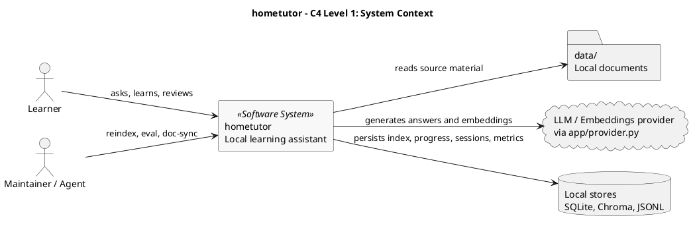

### C4 Level 2 — Containers

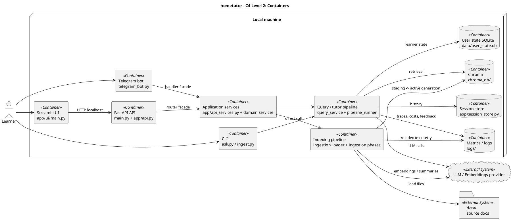

Ключевые границы: UI ходит в FastAPI по HTTP; CLI вызывает query-service напрямую; Telegram использует тот же service facade, что и HTTP-роутеры. Все настройки идут через `app/config.py`, LLM/embeddings — только через `app/provider.py`.

### C4 Level 3 — Query And Tutor Components

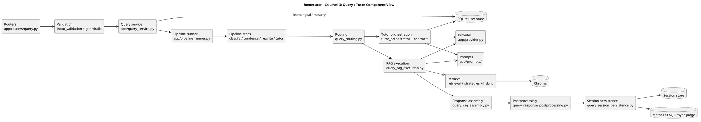

### C4 Level 3 — Indexing Components

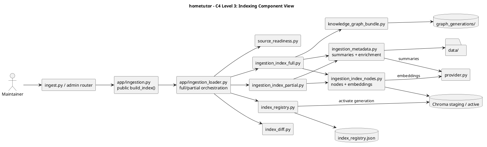

### Sequence — `/ask` Request

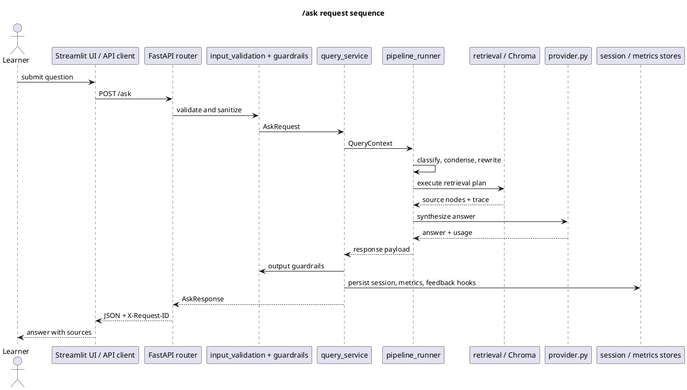

### Product Learning Loop

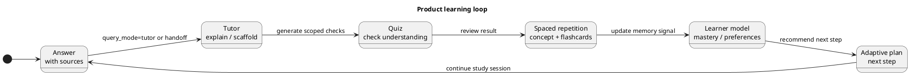

### Deployment And Storage View

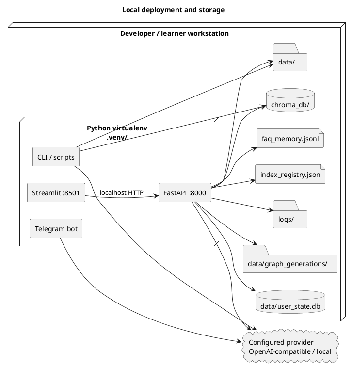

## Зависимости delivery-итераций (roadmap)

Цепочка из [`doc/backlog_registry.yaml`](backlog_registry.yaml): каждый следующий шаг опирается на честное закрытие предыдущего merge-gate. [`doc/tasklist.md`](tasklist.md) — производный weekly view.

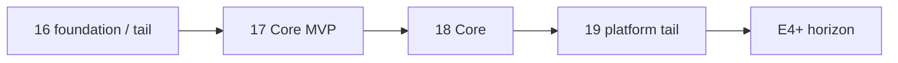

- **16** — data lifecycle foundation и хвосты (FAQ, freshness); не блокирует старт 17, но ограничен по tail-policy.
- **17 Core MVP** — structure-aware metadata, provenance/graph minimum, graph-backed retrieval path, eval baseline (`17 Core Extension` — отдельный gate).
- **18 Core** — retry/backoff, timeouts, observability, reliability (после MVP 17).
- **19 platform tail** — сессии, CLI parity, bounded history.
- **E4+** — см. [`doc/future_roadmap.md`](future_roadmap.md); после закрытия **19 platform tail** — основной следующий горизонт в [`doc/backlog_registry.yaml`](backlog_registry.yaml).

## Контейнеры и каналы доступа

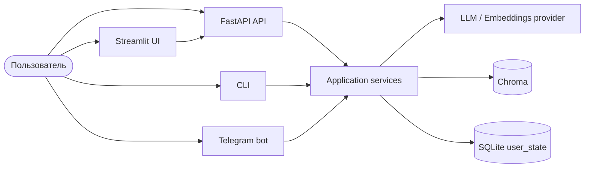

Ключевое уточнение:

- Streamlit UI работает как HTTP-клиент локального FastAPI (`app/ui_client.py`).
- `ask.py` не идет через HTTP, а вызывает `app.query_service.answer_question` напрямую.
- Telegram-бот не идет через HTTP API: обработчики в `app/telegram_handlers.py` вызывают `app.api_services` (тот же фасад, что и роутеры FastAPI).

## Основные слои

### Входные точки

- `main.py` — FastAPI через Uvicorn
- `app/ui/main.py` — Streamlit UI
- `ask.py` — CLI для вопросов
- `ingest.py` — ручной запуск индексации
- `telegram_bot.py` — aiogram-бот
- `run_eval.py`, `run_eval_compare.py` — offline eval и сравнение конфигураций

### HTTP API

- `app/api.py` — сборка приложения, lifespan, middleware, CORS
- `app/routers/core.py` — `/`, `/health`, `/health/deep`, `/ui/bootstrap`, `/tutor/example`
- `app/routers/query.py` — `POST /ask`
- `app/routers/admin.py` — reindex, index/cache/profile endpoints
- `app/routers/knowledge.py` — topics, synthesis, learning plan, KB endpoints
- `app/routers/quiz.py` — scoped quiz generation и evaluation
- `app/routers/review.py` — due reviews (concept-level SM-2)
- `app/routers/flashcards.py` — (E12) flashcard decks/cards CRUD, generate, review, due
- `app/routers/dashboard.py` — mastery, coach plan, adaptive daily plan, analytics, offline status
- `app/routers/sessions.py` — список, чтение и удаление chat sessions
- `app/routers/sync.py` — export/import локального прогресса
- `app/routers/files.py` — explain/content для файлов в `data/`
- `app/routers/metrics.py` — метрики, feedback, history, pipeline trace

### Pipeline и retrieval

- `app/query_service.py` — orchestration верхнего уровня для ответа
- `app/pipeline_runner.py` — запуск шагов pipeline
- `app/pipeline_steps.py` — classify, condense, rewrite и tutor/orchestrator steps
- `app/condense_step.py` — работа с историей сессии для multi-turn
- `app/retrieval.py` — execution plan и сборка query engine
- `app/retrieval_router.py` ? profile-aware retrieval route selection and reason payloads.
- `app/retrieval_strategies.py` — реестр retrieval modes
- `app/hybrid_retrieval.py` — `vector_only`, `hybrid`, `bm25_only`, `doc_then_chunk`
- `app/retrieval_cache.py` — кэш базовых retrieval services и query engine

### Индексация и хранение индекса

- `app/ingestion.py` — загрузка и разбор документов, metadata enrichment, кэш извлечённого текста, прогресс; публичный `build_index()` делегирует оркестрацию в `ingestion_loader`
- `app/ingestion_loader.py` — верхнеуровневая оркестрация reindex (ветвление partial/full, noop skip, загрузка документов); линия ≤600L после вынесения фаз
- `app/ingestion_index_nodes.py` — парсинг нод и embed→Chroma с IngestionCache (общий код partial/full)
- `app/ingestion_index_partial.py` — фазы и thin-оркестратор partial staging reindex (`_build_index_partial`)
- `app/ingestion_index_full.py` — фазы полного reindex (enrichment, запись коллекций, активация, метрики) и noop-skip
- `app/ingestion_metadata.py` — summary и enrichment document-level
- `app/index_registry.py` — реестр активного поколения индекса
- `app/chroma_vector_backend.py` — работа с Chroma и generation-aware backend
- `app/knowledge_graph_bundle.py`, `app/graph_generation_paths.py` — PropertyGraph bundle по поколению индекса (staging → `by_generation/<id>/` в `data/graph_generations/`)
- `app/index_diff.py` — diff по файлам относительно последней индексации

### Учебный контур

- `app/knowledge_service.py` — topics catalog, synthesis, KB overview/search/suggestions
- `app/learning_plan_service.py` — фасад learning/coach/adaptive plan; реализация в `app/learning_plan_generation.py` (генерация) и `app/learning_plan_adaptive.py` (снимки daily plan, next-step после quiz)
- `app/quiz_service.py`, `app/quiz_adaptive.py`, `app/quiz_stats.py` — quiz generation и оценка
- `app/spaced_repetition.py` — concept-level SM-2 (`spaced_repetition` table, keyed by concept name)
- `app/flashcard_service.py` — (E12) flashcard generation (LLM + `FLASHCARD_GENERATION_PROMPT`), save deck, SM-2 per-card review, Anki export; использует `apply_sm2()` из `spaced_repetition.py`, `explain_file()`, `get_topics_catalog()`; экспорт колоды — `export_deck_to_anki()` → `app/export_utils.py` (`anki_apkg_from_pairs`), HTTP: `GET /flashcards/decks/{deck_id}/export/anki` в `app/routers/flashcards.py`
- `app/learner_model_service.py` — personalized learner model
- `app/knowledge_graph.py` — граф концептов и рекомендации следующего шага
- `app/tutor_orchestrator.py`, `app/tutor_prompts.py`, `app/orchestrator_router.py` — tutor orchestration
- `app/tutorial_service.py` — сохранение/чтение прогресса onboarding-тура
- `app/gamification_service.py`, `app/analytics_service.py`, `app/visualization_service.py` — прогресс, аналитика, визуализации

#### Tutorial subsystem (onboarding)

- `app/ui/tutorial_guide.py` — orchestration guided onboarding/tutorial flow в UI.
- `app/ui/tutorial_chapters.py` — структуры глав/шагов и учебный контент tutorial.
- `app/tutorial_service.py` — persistence прогресса tutorial (load/save/continue state).

### Состояние, наблюдаемость и интеграции

- `app/session_store.py` — хранение chat sessions
- `app/user_state.py` — локальное пользовательское состояние в SQLite
- `app/history_service.py`, `app/feedback_service.py`, `app/metrics.py` — история, feedback, метрики
- `app/offline_service.py` — offline flag и probe доступности провайдера
- `app/otel_tracing.py` — optional OTEL tracing
- `app/telegram_handlers.py`, `app/telegram_notifications.py` — Telegram-контур

## Поток запроса `/ask`


Фактические особенности текущей реализации:

- tutor-режим идет через тот же `POST /ask` с `query_mode="tutor"`
- multi-turn основан на `session_id`
- `condense` включен по умолчанию
- `debug` возвращает timings, trace, usage, cost, guardrails и retrieval trace
- `X-Request-ID` проставляется middleware и дублируется в response header

## Поток индексации

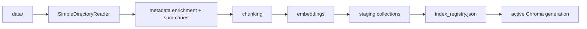

Текущее поведение:

- ingest поддерживает `.pdf`, `.txt`, `.md`, `.docx`, `.html`
- explain/content поддерживают `.txt`, `.md`, `.html`, `.pdf`, `.docx` (для docx — `python-docx`)
- при обычном reindex строится staging generation и затем активируется через `index_registry.json`
- `reset=True` остается explicit hard-reset path

## Хранилища

- `data/` — документы и `user_state.db` (таблицы: `reading_status`, `annotations`, `quiz_results`, `spaced_repetition`, `quiz_mastery`, `flashcard_decks`, `flashcards`)
- `data/graph_generations/` — staging и активные поколения PropertyGraph (`kg.sqlite`, `property_graph_store.json`)
- `chroma_db/` — persistent Chroma; внутри также `ingestion_content_hashes.json` (идемпотентность partial reindex)
- `logs/` — лог-файлы, LLM cost logs, metrics store и metrics dashboard DB
- `faq_memory.jsonl` — FAQ-память
- `index_meta.json` — метаданные индекса
- `index_registry.json` — активное поколение индекса (blue-green)
- `eval_data/`, `eval_results/` — offline eval

Резервное копирование индексных файлов, поведение кэша и производных при `reindex`/`reset`: [index_lifecycle.md](index_lifecycle.md).

## Поставка и зависимости эпох (roadmap)

Согласовано с `backlog_registry.yaml` и `future_roadmap.md` (не runtime-контракт, а ориентир для чтения документации):

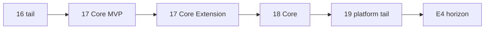

## E12 Flashcards — схема данных

Две новые таблицы в `user_state.db` (добавляются в `_ensure_schema()`):

```sql
flashcard_decks(id PK, name, source_type, source_id, card_count, created_at, updated_at)
flashcards(id PK, deck_id FK → decks, front, back, tags,
           easiness REAL DEFAULT 2.5, interval_days INT DEFAULT 0,
           repetitions INT DEFAULT 0, next_review TEXT, last_review TEXT,
           created_at, updated_at)
```

**Ключевое отличие от `spaced_repetition`:** SM-2 state per-card (integer PK), а не per-concept (string key). Системы независимы: concept-level SR для граф-концептов, card-level SR для конкретных учебных артефактов.

**Flowchart:**
```
UI: выбор документа / загрузка файла
  → POST /flashcards/generate
  → explain_file(relative_path) / content extraction
  → LLM + FLASHCARD_GENERATION_PROMPT (10–15 front/back пар, Wozniak rules)
  → editable preview в UI
  → POST /flashcards/decks (persist)
  → flashcard_decks + flashcards rows (next_review = NULL = new card)

UI: review session
  → GET /flashcards/due (next_review <= now OR next_review IS NULL)
  → flip card (front → back state toggle)
  → POST /flashcards/review {card_id, quality: 0/3/4/5}
  → apply_sm2(easiness, interval_days, repetitions, quality)
  → UPDATE flashcards SET next_review = now + interval
```

## Module Reference (appendix)

### Config / infra

- `app/config.py` — settings schema + env resolution.
- `app/provider.py` — фабрика LLM/embedding клиентов.
- `app/llm_resilience.py` — fallback/metrics-обёртка для `llm.complete`.
  Контракт: `doc/adr.md` ADR-014.
- `app/logging_config.py` — единая инициализация логирования.
- `app/middleware.py` — HTTP middleware (`X-Request-ID`, tracing hooks).
- `app/path_safety.py` — нормализация и валидация путей внутри `data/`.
- `app/input_validation.py` — контракты и санитизация входа.
- `app/guardrails.py` — входные/выходные guardrails.
- `app/llm_guards.py` — LLM-specific guard checks and policies.
- `app/api_models.py` — pydantic-модели API.
- `app/api_requests.py` — клиентские request-модели для UI/CLI.
- `app/api_helpers.py` — общие HTTP/response helper-функции API слоя.
- `app/api_services.py` — фасад сервисов для роутеров FastAPI.
- `app/models.py` — shared domain dataclasses/types.
- `app/token_utils.py` — подсчёт/ограничение token budgets.
- `app/utils.py` — утилиты общего назначения.

### Pipeline / retrieval

- `app/pipeline_factory.py` — единая сборка параметров retrieval/prompt.
- `app/pipeline_runner.py` — последовательный запуск шагов pipeline.
- `app/pipeline_steps.py` — classify/condense/rewrite/tutor steps.
- `app/condense_step.py` — сжатие истории диалога.
- `app/query_routing.py` — выбор режима ответа.
- `app/query_rag_execution.py` — выполнение RAG-ветки.
- `app/query_response_postprocessing.py` — постобработка ответа и debug-пакета.
- `app/query_session_persistence.py` — сохранение сессии/следов после ответа.
- `app/query_metrics.py` — вычисление retrieval/debug trace и confidence метрик.
- `app/query_tutor_context.py` — нормализация tutor payload и контекста.
- `app/query_fallbacks.py` — fallback-ветки генерации ответа.
- `app/ask_goal_snapshot_merge.py` — merge goal snapshot в ask-flow.
- `app/request_cache.py` — request-level caching helpers.
- `app/prompt_smoke_checks.py` — smoke-проверки prompt-конструкции.
- `app/retrieval.py` — orchestration retrieval + query engine.
- `app/retrieval_router.py` ? profile-aware retrieval route selection and reason payloads.
- `app/retrieval_cache.py` — кэш retrieval сервисов.
- `app/retrieval_cache_discovery.py` — Chroma collection discovery and recovery heuristics for active/staging retrieval caches.
- `app/retrieval_strategies.py` — реестр retrieval режимов.
- `app/hybrid_retrieval.py` — BM25/vector/doc_then_chunk и fusion.
- `app/graph_retrieval.py` — graph-assisted retrieval path.
- `app/router_eval.py` — eval-routing утилиты.
- `app/pipeline_profiler.py` — профилирование retrieval pipeline.
- `app/compare_eval.py` — сравнение профилей/конфигураций eval.
- `app/eval_ragas_backend.py` — optional RAGAS-compatible evaluation backend adapter.

### Services (domain/application)

- `app/query_service.py` — верхнеуровневый orchestration ответа.
- `app/query_rag_assembly.py` — сборка RAG/tutor response payload.
- `app/knowledge_service.py` — topics catalog/search/synthesis контур.
- `app/learning_plan_service.py` — фасад learning/coach/adaptive plans (`learning_plan_generation` + `learning_plan_adaptive`).
- `app/coach_insights.py` — вычисление coach insights по прогрессу.
- `app/adaptive_plan_progress.py` — backend-safe Adaptive Daily Plan progress captions for receipts and non-UI surfaces.
- `app/smart_study_router.py` — public facade Smart Study Router (SSR) for next-step recommendations.
- `app/smart_study_scoring.py` — вспомогательные функции оценки и steering для рекомендаций SSR.
- `app/smart_study_recommendation.py` — deterministic SSR rule engine and recommendation contract.
- `app/smart_study_evidence.py` — local SSR explainability ledger builders.
- `app/smart_study_ssr_ml.py` — optional local SSR ML hybrid/reranking adapter.
- `app/ssr_ml_reranking.py` — local SSR ML weight loading and probability prediction.
- `app/ssr_ml_monitoring.py` — SSR ML latency/confidence/fallback telemetry.
- `app/ssr_pregeneration.py` ? background pre-generation for SSR explanations.
- `app/ssr_semantic_cache.py` ? semantic cache lookup/store for SSR explanations.
- `app/ssr_explanation_cache.py` — backend-safe exact SSR explanation cache and feedback metadata context.
- `app/ssr_explain_service.py` — server-side SSR explanation streaming path (exact cache, semantic cache, tier gate, LLM fallback).
- `app/ssr_context_builder.py` — pure SSR explanation learning-context builder shared by UI and backend services.
- `app/ssr_weekly_planner.py` ? rule-based seven-day SSR planner over compact learner profiles.
- `app/ssr_weekly_narrative.py` — deterministic weekly SSR narrative snapshot over 7-day learning signals.
- `app/ssr_feedback_collection.py` ? accept/reject/defer feedback collection for SSR recommendations.
- `app/ssr_misroute_policy.py` — offline misroute tie-break policy learning over SSR feedback buckets.
- `app/ssr_llm_profiling.py` — JSONL profiling for SSR LLM explanations.
- `app/ssr_llm_profile_summary.py` — SSR LLM profile aggregation/summarization.
- `app/smart_study_recovery_ladder.py` — Concept Recovery Ladder contract (US-20.1): overlay, resume blob, persistence helpers.
- `app/smart_study_route_simulator.py` — local what-if route simulator for SSR alternatives; pure deterministic, no side effects.
- `app/ssr_graph_routing.py` — prerequisite-aware weak-concept ordering helpers for SSR graph routing. Контракт: doc/adr_023_ssr_graph_routing.md.
- `app/ssr_explanation_tier_gate.py` — tiered explanation gate for SSR: decides template-only vs LLM-enriched "why now" explanation.
- `app/llm_local_circuit.py` ? per-endpoint circuit breaker for local OpenAI-compatible LLMs.
- `app/llm_local_health.py` ? local LLM endpoint health probe.
- `app/ssr_ai/` ? shared SSR AI infrastructure: dataset helpers, eval harness, fallback reasons, telemetry.
- `app/adaptive_plan_step_text.py` — shared text helpers for adaptive plan step labels/reasons.

Контракт Smart Study Router / SSR ML hybrid: `doc/adr.md` ADR-020.

Контракт Course Workspace progression/pace: `doc/adr.md` ADR-017.

- `app/course_cache.py` — кеширование course-level представлений.
- `app/course_graph_compiler.py` — компиляция локального course graph из источников и extraction payloads; контракт: `doc/adr_025_course_graph_compiler.md`.
- `app/konspekt_discovery.py` — обнаружение и классификация локальных конспектов.
- `app/langfuse_dataset.py` — адаптер локальных eval-наборов для Langfuse dataset workflows.
- `app/obsidian_export.py` — экспорт учебных артефактов и ссылок в Obsidian vault.
- `app/smart_konspekt.py` — orchestration генерации структурированного smart-конспекта.
- `app/course_metrics.py` — агрегаты и вычисления course metrics.
- `app/ui/graduation_overlay.py` — заголовки/overlay церемонии выпуска концепта (course UX; бывший `course_graduation.py` не используется).
- `app/pace_engine.py` — deterministic pace mode defaults and recommendations.
- `app/warmup_planner.py` — подготовка warmup-плана для course/study flows.
- `app/services/first_session_builder.py` — builds First Session Artifact payloads at ingest tail (Move 1 / balance plan §11.1).
- Диагностика готовности/состояния обучения: `user_state.get_learner_state_diagnostics`, `GET /learner-state/diagnostics` (`routers/admin.py`); отдельного `diagnostic_service.py` нет.
- `app/quiz_service.py` — quiz generation/evaluation/use-cases.
- `app/quiz_adaptive.py` — адаптация сложности quiz по mastery.
- `app/quiz_stats.py` — вычисление quiz-статистики.
- `app/flashcard_service.py` — flashcard lifecycle + card-level SM-2.
- `app/explain_service.py` — explain/content extraction из файлов.
- `app/ingestion.py` — pipeline загрузки документов (parse, metadata, extraction cache).
- `app/ingestion_loader.py` — сборка и reindex индекса; вызывается из `build_index()` в `ingestion`; фазы — `ingestion_index_partial.py`, `ingestion_index_full.py`, ноды/embed — `ingestion_index_nodes.py`.
- `app/ingestion_metadata.py` — summary/enrichment на этапе ingestion.
- `app/ingestion_content_state.py` — content hash/idempotency state.
- `app/source_readiness.py` — pre-ingestion source classification and readiness diagnostics (PDF/DOCX/text/OCR readiness scoring); used by `api_services.py` via `build_source_readiness_summary()`
- `app/knowledge_graph.py` — knowledge graph операции и рекомендации.
- `app/knowledge_graph_bundle.py` — graph generation bundle lifecycle.
- `app/learner_model_service.py` — learner model updates/features.
- `app/tutor_learner_contract.py` — контракт learner-context для tutor pipeline.
- `app/tutor_pipeline_contract.py` — контракт payload между шагами tutor pipeline.
- `app/tutor_orchestrator.py` — tutor decision loop.
  Контракт: `doc/adr.md` ADR-015.
- `app/tutor_cycle.py` — unified tutor cycle helpers.
- `app/tutor_personalization_policy.py` — персонализация tutor-ответа.
- `app/tutorial_service.py` — сервис прогресса tutorial/onboarding (load/save).
- `app/gamification_service.py` — XP/уровни/награды.
- `app/analytics_service.py` — аналитические агрегаты.
- `app/visualization_service.py` — payloads для визуализаций/графиков.
- `app/adaptive_plan.py` — adaptive plan computations.
- `app/offline_service.py` — offline probe + статус доступности.
- `app/feedback_service.py` — feedback ingestion.
- `app/history_service.py` — история запросов/ответов.
- `app/sync_service.py` — export/import локального прогресса.
- `app/export_utils.py` — экспорт (в т.ч. Anki).
- `app/voice_service.py` — TTS/STT интеграции.
- `app/event_tracking.py` — backend-safe event tracking.
- `app/faq_memory.py` — FAQ memory store/retrieval.
- `app/async_quality_judge.py` — асинхронный quality judge.
- `app/eval_service.py` — фасад eval pipeline и сравнения ответов.
- `app/eval_baseline.py` — regression threshold constants and defense baseline schema for eval comparisons.
- `app/eval_helpers.py` — timing and path helpers for eval pipeline runs.
- `app/due_queue_display.py` — shared due-queue display captions and overflow thresholds without Streamlit dependency.
- `app/flashcards_review_receipt.py` — pure flashcard review receipt metrics/diff/HTML builder.
- `app/prompts/` — единый реестр prompt-шаблонов (`__init__.py` re-exports public prompt API from `_impl.py`).
- `app/prompts/course_graph_extraction.py` — prompt contract извлечения узлов и связей course graph.
- `app/ui_events.py` — backend-safe события UI для аналитики.

### Routers

- `app/ui/knowledge_graph_d3.py` — подготовка D3 payload и интерактивный Streamlit render knowledge graph.

- `app/routers/core.py` — root, health, bootstrap, tutor example.
- `app/routers/query.py` — `/ask`.
- `app/routers/admin.py` — reindex/index/cache/profile операции.
- `app/routers/knowledge.py` — topics/synthesis/learning-plan endpoints.
- `app/routers/quiz.py` — quiz generation/evaluation endpoints.
- `app/routers/review.py` — due concept reviews.
- `app/routers/flashcards.py` — flashcards CRUD/generate/review/export.
- `app/routers/dashboard.py` — mastery/analytics/coach/adaptive endpoints.
- `app/routers/sessions.py` — chat session listing/read/delete.
- `app/routers/sync.py` — sync export/import endpoints.
- `app/routers/files.py` — file explain/content endpoints.
- `app/routers/metrics.py` — metrics/feedback/history/pipeline trace.
- `app/routers/learner.py` — learner profile/preferences endpoints.
- `app/routers/ssr.py` — `POST /ssr/explain` SSE endpoint for server-side SSR explanations.
- `app/routers/debug_session_tape.py` — debug session tape read API (gated by `session_tape_debug_replay_enabled=False`).

### User-state / persistence

- `app/user_state.py` — публичный фасад user-state.
- `app/user_state_core.py` — `_with_db()` + schema/migrations.
- `app/user_state_reading.py` — reading-status persistence.
- `app/user_state_quiz.py` — quiz results/mastery persistence.
- `app/user_state_flashcards.py` — flashcard tables CRUD.
- `app/user_state_tutor.py` — tutor-resume persistence.
- `app/user_state_sync.py` — sync bundle serialization.
- `app/user_state_research.py` — research-oriented state helpers.
- `app/user_state_ssr_feedback.py` ? SQLite persistence helpers for SSR misroute feedback.
- `app/user_state_weekly_narrative.py` — SQLite-backed 7-day weekly narrative aggregation helpers.
- `app/learner_state_scope.py` — scoped accessors для learner state.
- `app/session_store.py` — отдельное sessions DB хранилище.
- `app/session_tape.py` — append-only session tape writer (JSONL under DATA_DIR/sessions/). Контракт: doc/adr.md ADR-022 Session tape.
- `app/session_replay.py` — lenient session tape reader (iter_events); skips malformed lines without raising.
- `app/index_registry.py` — активная index generation pointer.
- `app/index_state.py` — index status snapshot API.
- `app/index_lifecycle.py` — generation lifecycle orchestration.
- `app/index_backup.py` — backup/restore index artifacts.
- `app/index_diff.py` — diff по изменённым файлам для reindex.
- `app/chroma_vector_backend.py` — Chroma backend abstraction.
- `app/graph_generation_paths.py` — graph generation path helpers.

### Metrics / observability

Контракт декомпозиции observability: `doc/adr.md` ADR-016.

- `app/metrics.py` — runtime metrics ingestion/public API.
- `app/metrics_core.py` — базовые metric primitives.
- `app/metrics_storage.py` — JSONL/SQLite persistence backend.
- `app/metrics_db.py` — dashboard SQLite cache IO.
- `app/metrics_aggregator.py` — агрегирование метрик.
- `app/metrics_summarizer.py` — сводные метрики/summary payload.
- `app/metrics_graph_expansion.py` — graph-specific metric counters.
- `app/usage_cost.py` — token usage/cost estimation.
- `app/otel_tracing.py` — optional OpenTelemetry tracing.
- `app/latency_budget.py` — surface latency budgets, degradation ladder, and Package E JSONL trace. Контракт: doc/adr.md ADR-021 Surface latency budgets.

### Scripts (automation/runtime)

Контракт автономного control plane: `doc/adr.md` ADR-018.

- `scripts/run_autonomous.py` — автономный агентный runner (основной entrypoint).
- `scripts/run_autonomous.ps1` — PowerShell launcher для Windows.
- `scripts/run_autonomous.bat` — batch launcher для Windows shell fallback.
- `tests/test_run_autonomous_agent_chain.py` — smoke/chain-проверки orchestration.
- `tests/test_run_autonomous_cost_summary.py` — проверка cost summary и лимитов.

### UI (Streamlit)

- `app/ui/main.py` — entrypoint и маршрутизация UI.
- `app/ui_client.py` — HTTP client к FastAPI.
- `app/ui/home_hub.py` — главный хаб/landing.
- `app/ui/course_cockpit.py` — Course Cockpit Streamlit scaffold/surface.
- `app/ui/adaptive_plan_card.py` — compatibility facade for Adaptive Daily Plan and SSR cards.
- `app/ui/adaptive_plan_hub_layout.py` — home hub Adaptive Daily Plan CTA layout.
- `app/ui/adaptive_daily_plan_layout.py` — full Adaptive Daily Plan card renderer.
- `app/ui/adaptive_plan_llm_enrichment.py` — SSR "why now" LLM enrichment and observability.
- `app/ui/adaptive_plan_llm_explanation.py` ? SSR LLM explanation generation.
- `app/ui/adaptive_plan_llm_stream.py` ? streaming SSR explanation helpers.
- `app/ui/adaptive_plan_llm_feedback.py` ? SSR explanation feedback widgets.
- `app/ui/llm_local_banner.py` ? local LLM availability banner.
- `app/ui/offline_banner.py` ? offline-mode banner.
- `app/ui/quick_answer.py` ? quick-answer UI surface.
- `app/ui/mission_control.py` ? mission-control SSR/progress surface.
- `app/ui/smart_study_next_step_card.py` — shared Smart Study Router card renderer.
- `app/ui/resume_cards_due.py` — due review and flashcard cards for the home resume surface.
- `app/ui/resume_cards_smart_study.py` — Smart Study Router helpers for home resume cards.
- `app/ui/resume_cards_recovery_ladder.py` — Concept Recovery Ladder context and status UI for resume cards.
- `app/ui/resume_cards_tutor.py` — tutor and reading resume cards for the home surface.
- `app/ui/query_tab.py` — Q&A вкладка.
- `app/ui/query_tab_answer_section.py` — блок ответа, источников и отладки под колонками Q&A.
- `app/ui/query_tab_poll.py` — опрос статуса переиндексации для вкладки Q&A.
- `app/ui/topics_tab.py` — topics/synthesis UI.
- `app/ui/topics_tab_right_column.py` — правая колонка вкладки «Темы»: действия, документы, подвкладки.
- `app/ui/interactive_quiz.py` — interactive quiz flow.
- `app/ui/quiz_panel.py` — quiz виджеты/рендер.
- `app/ui/scoped_quiz.py` — scoped quiz UI.
- `app/ui/flashcards_ui.py` — flashcards root UI.
- `app/ui/flashcards_generate_view.py` — генерация flashcards.
- `app/ui/flashcards_decks_view.py` — просмотр колод.
- `app/ui/flashcards_review_view.py` — review-сессия карточек.
- `app/ui/tutor_chat.py` — tutor chat экран.
- `app/ui/tutor_chat_controls.py` — session and depth controls for tutor chat UI.
- `app/ui/tutor_chat_actions.py` — tutor action handlers.
- `app/ui/tutor_chat_render.py` — рендер сообщений tutor.
- `app/ui/tutor_chat_response_render.py` ? structured tutor response renderer.
- `app/ui/tutor_mastery_ui.py` — mastery panels для tutor.
- `app/ui/tutor_mastery_forecast_panel.py` — панель emotional_state + XP forecast.
- `app/ui/tutorial_guide.py` — guided onboarding/tutorial flow в UI.
- `app/ui/tutorial_chapters.py` — модели/структуры глав и шагов tutorial.
- `app/ui/dashboards.py` — dashboard layout/widgets.
- `app/ui/dashboards_graph.py` — interactive Knowledge Graph dashboard tab.
- `app/ui/dashboards_progress.py` — learning progress tab and personalization settings dashboards.
- `app/ui/progress_visuals.py` — графики прогресса.
- `app/ui/kb_fetch.py` — тонкие GET к KB из UI (без кэша st.cache_data).

## Источники правды

- HTTP-контракты: `app/routers/*` и Swagger `/docs`
- runtime settings: `app/config.py` и `app/metrics.py`
- поведение UI: `app/ui/main.py`, `app/ui_client.py`
- поведение tutor/multi-turn: `app/query_service.py`, `app/session_store.py`
