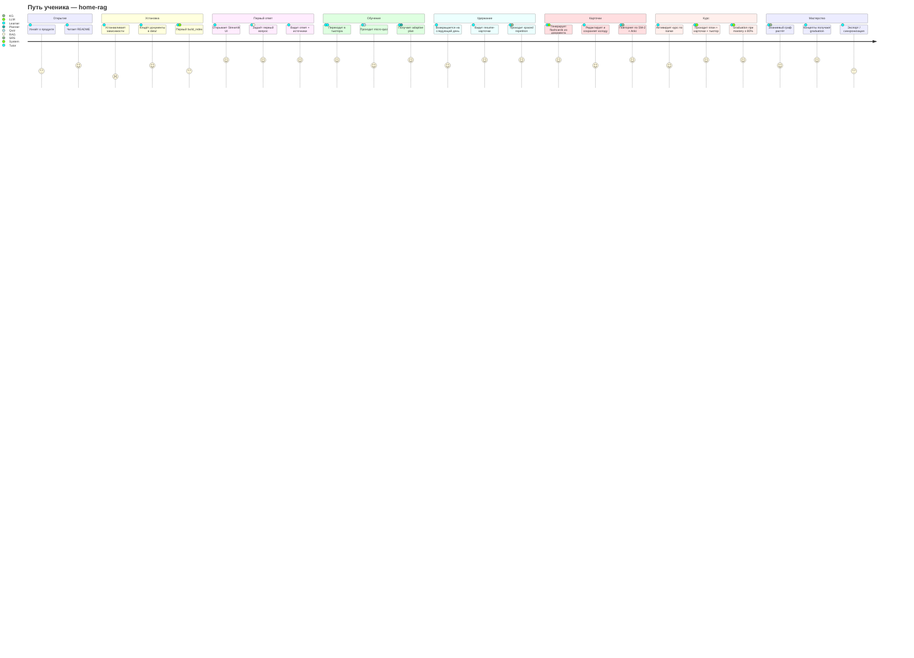
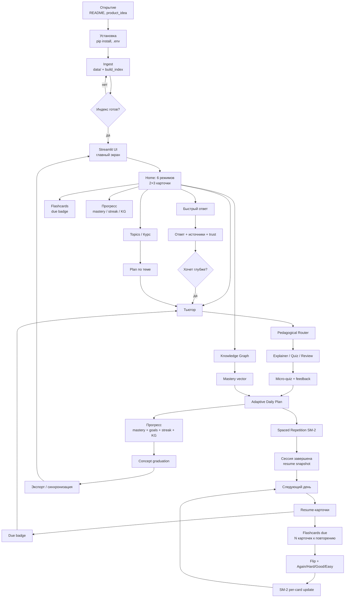

# Customer Journey Map — Карта пути ученика

> **Для кого этот документ:** Владелец продукта, который хочет понять, где пользователь получает ценность, где теряется, и что делать дальше.
>
> **Когда открывать:** перед планированием следующего пакета, при разборе жалобы пользователя, при выборе приоритета между фичами, при ревью UX-решения.
>
> **Связанные документы:** [`user_scenarios.md`](user_scenarios.md) — каталог demo-сценариев, [`user_guide.md`](user_guide.md) — карта продукта, [`backlog_registry.yaml`](backlog_registry.yaml) — текущие приоритеты.

*Актуализировано: 2026-05-23*

---

## Зачем владельцу продукта нужен CJM

Представьте: вы смотрите на список фич в бэклоге — Resume Cards, Graduation overlay, Trust panel, Soft recovery. Как выбрать, что важнее?

**CJM отвечает на этот вопрос.** Он показывает путь пользователя как единую историю: от первого знакомства с продуктом до момента, когда тема полностью освоена. Каждый шаг — это действие, точка контакта, эмоция, боль и возможность. Видя эту карту целиком, вы понимаете:

- **Где узкое горло**: момент, в который пользователь чаще всего уходит
- **Где скрытая ценность**: момент, которого пользователь ещё не видит, но который изменит его отношение к продукту
- **Что ломает доверие**: критические моменты, провалив которые, продукт теряет пользователя навсегда

> **Аналогия.** CJM — это не карта метро (где линии и станции), а маршрут живого человека: он идёт пешком, потом берёт такси, теряет кошелёк на переходе и добирается домой уставшим. Метро — это архитектура. CJM — это опыт.

---

## Как пользоваться этим документом

| Если вы хотите... | Идите в раздел |
|---|---|
| Понять весь путь пользователя за 2 минуты | [§1 Большая карта](#1-большая-карта-пути) |
| Найти, где именно теряется пользователь | [§2 Эмоциональная кривая](#2-эмоциональная-кривая-и-ключевые-переходы) |
| Выбрать приоритет между болями | [§3 Таблица стадий](#3-таблица-стадий--боли--возможности) |
| Убедиться, что фича решает правильную проблему | [§4 Моменты истины](#4-моменты-истины--критерии-приёмки) |
| Измерить, улучшилось ли UX после релиза | [§5 Метрики переходов](#5-метрики-переходов) |
| Найти модуль, отвечающий за стадию | [§6 Архитектурная привязка](#6-архитектурная-привязка) |
| Связать боль с конкретной User Story | [§7 Pain → US backlog](#7-pain--us-backlog) |

---

## 1. Большая карта пути

**North Star продукта:** пользователь не переключается между разрозненными инструментами — он проходит непрерывный учебный маршрут: `получить ответ → поверить источникам → разобраться с тьютором → проверить себя → повторить → увидеть прогресс`.

### Детальный flow

---

## 2. Эмоциональная кривая и ключевые переходы

> **Как читать.** Кривая — это не просто UX-украшение. Это карта рисков. Каждый спад — место, где пользователь может уйти. Каждый пик — точка, которую нужно беречь и усиливать.

```mermaid
flowchart LR
    D["Открытие<br/>😐 любопытство"] --> I["Установка<br/>😟 сомнение"]
    I --> Ing["Ingest<br/>🙂 предвкушение"]
    Ing --> FA["Первый ответ<br/>😀 wow"]
    FA --> T["Проверка источников<br/>🤔 критичность"]
    T --> Tu["Тьютор<br/>😀 вовлечён"]
    Tu --> Q["Micro-quiz<br/>😬 напряжение"]
    Q --> AP["Adaptive Plan<br/>😀 ясность"]
    AP --> R["День 2, resume<br/>🙂 ритуал"]
    R --> SR["Spaced rep<br/>🙂 дисциплина"]
    SR --> P["Прогресс<br/>😀 мотивация"]
    P --> FC["Flashcards<br/>😀 продуктивность"]
    FC --> M["Graduation<br/>😀 гордость"]
```

### Где опасные точки

| Точка провала | Почему критична | Что с этим сделано |
|---|---|---|
| **Установка** 😟 | Пользователь не успел получить ценность — уже платит усилием | Упрощён onboarding, авто-проверка env |
| **Micro-quiz** 😬 | Первый провал убивает мотивацию | Hint вместо fail, мгновенный feedback |
| **День 2** 🙂 (риск 😐) | Если нет resume — пользователь не возвращается | Resume-карточки на главном экране |
| **Spaced rep overflow** | 50+ due без приоритизации = паника | Soft-recovery разносит overdue |

---

## 3. Таблица стадий: боли и возможности

> **Как использовать.** Найдите стадию, на которую жалуется пользователь. Посмотрите Pain — это то, что происходит сейчас. Посмотрите Opportunity — это то, что можно сделать. Затем проверьте §7 (Pain → US) чтобы найти статус реализации.

| Стадия | Цель пользователя | Touchpoint | Эмоция | Pain | Opportunity |
|---|---|---|---|---|---|
| **Открытие** | Понять, нужен ли продукт | `README.md`, `product_idea.md` | 😐 | Непонятно, чем лучше ChatGPT | Короткий screencast / GIF в README |
| **Установка** | Поднять локально | terminal, `user_guide.md` | 😟 | Тяжёлые зависимости; непонятные env vars | Один установщик / docker compose; auto-check env |
| **Ingest** | Загрузить базу | CLI, `index_lifecycle.md` | 🙂 | Долгий indexing; нет прогресса | Прогресс-бар + ETA; инкрементальный reindex |
| **Первый ответ** | Получить осмысленный ответ | `query_tab.py`, hero | 😀 | Weak retrieval → разочарование на первой минуте | Smart-defaults; «Try these examples»; wait-state runway |
| **Выбор режима** | Найти нужный режим | `home_hub.py`, `main.py` | 🙂 | 10 равнозначных действий на первом экране | 2×3 mode selector; Flashcards due badge; прогрессивное раскрытие |
| **Trust** | Убедиться в достоверности | `source_cards.py`, debug panel | 🤔 | Источники обрезаны; провенанс неясен | Inline-цитаты; «почему этот фрагмент» |
| **Quality defense** | Поверить не только ответу, но и доказательствам качества | eval reports, baseline docs, governance docs | 🤔 | Quality claims sound subjective; privacy boundaries and failure modes are unclear | Reproducible eval run, adversarial RAG report, stage-level cost/latency, deletion verification |
| **Переход в тьютора** | Перейти от Q&A к обучению | `main.py`, hero, scenarios | 🙂 | Переход неочевиден; контекст не сохраняется | Persistent CTA «Учить эту тему» под каждым ответом |
| **Tutor-сессия** | Понять тему, не просто прочитать | `tutor_orchestrator.py`, tutor UI | 😀 | Router иногда выбирает не то действие | Прозрачность: «сейчас объясняю, потому что…» |
| **Micro-quiz** | Проверить себя | `quiz_panel.py`, scoped_quiz | 😬 | Длинные вопросы; нет частичного зачёта | Мгновенный feedback; hint вместо строгого fail |
| **Adaptive Plan** | Знать, что делать сегодня | `adaptive_plan_card.py` | 😀 | Нет истории плана; непонятно, что изменилось | History плана + diff «что изменилось» |
| **Spaced rep** | Не забыть пройденное | resume cards, SRS badge | 🙂 | Пропустил день → 50+ due в очереди | Soft-recovery: разнести overdue |
| **Resume** | Продолжить с места | `resume_cards.py`, tutor_learning_resume | 😀 | Snapshot устаревает после reindex | Lineage sync + явный badge «обновлено» |
| **Прогресс** | Видеть рост | `dashboards.py`, `progress_visuals.py` | 😀 | Метрики разбросаны по экранам | Единый Progress tab: graph + metrics + streak |
| **Экспорт** | Перенести на другое устройство | `export_full_sync_bundle()` | 😐 | Функция спрятана; формат непонятен | UI-кнопка «Backup my learning» + restore wizard |
| **Telegram** | Учиться с телефона | tg integration | 🙂 | Не все функции тьютора доступны | Feature parity map; явные ограничения |
| **Flashcards Gen** | Создать карточки за минуту | `flashcards_ui.py`, `/flashcards/generate` | 😀 | Нет preview перед сохранением | Editable preview; Wozniak one-idea-per-card |
| **Flashcards Review** | Повторить по расписанию | `flashcards_ui.py`, due badge | 😀 | Нет ощущения «я запомнил»; перегрузка при пропуске | 4-кнопочный рейтинг + summary сессии + soft-recovery |
| **Course Mode** | Пройти курс за несколько дней | `home_hub.py`, Topics, Flashcards | 😀 | Ручная навигация между табами ломает поток | Daily runway + retrieval gates между модулями |
| **Graduation** | Ощутить завершение темы | `adaptive_plan.py`, KG / progress UI | 😀 | Нет ощущения «финиша»; тема снова в gap | Concept graduation overlay: освоено, больше не беспокоит |

---

## 4. Моменты истины — критерии приёмки

> **Как использовать.** Это 13 критических точек, в которых продукт либо завоёвывает доверие пользователя, либо теряет его. Используйте этот список как **чеклист приёмки** для любой фичи, которая касается UX: если фича затрагивает один из этих моментов — проверьте, что ничего не сломалось.

| # | Момент | ✅ Что должно произойти | ❌ Что ломает доверие |
|---|---|---|---|
| 1 | **Первый запуск** | UI открывается, hero показывает понятный следующий шаг | Stack trace, пустой экран, missing env |
| 2 | **Первый ответ** | Релевантный ответ + источники за < 5 сек | «Не нашёл информации» на тривиальный вопрос |
| 3 | **Переход в тьютора** | Контекст вопроса сохраняется | Тьютор стартует «с нуля», забывая тему |
| 4 | **Первый micro-quiz** | Вопрос по теме, мгновенный feedback | Вопрос не по теме / fail без объяснения |
| 5 | **День 2: Resume** | Resume-карточка видна сразу на главном экране | «Где я был вчера?» — пользователь ищет вручную |
| 6 | **После reindex** | Профиль и прогресс сохраняются | Mastery обнуляется, история теряется |
| 7 | **Spaced rep due** | Понятно, что повторить и почему | Список из 50+ overdue без приоритизации |
| 8 | **Progress check** | Mastery, weekly goals, streak и KG — в одном месте | Метрики разбросаны по трём экранам |
| 9 | **Concept graduation** | Transfer-концепт помечается освоенным, не возвращается в gap | Нет ощущения завершения, план предлагает уже освоенное |
| 10 | **Guided start** | Новичок видит один следующий шаг; advanced controls — по запросу | Первый экран предлагает 10 равных действий |
| 11 | **Flashcard generation** | Editable preview перед сохранением | Карточки сохранены без контроля качества |
| 12 | **Flashcard review session** | Summary: сколько снова/хорошо/легко, когда следующее повторение | Сессия заканчивается без feedback |
| 13 | **Home mode selection** | 6 режимов чётко разграничены; due badge видна; вторичные инструменты свёрнуты | Главный экран превращается в набор равноправных виджетов |
| 14 | **SSR guided action** | Подсказка «что учить дальше» на Mission Control с ИИ-объяснением «Почему сейчас» и A/B-тестом | Подсказка нерелевантна, выглядит шаблонно или недоступна |

---

## 5. Метрики переходов

> **Как использовать.** Это не технические метрики — это UX-сигналы качества перехода между стадиями. Когда вы спрашиваете «стало ли лучше после релиза?» — смотрите на соответствующий сигнал.

| Переход | Сигнал успеха | Антисигнал |
|---|---|---|
| **answer → trust** | Пользователь видит источники, понимает покрытие | Пользователь закрывает вкладку |
| **trust → tutor** | Есть понятный CTA «Учить»; тьютор сохраняет вопрос и источники | Пользователь не нашёл кнопку |
| **tutor → quiz** | Micro-quiz появляется в нужный момент, по теме и уровню | Quiz выглядит случайным |
| **quiz → review** | Ошибка превращается в hint или следующий плановый шаг | Fail без объяснения |
| **review → progress** | После review видно, что изменилось: due, mastery, streak | Никакого подтверждения результата |
| **progress → next action** | Progress предлагает следующий шаг, не только показывает метрики | Дашборд без призыва к действию |
| **any learning state → next best study action** | Умная подсказка объясняет, почему сейчас нужен quiz, tutor, flashcard, review или план | Пользователь вручную угадывает режим и выпадает из цикла |

### Smart Study Router opportunities

| Type | Entry | Notes |
|---|---|---|
| Opportunity | Explainable Next Step Card | One primary study action with "почему сейчас" reason and 2-4 safe alternatives; source: JTBD + recognition over recall. |
| Opportunity | Due-review priority | `cards_due -> Повторить`: local due cards can outrank new learning so retention debt stays visible; source: Anki / SM-2. |
| Opportunity | Weak-concept recovery route | `quiz_failed -> Разобрать слабое место`: quiz failure routes to tutor, retry, or card creation; source: retrieval practice + mastery learning. |
| Opportunity | Post-answer learning runway | `answer_ready -> Учить тему`: sourced answer becomes a guided tutor/quiz/cards loop; source: Duolingo next lesson flow + Hook Model. |
| Opportunity | Accessible router and preserved entry points | Recommendation reason and alternatives remain keyboard/screen-reader reachable, while tutor/quiz/flashcards/dashboard stay visible. |
| Opportunity | Contrastive router explanation | Show "why this action, not the other visible modes" while preserving tutor, quiz, flashcards, and dashboard entry points. Source: contrastive explanations + recognition over recall. |
| Opportunity | Local route confidence ledger | Expose compact local signals behind the recommendation so trust does not depend on hidden scoring or cloud inference. Source: model cards + decision logs. |
| Opportunity | Learning debt queue | Separate due memory debt, weak-concept recovery, and new learning so the learner understands the pedagogical reason for the route. Source: Anki / SM-2 + mastery learning. |
| Opportunity | Learner steering toggles | Let the learner prefer review/new-topic/gentle mode while the router explains when it follows or overrides the preference. Source: user control heuristics. |
| Opportunity | Micro-outcome receipt | After a routed action, show what changed in local learning state: due reduced, weak concept practiced, or next step unlocked. Source: habit loop feedback + goal-gradient effect. |
| Opportunity | Quiet mode route | Preserve the same action/reason/alternatives in a lower-cognitive-load display. Source: cognitive load reduction + accessibility design. |

---

## 6. Архитектурная привязка

> **Как использовать.** Если вы пишете спек на фичу — найдите её стадию здесь и скопируйте название модуля в write-set задачи. Если вы ревьюите PR — убедитесь, что затронутые модули соответствуют заявленной стадии.

| Стадия CJM | Owning module | Контракт |
|---|---|---|
| Первый ответ | `app/query_service.py`, `app/routers/query.py` | typed query response, sources, trust |
| Quality defense | `run_eval.py`, `app/eval_service.py`, `app/pipeline_profiler.py`, `app/guardrails.py` | run-id eval report, retrieval comparison, adversarial report, cost/latency trace |
| Тьютор | `app/tutor_orchestrator.py`, `app/pipeline_steps.py`, `app/tutor_pipeline_contract.py` | `metadata["tutor_orchestration_pipeline"]`, `trace["tutor_pipeline"]` |
| Персонализация | `app/learner_model_service.py`, `app/tutor_personalization_policy.py` | `PersonalizedLearnerModel`, policy clamp |
| Adaptive Plan | `app/adaptive_plan.py` | `AdaptiveDailyPlan.build_adaptive_daily_plan()` |
| Spaced Repetition | `app/spaced_repetition.py`, `app/user_state.py` | SM-2 |
| Resume / Persistence | `app/user_state.py:tutor_learning_resume` | single-row snapshot, WAL durability |
| Прогресс / Метрики | `app/ui/dashboards.py`, `app/ui/progress_visuals.py`, `app/gamification_service.py` | mastery vector + weekly goals + daily streak + KG |
| Graduation | `app/adaptive_plan.py`, `app/knowledge_graph.py`, `app/quiz_adaptive.py` | `graduated`: transfer stable > 7 days |
| Guided Start | `app/ui/resume_cards.py`, `app/ui/sidebar.py`, `app/ui/debug_panel.py` | progressive disclosure: один primary CTA |
| Home Mode Selector | `app/ui/home_hub.py`, `app/ui/main.py`, `app/ui_theme.css` | 2×3 mode cards → `st.session_state["current_view"]`; Flashcards due badge |
| Flashcards Gen | `app/ui/flashcards_ui.py`, `app/flashcard_service.py`, `app/routers/flashcards.py` | `explain_file()` → LLM → editable preview → `POST /flashcards/decks` |
| Flashcards Review | `app/ui/flashcards_ui.py`, `app/spaced_repetition.py:apply_sm2()` | `GET /flashcards/due` → flip UI → `POST /flashcards/review` → SM-2 |
| Экспорт / Синхронизация | `app/user_state.py:export_full_sync_bundle` | `SYNC_BUNDLE_VERSION` |

---

## 7. Pain → US Backlog

> **Как использовать.** Если пользователь описывает проблему — найдите соответствующий pain, убедитесь в статусе US. `closed:*` — уже реализовано. `open` — кандидат в следующий пакет.

<!-- GENERATED: user_stories_index.items + pain map (do not edit manually) -->

| Pain point | US | Статус |
|---|---|---|
| Понять, для чего нужен home-rag | [US-1.1](user_stories/us-1.1.md) | `closed:epoch-tour-skeleton-ch1` |
| Stack trace / пустой экран / missing env | [US-1.2](user_stories/us-1.2.md) | `closed:unknown-closed` |
| Неочевидные обязательные env-переменные | [US-1.3](user_stories/us-1.3.md) | `closed:epoch-tour-skeleton-ch1` |
| Не вижу прогресс первой индексации | [US-2.1](user_stories/us-2.1.md) | `closed:epoch-ingest-first-index-progress` |
| Долгая переиндексация вместо инкрементальной | [US-2.2](user_stories/us-2.2.md) | `closed:epoch-demo-scenario-08-trust` |
| «Не нашёл информации» на тривиальный вопрос | [US-3.1](user_stories/us-3.1.md) | `closed:epoch-answer-trust-to-learning-path` |
| Не понимаю, почему фрагмент попал в ответ | [US-3.2](user_stories/us-3.2.md) | `closed:epoch-answer-trust-to-learning-path` |
| Пустой экран без примеров вопросов | [US-3.3](user_stories/us-3.3.md) | `closed:epoch-first-answer-examples` |
| Субъективно долгое ожидание первого ответа | [US-3.5](user_stories/us-3.5.md) | `closed:epoch-mot2-wait-ux-engagement` |
| Полная генерация при уже достаточном coverage | [US-3.6](user_stories/us-3.6.md) | `closed:epoch-mot2-two-stage-answer` |
| Тьютор стартует с нуля, забывая тему | [US-4.1](user_stories/us-4.1.md) | `closed:epoch-answer-trust-to-learning-path` |
| Learner не понимает решений тьютора | [US-4.2](user_stories/us-4.2.md) | `closed:epoch-concept-remediation-step` |
| Fail без объяснения / вопрос не по теме | [US-5.1](user_stories/us-5.1.md) | `closed:epoch-tour-persistence-ch2-5` |
| Нет плана на сегодня после первой сессии | [US-6.1](user_stories/us-6.1.md) | `closed:epoch-cjm-progress-next-action` |
| Непонятно, что изменилось в плане | [US-6.2](user_stories/us-6.2.md) | `closed:epoch-answer-trust-to-learning-path` |
| Слишком много due — нужен recovery-режим | [US-6.3](user_stories/us-6.3.md) | `closed:epoch-tour-persistence-ch2-5` |
| 50+ overdue без приоритизации | [US-7.1](user_stories/us-7.1.md) | `closed:epoch-tour-persistence-ch2-5` |
| «Где я был вчера?» — нет resume card | [US-7.3](user_stories/us-7.3.md) | `closed:epoch-cjm-progress-next-action` |
| Mastery обнуляется / история теряется | [US-8.1](user_stories/us-8.1.md) | `closed:epoch-mastery-gap-routing` |
| Метрики разбросаны | [US-9.1](user_stories/us-9.1.md) | `closed:epoch-cjm-progress-next-action` |
| Нет ощущения завершения | [US-9.2](user_stories/us-9.2.md) | `closed:epoch-concept-remediation-step` |
| Нет простого backup/restore обучения | [US-10.1](user_stories/us-10.1.md) | `closed:epoch-tour-scenarios-10-14` |
| Нет понятной multi-device политики синка | [US-10.3](user_stories/us-10.3.md) | `closed:epoch-tour-scenarios-10-14` |
| SRS не напоминает вовремя / нет due-очереди | [US-11.1](user_stories/us-11.1.md) | `closed:epoch-demo-scenario-06-srs` |
| Drift/линт ломают planning-цикл | [US-12.2](user_stories/us-12.2.md) | `closed:epoch-check-backlog-drift-token-registry` |
| 10 равных действий вместо одного next step | [US-14.1](user_stories/us-14.1.md) | `closed:epoch-cjm-progress-next-action` |
| Карточки без preview / course scope | [US-15.1](user_stories/us-15.1.md) | `closed:epoch-tour-persistence-ch2-5` |
| Нет summary после сессии | [US-15.2](user_stories/us-15.2.md) | `closed:epoch-home-mode-flashcard-time-badge` |
| Нельзя управлять колодами в UI | [US-15.3](user_stories/us-15.3.md) | `closed:epoch-tour-persistence-ch2-5` |
| Нет экспорта колоды в Anki | [US-15.4](user_stories/us-15.4.md) | `closed:epoch-tour-scenarios-10-14` |
| Нельзя изолировать scope по курсу | [US-16.0](user_stories/us-16.0.md) | `closed:epoch-tour-scenarios-10-14` |
| Course mode: нет диагностического старта | [US-17.1](user_stories/us-17.1.md) | `closed:epoch-e30-c1-diagnostic` |
| Course cockpit: нет единого entry surface | [US-17.2](user_stories/us-17.2.md) | `closed:epoch-e30-a1-cockpit-scaffold` |
| Нет явного graduation overlay | [US-17.5](user_stories/us-17.5.md) | `closed:epoch-e30-b1-graduation-overlay` |
| Нет daily briefing/debrief в course режиме | [US-17.6](user_stories/us-17.6.md) | `closed:epoch-e30-b2-daily-briefing` |
| Нет focus-mode / deep work цикла | [US-17.7](user_stories/us-17.7.md) | `closed:epoch-e30-d2-focus-mode` |
| Нет smart resume в course режиме | [US-17.8](user_stories/us-17.8.md) | `closed:epoch-course-retention-polish` |
| Нет course graduation/knowledge vault | [US-17.9](user_stories/us-17.9.md) | `closed:epoch-e30-e1-course-graduation` |
| Нет daily runway микро-цели | [US-17.10](user_stories/us-17.10.md) | `closed:epoch-course-retention-polish` |
| Нет retrieval-gates между модулями плана | [US-17.11](user_stories/us-17.11.md) | `closed:epoch-course-confidence-dip-detector` |

---

## Как поддерживать этот документ

**Обновляйте CJM**, когда:

- Появляется новая user-facing поверхность (новый таб, новый режим, новый touchpoint)
- Закрывается pain point из §7 — обновите статус US
- Появляется новый «момент истины» — добавьте в §4
- Меняется North Star продукта — обновите вводный блок §1

**Не обновляйте вручную** §7 — эта секция генерируется из `user_stories_index.json` + pain map.

**Связанные документы:**
- [`user_scenarios.md`](user_scenarios.md) — каталог demo-сценариев и wow-моментов
- [`user_guide.md`](user_guide.md) — главная карта продукта для пользователя
- [`backlog_registry.yaml`](backlog_registry.yaml) — текущие приоритеты (SSoT)
- [`product_idea.md`](product_idea.md) — стратегический контекст
