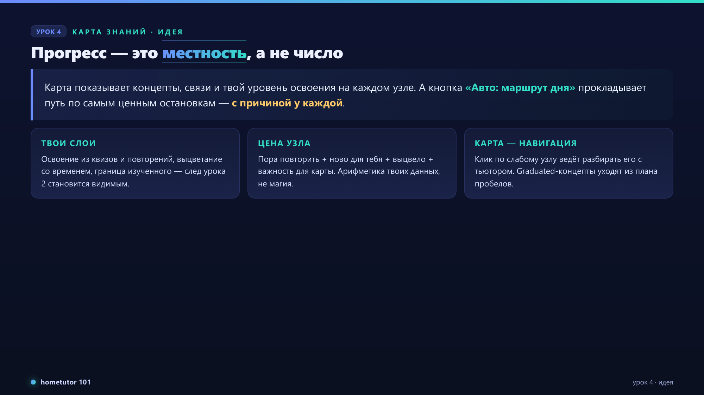
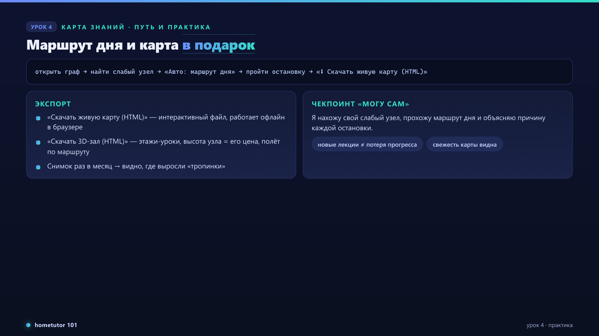

# 📝 Конспект: Урок 4. Карта знаний — прогресс, цена узлов и маршрут дня

*В этом уроке прогресс перестаёт быть счётчиком и становится картой: концепты,
связи, твой уровень освоения на каждом узле — и маршрут дня по самым ценным
остановкам. Карту можно даже скачать одним HTML-файлом и открыть без
приложения. 🚀*

## 📑 Оглавление

- 🎯 Главная мысль
- 🖼 Слайды урока
- 📌 Ключевые темы: карта со слоями; цена узла и маршрут дня; освоение и экспорт
- ⚠️ Ошибки и антипаттерны
- 🛠 Практические выводы
- 🧠 Термины · ❓ Контрольные вопросы · 🎓 Артефакты повторения
- 🏁 Итоги · 🔗 Связь со следующими темами

## 🎯 Главная мысль

Твои знания — местность, а не число: карта показывает концепты, связи и твой
уровень освоения на каждом узле, а «Авто: маршрут дня» прокладывает короткий
путь по самым ценным для тебя остановкам — с причиной у каждой.

## 🖼 Слайды урока

Ключевые кадры из слайд-дека курса — визуальная опора к разделам ниже.

### Главная идея

### Путь и практика

## 📌 Ключевые темы

### 🔹 Карта со слоями: узлы, связи, твой след

#### Суть
Граф знаний строится из материалов (концепты + связи «что на чём основано»);
поверх ложатся личные слои: уровень освоения из квизов и повторений,
выцветание со временем, граница изученного.

#### Простое объяснение
Карта местности после твоих походов: где ходил часто — тропинки протоптаны,
где давно не был — заросло. След из урока 2 здесь становится видимым.

#### Важные нюансы
Карта строится по строгим правилам качества: у каждого концепта и связи есть
подтверждение в тексте лекций. Поэтому она может на шаг отставать от только
что добавленных файлов — свежесть карты честно показывается на главном экране.

### 🔹 Цена узла и «Авто: маршрут дня»

#### Суть
Каждый узел получает честную оценку ценности остановки: пора ли повторять,
ново ли для тебя, выцвело ли, насколько узел важен для остальной карты.
Кнопка «Авто: маршрут дня» выбирает несколько узлов с наибольшей ценой и
выстраивает их в разумном порядке — с причиной одной строкой у каждой
остановки.

#### Почему это важно
Без цены узлов карта — украшение; с ценой — навигация: «куда идти сегодня»
решается за секунды, а не блужданием.

#### Важные нюансы
Никакой магии: цена — арифметика твоих же данных. Клик по слабому узлу ведёт
разбирать его с тьютором — карта соединена с петлёй памяти.

### 🔹 Освоение, праздник и карта в подарок

#### Суть
Экран освоения показывает закреплённые (graduated) и шаткие (weak) концепты;
закреплённое исчезает из плана пробелов. Закрепление концепта продукт
отмечает церемонией «Поздравляем — концепт освоен». Карту можно скачать:
«⬇ Скачать живую карту (HTML)» — интерактивный файл, работающий в браузере
офлайн; «⬇ Скачать 3D-зал (HTML)» — объёмная версия: этажи — уроки, высота
узла — его цена, полёт камеры по маршруту дня.

#### Простое объяснение
Скачанная карта — снимок твоих знаний на сегодня: через месяц скачай новый
и сравни, где выросли тропинки.

## ⚠️ Ошибки, риски и антипаттерны

| Ошибка / риск | Почему возникает | Чем опасно | Как избежать |
|---|---|---|---|
| Ждать карту от 1–2 файлов | Мало материала для связей | «Карта пустая» и разочарование | Добавить несколько документов — карта вырастет |
| Бояться переиндексации | «Вдруг прогресс сгорит» | Курс не пополняется | Прогресс сохраняется — это проверенный сценарий |
| Сравнивать числа разных экранов в моменте | Карта пересобирается с гейтом качества | Ложное «всё сломалось» | Смотреть индикатор свежести карты |
| Начинать с 3D | Красиво | Смысл — в цене узлов, не в объёме | Сначала обычная карта и маршрут дня |

## 🛠 Практические выводы

- Раз в несколько дней: открыть карту → «Авто: маршрут дня» → пройти хотя бы
  первую остановку.
- Слабый узел, в который не веришь, проверяй квизом — карта и самоощущение
  часто расходятся, и это полезно узнать.
- Скачивай живую карту раз в месяц — личный архив роста.

## 🧠 Важные термины и концепции

- **Концепт (узел)** — единица знания, извлечённая из материалов.
- **Mastery (освоение)** — твой уровень по концепту, из квизов и повторений.
- **Graduated** — закреплённый концепт; уходит из плана пробелов.
- **Цена узла (worth)** — оценка ценности остановки: пора повторить + новое +
  выцветание + важность узла для карты.
- **Маршрут дня** — короткий путь по узлам с наибольшей ценой, с причинами.
- **Живая карта (HTML)** — скачанная интерактивная карта, работает офлайн.

## ❓ Контрольные вопросы

1. Из чего складываются личные слои на узлах карты?
2. Почему карта может на шаг отставать от только что добавленных файлов?
3. Что означает причина «пора повторить» у остановки маршрута дня?
4. Что происходит с прогрессом при добавлении новых лекций?

## 🎓 Учебные артефакты для повторения

### Flashcards

| Вопрос | Ответ | Тема |
|---|---|---|
| Что показывает кольцо/цвет на узле карты? | Твой уровень освоения концепта | Слои |
| Что делает «Авто: маршрут дня»? | Выбирает самые ценные остановки и называет причину каждой | Маршрут |
| Куда исчезают graduated-концепты? | Из плана пробелов — система знает, что они закреплены | Mastery |
| Как забрать карту с собой? | «⬇ Скачать живую карту (HTML)» — офлайн-файл для браузера | Экспорт |

### Quiz

1. Цена узла — это… (а) магия ИИ; (б) арифметика твоих данных (повторения, новизна, выцветание, важность). — **б**
2. Клик по слабому узлу… (а) просто выделяет его; (б) ведёт разбирать тему с тьютором. — **б**
3. После добавления новых лекций прогресс… (а) обнуляется; (б) сохраняется, база растёт. — **б**

### План повторения

| Когда | Что повторить | Как проверить себя |
|---|---|---|
| Сегодня | Слои карты и цена узла | Найти сильный и слабый узел на своей карте |
| Через 1 день | Маршрут дня | Пройти маршрут и пересказать причины остановок |
| Через 3 дня | Экспорт | Скачать живую карту и открыть офлайн |
| Через 7 дней | Весь урок | Контрольные вопросы без конспекта |

## 🏁 Итоги и выводы

Карта превращает след твоих занятий в навигацию: видно, что освоено, что
выцветает и куда идти сегодня — с причиной у каждой остановки. А скачанная
живая карта делает прогресс осязаемым артефактом.

## 🔗 Связь со следующими темами

Карта говорит, *что* учить. Урок 5 — про то, *из чего* учить: конспекты с
паспортом качества, статусами твоего понимания, голосом лектора и возвратом
в точную минуту видео.

## ✅ Рубрика качества конспекта

| Критерий | Оценка 1–5 | Комментарий |
|---|---:|---|
| Полнота покрытия лекции | 5 | Слои, цена узла, маршрут, mastery, экспорт — всё отражено |
| Понятность сложных тем | 5 | Worth объяснён как «цена остановки», без формул |
| Качество примеров | 4 | «Карта походов» и снимок роста; мало числовых примеров |
| Использование презентации | н/д | Входной презентации у урока нет |
| Сохранение графической информации | н/д | Графики нет; сама карта — интерактивный экран продукта |
| Проверка точности | 5 | Кнопки и поведение сверены с витриной (scenario_07, 25–27, 33) и кодом графа |
| Практическая применимость | 5 | Ритуал «карта → маршрут дня → первая остановка» |
| Учебные артефакты для повторения | 5 | Flashcards, quiz и план повторения включены |
| Дополнительные материалы | 3 | Внешние ссылки сознательно не включены — курс замкнут на продукт |
| RAG-friendly структура | 5 | Разделы-роли, таблицы, стабильные заголовки |
