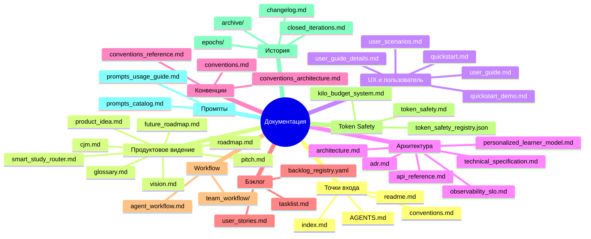
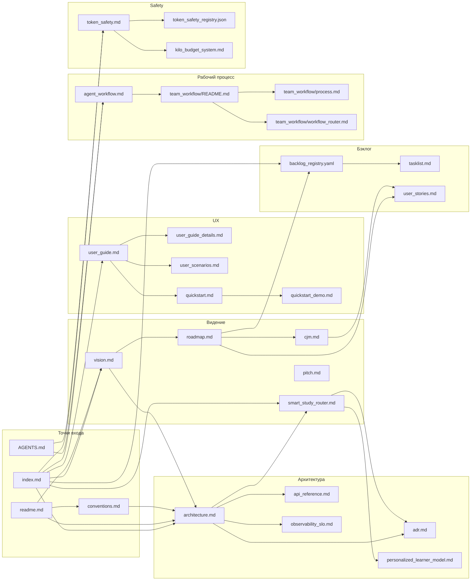

# Онбординг в документацию home-rag_v2

> **Цель**: за 5 минут понять структуру документации, найти свою точку входа
> и не потеряться в большом `doc/`-дереве.

---

## TL;DR — три вещи, которые нужно знать

1. **Единая точка входа** — [index.md](index.md). Оттуда можно попасть почти в любой актуальный раздел.
2. **Интерактивный граф** — [doc_graph.html](doc_graph.html): визуальная карта связей между документами.
3. **Порядок доверия**: код -> живые документы -> справочники -> ADR -> roadmap -> архив.

---

## Инвентаризация: масштаб документации

| Область | Файлов | Что внутри |
|---|---:|---|
| `doc/` корень | ~80 | Основные входные точки, архитектура, roadmap, user guide |
| `doc/user_stories/` | ~97 | User Stories US 1.1 — 20.17 |
| `doc/team_workflow/` | ~49 + поддиректории | Роли, промпты, рабочий процесс, audit/coverage |
| `doc/presentations/` | ~39 | Материалы защиты и презентаций |
| `doc/scenarios/` | ~25 YAML | E2E/demo/regression сценарии |
| `doc/next/` | ~9 | Следующие продуктовые идеи и breakthrough-планы |
| `doc/archive/` | ~20+ | Исторические артефакты |
| `doc/epochs/` | ~25 | Архив эпох e4–e32 |
| **Итого** | **~340+** | Живая документация + история + derived/reference артефакты |

Интерактивный граф строится не по всем файлам подряд, а по документационным
markdown/yaml связям. Текущая генерация: **244 документа, 778 связей**.

---

## Категоризация: 15 групп



---

## Онбординг по ролям — reading paths

### Новичок в проекте

```text
readme.md -> quickstart.md -> vision.md -> user_guide.md -> architecture.md
```

| Шаг | Документ | Время | Что получите |
|---|---|---:|---|
| 1 | [readme.md](readme.md) | 3 мин | Карта файлов, статусы, порядок доверия |
| 2 | [quickstart.md](quickstart.md) | 10 мин | Локальный запуск проекта |
| 3 | [vision.md](vision.md) | 5 мин | Продукт, стек, границы, ценность |
| 4 | [user_guide.md](user_guide.md) | 7 мин | Как пользоваться продуктом |
| 5 | [architecture.md](architecture.md) | 5 мин | Архитектура и потоки данных |

### Product Owner / аналитик

```text
vision.md -> cjm.md -> user_stories.md -> backlog_registry.yaml -> roadmap.md
```

`backlog_registry.yaml` — единственный SSoT для задач. `tasklist.md` —
производный weekly view, его не редактируют вручную.

### Разработчик

```text
conventions.md -> technical_specification.md -> api_reference.md -> agent_workflow.md -> conventions_reference.md
```

Жёсткие правила из [AGENTS.md](../AGENTS.md) и [conventions.md](conventions.md)
применяются ко всем: людям, Codex, Cursor, Claude Code и другим агентам.
Нарушение архитектурных границ считается blocker.

### Архитектор

```text
architecture.md -> adr.md -> conventions_architecture.md -> smart_study_router.md -> observability_slo.md
```

Главный фокус: границы слоёв, ownership модулей, ADR, persistence/graph
контракты и уже известный архитектурный долг.

### Tester / QA

```text
user_scenarios.md -> scenarios/README.md -> agent_workflow_test_bundles.md -> user_guide_details.md
```

Ищите пользовательский сценарий, затем YAML/e2e fixture, затем focused pytest
bundle. Полный test suite запускается только по явному запросу.

### AI-агент: Codex / Claude Code / Cursor

```text
AGENTS.md -> token_safety.md -> agent_workflow_rules.md -> agent_workflow.md -> team_workflow/README.md
```

Token budget: целевой <=12k, 12k–20k — сжимать history/read-set, >20k —
стоп и отчёт. Read-set обычно 2–3 файла, максимум 3–5. Для крупных файлов
используйте signatures/секции/`rg`, а не full-read.

### DevOps / Observability

```text
observability_slo.md -> index_lifecycle.md -> kilo_budget_system.md -> loop_metrics_gate_runbook.md
```

Здесь живут SLO, lifecycle индекса, latency/cost gates и operational runbooks.

### Пользователь / demo operator

```text
user_guide.md -> quickstart_demo.md -> user_scenarios.md -> presentations/defense_README.md
```

Цель — быстро понять пользовательский learning loop и уметь показать его на
демо без погружения в engineering internals.

---

## Граф связей — ядро документации



---

## Ключевые хабы

Актуальный top hubs лучше смотреть через генератор:

```powershell
.\.venv\Scripts\python.exe scripts\generate_doc_graph.py --dry-run
```

На текущей генерации самые связные документы:

| # | Документ | Связей | Роль |
|---:|---|---:|---|
| 1 | [index.md](index.md) | 85 | Мега-навигатор |
| 2 | [prompts_catalog.md](prompts_catalog.md) | 77 | Каталог промптов |
| 3 | [prompts_usage_guide.md](prompts_usage_guide.md) | 49 | Использование промптов |
| 4 | [team_workflow/process.md](team_workflow/process.md) | 45 | Процесс командной работы |
| 5 | [team_workflow/product_owner_router.md](team_workflow/product_owner_router.md) | 40 | PO/router-процесс |
| 6 | [roadmap.md](roadmap.md) | 37 | Карта эпох и волн |
| 7 | [readme.md](readme.md) | 31 | Карта проекта |
| 8 | [team_workflow/workflow_router.md](team_workflow/workflow_router.md) | 27 | Умный роутер рабочего процесса |
| 9 | [documentation_onboarding_guide.md](documentation_onboarding_guide.md) | 27 | Ролевой онбординг |
| 10 | [smart_study_router.md](smart_study_router.md) | 27 | Smart Study Router |

---

## Группировка по статусам и доверию

### Живые документы — верить в первую очередь

| Документ | Назначение |
|---|---|
| [architecture.md](architecture.md) | Реальная архитектура |
| [conventions.md](conventions.md) | Правила кода |
| [conventions_architecture.md](conventions_architecture.md) | Архитектурные границы |
| [user_guide.md](user_guide.md) | Руководство пользователя |
| [vision.md](vision.md) | Продуктовое видение |
| [changelog.md](changelog.md) | Что изменилось |
| [index.md](index.md) | Навигатор |

### Справочники

| Документ | Назначение |
|---|---|
| [api_reference.md](api_reference.md) | HTTP API |
| [observability_slo.md](observability_slo.md) | Метрики и SLO |
| [personalized_learner_model.md](personalized_learner_model.md) | Модель ученика |
| [token_safety.md](token_safety.md) | Safe-read методы |
| [conventions_reference.md](conventions_reference.md) | Справочник по сервисам и контрактам |

### Roadmap — планы и текущие пакеты

| Документ | Назначение |
|---|---|
| [backlog_registry.yaml](backlog_registry.yaml) | SSoT бэклога |
| [roadmap.md](roadmap.md) | Карта эпох |
| [user_stories.md](user_stories.md) | User Stories |
| [tasklist.md](tasklist.md) | Производный weekly view |

### Архив — только для археологии

`doc/archive/`, `doc/epochs/`, исторические prompt/audit artifacts и закрытые
итерации. Если архив противоречит live docs или коду, верить live docs и коду.

---

## Интерактивный граф документации

Граф находится в [doc_graph.html](doc_graph.html). Его можно открыть локально в
браузере.

Что умеет граф:

- **Поиск** по названию или описанию: клавиша `/`.
- **Онбординг по роли**: клик по роли в боковой панели подсвечивает reading path.
- **Фильтрация по категориям**: клик по категории скрывает/показывает группу.
- **Hover**: tooltip с описанием и подсветкой связей.
- **Click**: детальная панель со связанными документами.
- **Minimap**: общий вид графа в правом нижнем углу.
- **Escape**: сброс фильтров и выделений.

Граф работает локально: D3 подключается из [assets/d3.v7.min.js](assets/d3.v7.min.js),
без внешних CDN.

Регенерация:

```powershell
.\.venv\Scripts\python.exe scripts\generate_doc_graph.py
```

Проверка без записи:

```powershell
.\.venv\Scripts\python.exe scripts\generate_doc_graph.py --dry-run
```

JSON для автоматизации:

```powershell
.\.venv\Scripts\python.exe scripts\generate_doc_graph.py --json
```

`--json` пишет чистый JSON в stdout, а human-readable scan log — в stderr.

Obsidian Graph View настроен через [.obsidian/graph.json](.obsidian/graph.json).

---

## Где искать ответы — quick reference

| Вопрос | Где искать |
|---|---|
| Как запустить проект? | [quickstart.md](quickstart.md) |
| Что делает продукт? | [vision.md](vision.md) |
| Как устроена архитектура? | [architecture.md](architecture.md) |
| Какие API-эндпоинты есть? | [api_reference.md](api_reference.md) |
| Какие правила кода? | [conventions.md](conventions.md) |
| Что в бэклоге? | [backlog_registry.yaml](backlog_registry.yaml) |
| Что за Smart Study Router? | [smart_study_router.md](smart_study_router.md) |
| Как работать с AI-агентами? | [agent_workflow.md](agent_workflow.md) |
| Какие промпты есть? | [prompts_catalog.md](prompts_catalog.md) |
| Что изменилось? | [changelog.md](changelog.md) |
| Не нашёл документ | `rg "ключевое слово" doc/` |

---

## Чеклист сопровождения

Когда добавляется или переносится документация:

1. Добавьте ссылку из ближайшего SSoT/hub-документа.
2. Проверьте граф: `.\.venv\Scripts\python.exe scripts\generate_doc_graph.py --dry-run`.
3. Перегенерируйте [doc_graph.html](doc_graph.html), если связи изменились.
4. Обновите [index.md](index.md), если появился новый top-level hub.
5. Обновите [changelog.md](changelog.md), если поменялась навигация или публичный doc-flow.
6. Не редактируйте [tasklist.md](tasklist.md) вручную: это derived view.

> Граф сейчас покрывает 244 связанных документа из большого корпуса `doc/`.
> User Stories, сценарии, архив и презентации частично представлены через
> индексы, README и реальные markdown/yaml ссылки.
