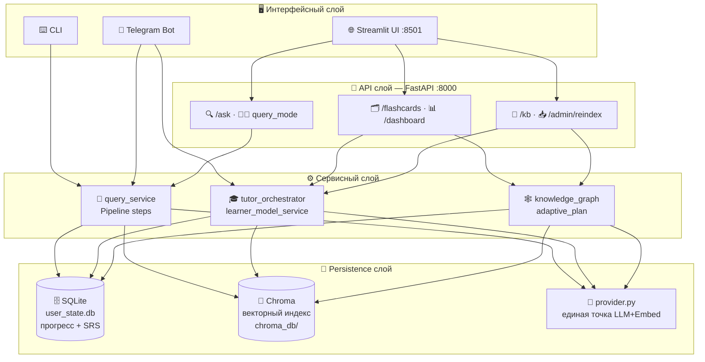
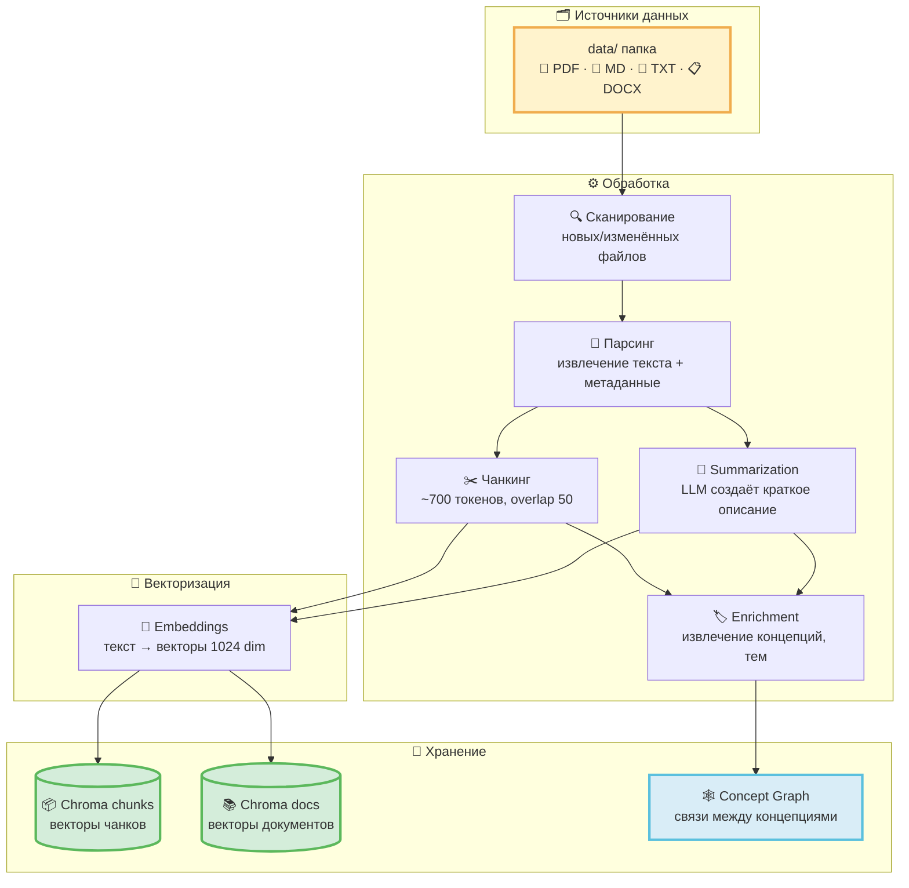
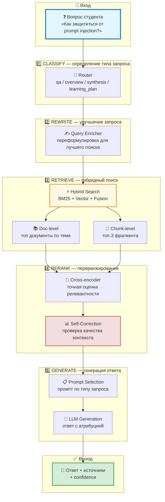

# 🎓 home-rag_v2 — Академическая защита проектной работы

> **Проект:** home-rag_v2 · Персональный учебный ассистент на основе ваших материалов  
> **Дата:** май 2026  
> **Мероприятие:** Академическая защита проектной работы  
> **Формат:** 9 слайдов · Markdown-презентация


---

## Оглавление

1. [🎯 Слайд 1 — Обзор продукта: проблема и решение](#слайд-1--обзор-продукта-проблема-и-решение)
2. [🏗️ Слайд 2 — Архитектура и стек технологий](#слайд-2--архитектура-и-стек-технологий)
3. [🔍 Слайд 3 — RAG: сердце системы — от документов до умных ответов](#слайд-3--rag-сердце-системы--от-документов-до-умных-ответов)
4. [🎓 Слайд 4 — Учебный цикл в действии: вопрос → квиз](#слайд-4--учебный-цикл-в-действии-вопрос--квиз)
5. [📊 Слайд 5 — Прогресс и Рабочее пространство курса](#слайд-5--прогресс-и-рабочее-пространство-курса)
6. [🧭 Слайд 6 — Smart Study Router: система ведёт вас по учебному циклу](#слайд-6--smart-study-router-система-ведёт-вас-по-учебному-циклу)
7. [🖥️ Слайд 7 — Local LLM vs Cloud LLM](#слайд-7--local-llm-vs-cloud-llm)
8. [🔄 Слайд 8 — Процесс разработки: от хаоса к песне](#слайд-8--процесс-разработки-от-хаоса-к-песне)
9. [💡 Слайд 9 — Идеи развития](#слайд-9--идеи-развития)
10. [👥 Слайд 10 — Для кого этот проект](#слайд-10--для-кого-этот-проект)
11. [⚖️ Слайд 11 — Сравнение с конкурентами](#слайд-11--сравнение-с-конкурентами)
12. [📚 Слайд 12 — Связанные документы](#слайд-12--связанные-документы)

---

## Слайд 1 — 🎯 Обзор продукта: проблема и решение


### 💡 Проблема: куча документов → ценность?

У вас есть **папка с материалами**: лекции, статьи, заметки, документация проекта.

**Что вы хотите:**
- Быстро найти ответ на вопрос по этим материалам
- Разобраться в сложной теме, не читая всё подряд
- Запомнить важное и не забыть через неделю
- Увидеть, что вы уже освоили, а что ещё предстоит

**Что происходит сейчас:**
- 🔍 Поиск по файлам → находите фрагмент, но не понимаете контекст
- 💬 ChatGPT → отвечает, но не знает ваших материалов
- 📝 Ручные заметки → создаёте карточки, но это долго и скучно
- 🗂️ Anki → повторяете, но откуда взялись эти карточки?

**Результат:** Вы тратите время на переключение между инструментами, теряете контекст и мотивацию 📉

---

### ✨ Решение: home-rag_v2 — от документов до знания

**Один инструмент. Полный цикл. Локально.**

```
📁 Ваши документы (data/)
        ↓
🔍 Индексация → векторный поиск + граф концепций
        ↓
❓ Вопрос → 📚 Ответ с источниками (проверяемый)
        ↓
👨‍🏫 Tutor → разбор темы через диалог
        ↓
📝 Quiz → проверка понимания
        ↓
🗂️ Flashcards → интервальное повторение (SM-2)
        ↓
📊 Mastery tracking → видите прогресс
        ↓
🎓 Concept Graduation → тема освоена, больше не беспокоит
```

**Принцип:** 🔒 **Local-first** — индекс, прогресс и учебное состояние на вашей машине. Полный offline возможен с локальными LLM.

---

### 🎯 Ключевые достижения проекта

**🎁 Главная ценность:**
- **Превращает кучу документов в структурированное знание** — от вопроса до освоения темы
- **Проверяемые ответы** — каждый ответ с источниками, можно проверить модель
- **Не забываете пройденное** — интервальное повторение и mastery tracking
- **Видите прогресс** — от recognition → recall → transfer → graduation

**🔬 Технологические инновации:**
- **Production-oriented RAG Pipeline** — 5-ступенчатая обработка (Classify → Rewrite → Retrieve → Rerank → Generate)
- **Self-Correction Loop** — опциональная проверка качества контекста с retry
- **Двухуровневая индексация** — Document-level + Chunk-level для разных типов запросов
- **Concept Graph** — граф связей между концепциями для построения learning plan
- **Smart Study Router** — умная подсказка следующего шага (не вы ищете режим, система ведёт вас)

**📊 Измеримые результаты:**
- **Масштабируемость:** поддержка больших локальных корпусов с профилированием bottleneck'ов
- **Производительность:** qa-запросы профилируются по стадиям pipeline
- **Качество:** deterministic checks + LLM-as-Judge + human feedback
- **Экономика:** при Ollama API-стоимость = 0 ₽; cloud зависит от провайдера

**🏗️ Архитектурная зрелость:**
- **14+ закрытых итераций** с полным DoD (Definition of Done)
- **Архитектурные инварианты** — жёсткие правила для maintainability
- **AI-assisted разработка** — автоматизированный workflow с роутером
- **Трёхслойная оценка качества** — Deterministic + LLM-as-Judge + Human Feedback

**🔒 Уникальное позиционирование:**
- **Local-first** — фокус на полном учебном цикле без обязательного облачного state
- **Полный цикл** — от вопроса до интервального повторения в одном инструменте
- **Адаптивность** — персонализированный план на основе mastery score
- **Гибкость** — переключение Local ↔ Cloud через `.env` без изменения кода

---

## Слайд 2 — 🏗️ Архитектура и стек технологий


### 🎨 Четыре слоя системы



---

### 🎯 Ключевые архитектурные решения

**1️⃣ 🔒 Local-first инвариант**  
Chroma и SQLite — локальные файлы. Нет облачного state. При локальных LLM/embeddings сценарий может работать без внешней сети.

**2️⃣ 🤖 Единая точка LLM/Embed — `app/provider.py`**  
Все вызовы LLM и embeddings идут через один модуль. Переключение между Ollama и OpenAI-совместимыми провайдерами делается конфигурацией `.env`, без правок бизнес-логики.

**3️⃣ 🔄 Typed pipeline — `QueryContext`**  
Каждый шаг обработки запроса принимает и возвращает `QueryContext`. Это позволяет добавлять/убирать шаги без рефакторинга.

**4️⃣ 🛡️ Guardrails на всех точках входа**  
API, Streamlit и Telegram проходят через `app/input_validation.py` / `app/guardrails.py`; Telegram использует те же сервисы, что API, но не обязан ходить через HTTP.

**🛠️ Стек:** Python 3.11+ · FastAPI · Streamlit · Chroma · llama-index · SQLite · Ollama / OpenAI-совместимые LLM

---

## Слайд 3 — 🔍 RAG: сердце системы — от документов до умных ответов

> **RAG (Retrieval-Augmented Generation)** — ключевая технология, позволяющая LLM отвечать на основе ваших документов, а не общих знаний


---

### 📥 Ingest Pipeline: превращаем документы в поисковый индекс



**🎯 Ключевые инновации Ingest:**

| Фича | Что даёт | Технология |
|------|---------|-----------|
| **Двухуровневая индексация** | Поиск по документам целиком + по фрагментам | 2 Chroma-коллекции |
| **Partial reindex** | Переиндексация только изменённых файлов | Инкрементальный update |
| **Metadata enrichment** | Концепции, темы, сложность → умная фильтрация | LLM-extraction |
| **Concept Graph** | Связи между концепциями → learning plan | JSON + SQLite |
| **Масштабируемость** | Поддержка больших локальных корпусов, с ограничениями по RAM/embedding throughput | Chroma + llama-index |

**💰 Стоимость индексации:** ~$0.002 на документ (summary + enrichment)

---

### 🔄 RAG Query Pipeline: 5-ступенчатая обработка запроса



**🎯 Детали каждой ступени:**

**1️⃣ CLASSIFY (Router)** — определяет тип запроса и стратегию обработки
- `qa` — точечный вопрос → краткий ответ
- `overview` — обзор темы → список ключевых идей
- `synthesis` — конспект → структурированный документ
- `learning_plan` — план обучения → упорядоченные шаги
- `keyword` — точный поиск → BM25 без векторов

**2️⃣ REWRITE (Enricher)** — улучшает запрос для поиска
- Переформулировка нечётких вопросов
- Генерация подвопросов для обзорных запросов
- Condensing для follow-up вопросов с учётом истории

**3️⃣ RETRIEVE (Hybrid / Vector / Doc-then-chunk)** — режим поиска выбирается настройками
- **BM25** — точное совпадение ключевых слов (HDBSCAN, OWASP)
- **Vector Search** — семантическая близость (синонимы, перефразировки)
- **Reciprocal Rank Fusion** — объединение результатов
- **Doc-level** → сужает корпус до релевантных документов в режиме `doc_then_chunk`
- **Chunk-level** → возвращает фрагменты для точечных qa-запросов

**4️⃣ RERANK (Cross-encoder)** — точная оценка релевантности
- Cross-encoder модель (BAAI/bge-reranker-base)
- Sentence Window — расширение контекста вокруг чанка
- **Self-Correction** — опциональная проверка качества контекста (настраивается):
  - Если score < порога → Query Rewriting → retry (max 1)
  - Если retry не помог → disclaimer «недостаточно данных»

**5️⃣ GENERATE (Synthesize)** — генерация ответа с атрибуцией
- Выбор промпта по типу запроса
- LLM-генерация строго по найденным фрагментам
- Атрибуция источников — кликабельные ссылки на файлы
- Retrieval confidence — объяснительный сигнал на основе scores источников, их количества и покрытия; это не вероятность истинности ответа

---

### 📊 Производительность и стоимость RAG Pipeline

| Метрика | Значение | Комментарий |
|---------|---------|-------------|
| **Latency (qa)** | измеряется profiler/cost logs | Зависит от модели, retrieval mode, reranker и self-correction |
| **Latency (synthesis)** | выше qa | Больше контекста и длиннее генерация |
| **Cost per query (qa)** | считается по usage logs | 0 API-cost при Ollama; cloud зависит от провайдера и токенов |
| **Cost per query (synthesis)** | выше qa | Больше токенов в контексте |
| **Качество (Faithfulness)** | eval-run метрика | Проверяется LLM-as-Judge и regression gate |
| **Качество (Context Recall)** | eval-run метрика | Проверяется на qa/overview/synthesis датасете |
| **Качество (Answer Relevancy)** | eval-run метрика | Зависит от промпта, retrieval и выбранной модели |

---

### 🧪 Экспертный eval-контур: как доказывать качество

| Что проверяем | Метрика / сигнал | Что считается сильным доказательством |
|---|---|---|
| Retrieval | recall@k, MRR, hit rate, route match | Сравнение `vector_only` / `hybrid` / `doc_then_chunk` на одном eval-наборе |
| Grounding | Faithfulness, наличие источников, weak-context disclaimer | Ответ опирается на найденные фрагменты и честно отказывается при слабом контексте |
| Answer quality | Answer Relevancy + human feedback | Ответ полезен именно для учебной задачи, а не просто “похож на правду” |
| Cost / latency | profiler, usage/cost logs | Понятно, какие стадии дороги: rewrite, retrieval, rerank, generation, eval judge |
| Regression | baseline JSON + gate | Новая правка не ухудшает retrieval и tutor-сценарии без явного решения |

**Честная граница:** без опубликованного eval-run нельзя утверждать “лучше всех” или “высокое качество” численно. На защите корректно говорить: “в проекте есть eval-инфраструктура и план измерений; конкретные числа показываются по последнему прогону”.

---

### 🎨 Уникальные фичи RAG в home-rag_v2

**🔹 Двухуровневая индексация**
- Chunk-level — для точечных вопросов
- Doc-level — для обзорных запросов и learning plan
- Позволяет отвечать на «Какие лекции покрывают тему X?»

**🔹 Multi-Prompt Architecture**
- Отдельный промпт для каждого типа запроса
- `qa` → краткий ответ, `synthesis` → подробный конспект
- Улучшение качества ответов за счёт специализации промптов

**🔹 Self-Correction Loop**
- Опциональная автоматическая проверка релевантности контекста
- Retry с переформулировкой при низком score
- Снижение галлюцинаций за счёт отсечения нерелевантного контекста

**🔹 Concept Graph**
- Граф связей между концепциями (JSON + SQLite)
- Prerequisite-цепочки для learning plan
- «Для понимания Self-Correction RAG нужно знать Query Rewriting»

**🔹 Единая точка LLM/Embed — `app/provider.py`**
- Переключение Ollama ↔ OpenAI-совместимых провайдеров через настройки `.env`
- Не ломает pipeline при смене провайдера
- Поддержка local-first storage и опционального cloud inference

---

### 🔬 Трёхслойная оценка качества

```
┌──────────────────────────────────────────────────┐
│  Слой 3: 👤 Human Feedback                       │
│  Кнопки 👍/👎 в UI → JSONL → анализ             │
├──────────────────────────────────────────────────┤
│  Слой 2: 🤖 LLM-as-Judge (опционально)          │
│  Faithfulness, Answer Relevancy, Context Recall  │
│  Async оценка → metrics_store (настраивается)    │
├──────────────────────────────────────────────────┤
│  Слой 1: ⚡ Deterministic Checks (каждый запрос) │
│  Ответ не пустой, есть источники, длина OK,     │
│  нет отказа при наличии контекста, score > порога│
└──────────────────────────────────────────────────┘
```

**Eval Dataset:** Набор тестовых вопросов для проверки качества (qa, keyword, overview, synthesis, негативные)  
**Regression detection:** Автоматическая проверка деградации качества при изменениях

---

### 🚀 Почему этот RAG — production-oriented

Для локального one-user сценария проект закрывает ключевые инженерные риски RAG, но честно не заявляет internet-scale/multi-tenant production без отдельной инфраструктурной доработки.

✅ **Гибридный поиск** — снижает риск пропуска точных совпадений (BM25) и поддерживает семантическую близость (Vector)  
✅ **Self-Correction** — опциональная проверка и улучшение качества контекста  
✅ **Двухуровневая индексация** — работает с вопросами разного масштаба  
✅ **Трёхслойная оценка** — continuous monitoring качества  
✅ **Масштабируемость** — рассчитано на локальные корпуса, с профилированием bottleneck'ов  
✅ **Local-first** — работает без облачного state; полностью offline при локальных LLM/embeddings  
✅ **Прозрачность** — каждый ответ с источниками и retrieval confidence

**Ограничения:** BM25 in-memory, качество OCR/парсинга PDF, локальные модели слабее cloud frontier-моделей, а confidence не является вероятностью истинности ответа.

---

## Слайд 4 — 🎓 Учебный цикл в действии: вопрос → квиз


### 📚 Шаг 1: Быстрый ответ с источниками


**✨ Что показано:**
- 💬 Ответ на вопрос по собственным материалам с **retrieval confidence chip**; значение зависит от найденных источников
- 📎 Три кликабельных источника — фрагменты из индексированных документов
- 🎯 CTA «Учить эту тему 5 минут» — запуск полного учебного цикла

**🔧 Технически:** RAG retrieval → LLM-генерация с атрибуцией → retrieval confidence агрегирует качество и покрытие найденных источников

---

### 📝 Шаг 2: Квиз — немедленная проверка знаний


**✨ Что показано:**
- ❓ Авто-сгенерированный квиз по теме из предыдущего ответа
- 🔗 Контекст передаётся из RAG-ответа — квиз проверяет именно то, что было объяснено
- 🗂️ После квиза — создание flashcard и обновление mastery score концепта

**🎯 Ключевая механика:** один клик от ответа до проверки знания — нет разрыва контекста

---

## Слайд 5 — 📊 Прогресс и Рабочее пространство курса


### 📈 Режим 1: Слабые места и mastery timeline


**✨ Что показано:**
- 📊 Визуализация концептов по уровням: `recognition → recall → transfer`
- 🎓 **Concept Graduation:** концепты со стабильным уровнем `transfer` (7+ дней) получают статус `graduated` и выпадают из активных повторений
- 📈 Mastery timeline — динамика освоения тем за 30 дней
- 🔥 Streak — серия дней с выполненными повторениями

**🧠 Модель прогресса:** каждый концепт имеет mastery score, пересчитываемый после каждого квиза и SRS-оценки. Три уровня освоения: recognition (узнавание) → recall (воспроизведение) → transfer (применение).

---

### 📚 Режим 2: Рабочее пространство курса — изолированный контекст


**✨ Что показано:**
- 📁 Активация папки как отдельного «курса» — изолированный прогресс внутри одного пространства
- 📊 Mastery dashboard курса: какие темы освоены, какие требуют повторения
- 🎯 Вопросы и план контекстуализированы только по материалам курса

**🎨 Уникальная механика:** можно учить несколько курсов параллельно с независимым прогрессом по каждому

---

## Слайд 6 — 🧭 Smart Study Router: система ведёт вас по учебному циклу


### 💡 Проблема: слишком много режимов — что делать дальше?

**У вас есть мощные функции:**
- 📚 Быстрый ответ с источниками
- 👨‍🏫 Tutor для разбора темы
- 📝 Quiz для проверки понимания
- 🗂️ Flashcards для повторения
- 📊 Dashboard прогресса

**Но вы теряетесь:** Что делать прямо сейчас? Задать вопрос? Пройти quiz? Повторить карточки? Открыть dashboard?

**Результат:** Вы вручную угадываете режим и выпадаете из учебного цикла 📉

---

### ✨ Решение: Smart Study Router — умная подсказка следующего шага

**Система сама анализирует ваше учебное состояние и предлагает лучшее действие.**

```
learning state → routing → next_action + reason + кнопка
```

**Пример подсказки в интерфейсе:**

> 💡 **Следующий лучший шаг:** пройти короткий quiz по теме "retrieval pipeline"  
> **Почему:** ответ с источниками уже получен, но понимание ещё не проверено  
> **После quiz:** я создам карточки по слабым местам и обновлю план повторения  
> 
> [**Начать quiz**] [Сначала объяснить проще] [Открыть источники]

---

### 🎯 Состояния роутера: 7 сценариев

| Состояние | Сигнал | Подсказка | Кнопка |
|-----------|--------|-----------|--------|
| `cards_due` | Есть карточки к повторению | "Повторить N карточек сегодня" | **Повторить** |
| `sm2_due` | Просроченные темы по SM-2 | "Пора повторить тему X" | **Повторить тему** |
| `quiz_failed` | Ошибки в quiz / низкий mastery | "Разобрать слабое место" | **Разобрать** |
| `answer_ready` | Есть ответ с источниками | "Учить эту тему" | **Учить тему** |
| `mastery_stale` | Давно не было проверки | "Проверить retention через mini-quiz" | **Проверить** |
| `adaptive_plan` | Есть данные mastery | "Открыть адаптивный план на неделю" | **План** |
| `tutor_resume` | Незавершённая сессия тьютора | "Продолжить с последнего шага" | **Продолжить** |

**Приоритет:** `cards_due` > `sm2_due` > `quiz_failed` > `answer_ready` > остальные

---

### 🔬 Как это работает: детерминированная логика

**Роутер анализирует:**
- `flashcard_due_n` — число карточек к повторению
- `sm2_due_n` — число просроченных тем
- `quiz_feedback_status` — результат последнего quiz
- `has_last_answer_qa` — есть ли свежий ответ
- `first_weak_concept` — самый слабый концепт
- `has_tutor_resume` — незавершённая сессия
- `plan_primary_block` — следующий блок плана

**Результат:**
```python
SmartStudyRecommendation(
    hint_kind="cards_due",
    primary_label_ru="Повторить",
    why_now_ru="У вас 5 карточек к повторению сегодня",
    primary_nav="flashcards_review",
    secondaries=["Учить новую тему", "Открыть план", "Пропустить"]
)
```

---

### 💪 Почему это прорыв

**1. Не вы ищете режим — система ведёт вас**
- Было: "Что мне делать? Открыть tutor? Quiz? Flashcards?"
- Стало: "Следующий шаг: повторить 5 карточек. Почему: retention debt."

**2. Объяснимая подсказка**
- Не просто "Нажми сюда"
- А "Почему именно это действие сейчас полезно"

**3. Безопасные альтернативы**
- Основная кнопка + 2-4 вторичных действия
- Можете выбрать другой путь без потери контекста

**4. Адаптивность**
- Роутер учитывает ваш прогресс
- Приоритеты меняются по мере освоения материала

**5. Сохранение точек входа**
- Tutor, Quiz, Flashcards, Dashboard остаются доступны
- Роутер — это подсказка, а не замена навигации

---

### 🎨 Где работает Smart Study Router

| Поверхность | Когда показывается |
|-------------|-------------------|
| **Home Hub** | Главный экран — карточка "Следующий шаг" |
| **После ответа** | Под ответом с источниками — CTA "Учить тему" |
| **После quiz** | После проверки — "Разобрать слабое место" или "Продолжить" |
| **Adaptive Plan** | В плане — "Следующий блок: gap/review/practice" |
| **Progress Dashboard** | В дашборде — "Что делать с этим прогрессом" |

---

### 📊 Измеримый эффект

| Метрика | До Smart Router | После Smart Router |
|---------|----------------|-------------------|
| **Пользователь знает, что делать дальше** | ⚠️ Угадывает | ✅ Видит подсказку |
| **Retention debt остаётся видимым** | ❌ Скрыт в меню | ✅ Приоритет #1 |
| **Переход от ответа к обучению** | ⚠️ Ручной поиск режима | ✅ Одна кнопка |
| **Выпадение из учебного цикла** | Высокое | Низкое |

---

### 🔥 Это килер-фича продукта!

**Аналогия с workflow router для разработки:**
- Там: `backlog_registry.yaml` → роутер → следующая команда
- Здесь: `learning state` → роутер → следующий учебный шаг

**Результат:**
- Разработчик не держит матрицу решений в голове → роутер ведёт по процессу
- Ученик не выбирает режим вручную → роутер ведёт по учебному циклу

**Это превращает продукт из "набора функций" в "учебного проводника"** 🎯

Подробно: [`doc/presentations/defense_user_router_breakthrough.md`](doc/presentations/defense_user_router_breakthrough.md)

---

## Слайд 7 — 🖥️ Local LLM vs ☁️ Cloud LLM


### ⚖️ Сравнение по ключевым критериям

| Критерий | 🖥️ Local LLM (Ollama) | ☁️ Cloud LLM (OpenAI-совместимые) |
|---|---|---|
| **🔒 Приватность / суверенитет данных** | ✅ Данные не покидают машину | ⚠️ Данные передаются провайдеру |
| **💰 Стоимость** | ✅ 0 ₽ API-cost после установки моделей | 💸 Зависит от провайдера, модели и объёма токенов |
| **📡 Работа без интернета** | ✅ Offline после установки моделей | ❌ Требует подключение |
| **🎯 Качество ответов** | ⚙️ Зависит от модели (llama3, mistral…) | ✅ Высокое у сильных cloud-моделей |
| **⚡ Скорость генерации** | ⚙️ Зависит от GPU/CPU/RAM | ✅ Быстро (серверные GPU) |
| **🖥️ Требования к железу** | 💻 8+ GB RAM, GPU желателен | 🌐 Только браузер / интернет |
| **🔄 Переключение** | `.env` без изменения кода | `.env` без изменения кода |

---

### 🔧 Переключение — конфигурация в `.env`, без изменения кода

```bash
# 🖥️ Local LLM (Ollama, полностью offline)
OPENAI_API_BASE=http://127.0.0.1:11434/v1
OPENAI_API_KEY=local
LLM_MODEL=qwen2.5:7b-instruct
EMBED_MODEL=nomic-embed-text

# ☁️ Cloud LLM (OpenAI-совместимые)
OPENAI_API_BASE=https://openrouter.ai/api/v1
OPENAI_API_KEY=sk-...
LLM_MODEL=gpt-4o-mini
EMBED_MODEL=perplexity/pplx-embed-v1-0.6b
```

**🎯 Код не меняется** — `app/provider.py` абстрагирует провайдера.

---

### 🤔 Когда что выбрать

**🖥️ Local LLM** — если важна приватность учебных материалов (корпоративные данные, личные заметки) или нет постоянного интернета. Хороший старт: компактная instruct-модель и локальная embedding-модель в Ollama.

**☁️ Cloud LLM** — если нужно максимальное качество объяснений и скорость. Подходит для быстрого старта без настройки Ollama.

**🔀 Гибридный подход** (продвинутый): embeddings — локально (конфиденциальность индекса), генерация — облачная LLM. В этом режиме ответы уже не полностью offline, но индекс и учебный state остаются локальными.

---

## Слайд 8 — 🔄 Процесс разработки: от хаоса к песне

### 🎯 Было: ручной конвейер с 15+ переключениями

**Каждый пакет требовал:**
- Открыть 6 разных документов, чтобы понять, что делать дальше
- Вручную запустить 8 команд в правильном порядке
- Помнить, на каком шаге остановился
- Переключаться между терминалом, IDE и документацией
- Проверять DoD вручную перед закрытием

**Результат:** 2-3 часа на один пакет, высокий риск пропустить шаг

---

### ✨ Стало: Smart Router + Cursor SDK = автопилот

**Одна команда. Весь конвейер. От контракта до закрытия.**

```powershell
python scripts/workflow.py --loop --skip-review --watch-contract \
    --trigger-cmd "npx tsx scripts/cursor_agent_trigger.ts" --agent cursor_ai
```

**Что происходит автоматически:**

```
📋 Plan-next → контракт в backlog_registry.yaml
        ↓ (роутер видит изменение)
🎯 Complexity check → orchestration или execution_auto
        ↓
📝 generate_orchestration_prompt.py → 8-шаговый план
        ↓
🤖 run_autonomous.py → doc/current_task.md
        ↓
🚀 Cursor SDK trigger → Agent.prompt (автозапуск)
        ↓
⏳ WATCH execution_contract.md (блокирующее ожидание)
        ↓
✅ run_autonomous --post-agent → DoD + close
        ↓
🔄 Re-route → следующий пакет (если есть)
```

**Ручных шагов:** **1** — принять контракт (Phase 7 plan-next)

---

### 🎨 Умная маршрутизация по сложности

**Роутер анализирует каждый пакет:**

| Сигнал | Что проверяет |
|--------|---------------|
| `write_set_size` | Число файлов в write-set |
| `dod_ops` | Число команд DoD (pytest, lint, …) |
| `outcomes` | Число задекларированных outcomes |
| `user_stories` | Число user story |
| `hot_paths` | Попадания в "горячие" пути (schema/auth/pipeline) |
| `risk_keywords` | Риск-термины в контракте |

**Результат:** `low` / `medium` / `high` → **автоматический выбор маршрута**

```
low complexity / нет US → execution_auto (прямо в код)
medium/high + US/CJM   → orchestration (8 шагов: PO→Analyst→Architect→Dev→Tester)
```

---

### 🚀 Кардинальная трансформация: до и после

| Метрика | Было (ручной) | Стало (Smart Router + SDK) |
|---------|---------------|----------------------------|
| **Команд вручную** | 15+ | 1 |
| **Переключений контекста** | 20+ | 0 (автопилот) |
| **Время на пакет** | 2-3 часа | 15-75 минут (зависит от сложности) |
| **Риск пропустить DoD** | Высокий | Нулевой (автоматическая проверка) |
| **Ручных шагов** | Все | 1 (принять контракт) |
| **Прозрачность** | Полная | Полная (логи каждого шага) |
| **Подходит для волны пакетов** | Утомительно | ✅ (--loop-max N) |

---

### 💡 Почему это прорыв

**1. Единая точка входа** — не нужно помнить матрицу решений
```bash
python scripts/workflow.py  # → роутер сам скажет, что делать
```

**2. Автоматическая оркестрация** — роутер выбирает маршрут по сложности
- Лёгкий пакет → прямо в код
- Тяжёлый пакет → полный конвейер с 8 ролями

**3. Cursor SDK integration** — автозапуск агента без ручного копирования промпта
```typescript
Agent.prompt(task) → execution_contract.md → --post-agent → close
```

**4. Блокирующее ожидание** — терминал занят, но работа идёт
```
⏳ [WATCH] Жду execution_contract.md (опрос каждые 10s)
✅ [WATCH] Обнаружен — запускаю --post-agent
```

**5. DoD-защита** — пакет не закроется, если тесты не прошли
```bash
pytest → lint → coverage → ✅ или ❌ (блокирует close)
```

---

### 🎯 Показатели зрелости процесса

| Метрика | Значение |
|---------|----------|
| **Закрытых итераций** | 14+ с полным DoD |
| **Автоматизация** | 95% шагов (1 ручной из 15+) |
| **Архитектурные инварианты** | Жёсткие правила для maintainability |
| **AI-assisted разработка** | Каждая роль — AI-агент с заточенным промптом |
| **Трёхслойная оценка качества** | Deterministic + LLM-as-Judge + Human Feedback |
| **Время на волну из 3 пакетов** | Было: 6-9 часов → Стало: 1-3 часа |

---

### 🔥 Это просто песня!

**До Smart Router:**
- Открыл документ → прочитал → скопировал команду → запустил → проверил результат → открыл следующий документ → …
- **15+ переключений** на один пакет

**После Smart Router + Cursor SDK:**
```powershell
python scripts/workflow.py --loop --skip-review --watch-contract \
    --trigger-cmd "npx tsx scripts/cursor_agent_trigger.ts" --agent cursor_ai
```
- Принял контракт → **всё остальное автоматически**
- Терминал показывает прогресс в реальном времени
- DoD проверяется автоматически
- Следующий пакет стартует сам

**Результат:** Разработчик фокусируется на решениях, а не на процессе 🎵

---

## Слайд 9 — 💡 Идеи развития

### 🚀 Направления развития

**💻 Desktop Installer & Onboarding Wizard**
- Packaged app (`.exe` / `.dmg` / `.AppImage`) с embedded Python
- GUI-wizard: выбор LLM (local/cloud), первая индексация, demo-сценарий
- **Эффект:** Снижение порога входа с "15 минут в терминале" до "3 клика"

**📊 Learning Outcomes Research**
- Longitudinal study: контрольная vs экспериментальная группа
- Метрики: retention after 7/30 days, quiz scores, time to mastery, transfer tasks
- **Эффект:** Доказательство эффективности, переход от "интересный инструмент" к "доказанно эффективный метод"

**🔄 Workflow Automation (для разработки)**
- SDK Trigger — автозапуск агента из терминала
- Event-driven Watching — реакция на изменения файлов через `watchdog`
- Multi-Agent Parallel Execution — параллельная разработка независимых пакетов

---

## Слайд 10 — 👥 Для кого этот проект

### 🎯 Целевая аудитория и fit-анализ

| Персона | Подходит? | Почему | Что нужно для улучшения |
|---|---|---|---|
| 🆕 **Новичок без опыта программирования** | ⚠️ Частично | Установка требует терминала и Python | Desktop installer с GUI |
| 📚 **Студент с техническим бэкграундом** | ✅ Да | Основная целевая аудитория | — |
| 🔥 **Power User с Anki + Obsidian** | ⚠️ Возможно | Если нужна автоматизация создания карточек из RAG-ответов | Экспорт в Anki, API для интеграций |
| 💼 **Корпоративный пользователь** | ✅ Да | При использовании локальных LLM — полная конфиденциальность | Audit logs, ACL для multi-user |
| 🎓 **Преподаватель** | ⚠️ Пока нет | Нужен групповой режим и dashboard прогресса класса | Multi-user backend, teacher dashboard |
| 💸 **Экономный пользователь** | ✅ Да | При локальных моделях — 0 API-cost | — |
| 🌍 **Международный пользователь** | ⚠️ Зависит | Качество на non-English зависит от модели | Multilingual eval, language-specific tuning |

---

### 🎬 Killer Demo для защиты

**Сценарий "От вопроса до mastery за 3 минуты":**

| Время | Действие | Реплика |
|---:|---|---|
| 0:00-0:20 | Показать материал и готовый индекс | "Это обычные локальные учебные материалы, не специально размеченная база знаний." |
| 0:20-0:55 | Задать сложный вопрос | "Вопрос требует синтеза из нескольких фрагментов, а не поиска одного определения." |
| 0:55-1:20 | Показать ответ, citations и confidence | "Я вижу, на каких источниках стоит ответ, и могу проверить модель." |
| 1:20-1:40 | Нажать "Учить эту тему" | "В большинстве RAG-систем сценарий заканчивается здесь. У нас он только начинается." |
| 1:40-2:05 | Пройти 1-2 шага tutor | "Tutor вытаскивает понимание через вопрос, а не просто читает лекцию." |
| 2:05-2:25 | Ответить на quiz | "Система проверяет, понял ли я тему, а не только получил ли красивый ответ." |
| 2:25-2:40 | Создать flashcard | "Важное превращается в карточку без ручного копирования." |
| 2:40-3:00 | Открыть mastery dashboard и adaptive plan | "Финал: система обновляет модель знания и предлагает следующий шаг." |

**Сильный демо-вопрос:**  
"Почему RAG-ответ сам по себе недостаточен для обучения, и как связка tutor, quiz, flashcards и mastery plan закрывает этот разрыв? Укажи, какие части ответа подтверждаются источниками."

**🎯 Что это доказывает:** Это не просто "RAG-чат" и не просто "SRS-система", а **полный учебный цикл: источник → объяснение → проверка → запоминание → план**.

Подробный сценарий, лог идеальной сессии и fallback-план: [`doc/presentations/defense_killer_demo.md`](doc/presentations/defense_killer_demo.md).

---

## Слайд 11 — ⚖️ Сравнение с конкурентами


### 📊 home-rag_v2 vs Альтернативы

| Функция | home-rag_v2 | NotebookLM | Anki | ChatGPT + Files | Obsidian |
|---|---|---|---|---|---|
| **📚 Q&A по документам** | ✅ RAG с источниками | ✅ Да | ❌ Нет | ✅ Да | ⚠️ Через плагины |
| **🎓 Автоматические квизы** | ✅ Из RAG-ответа | ❌ Нет | ⚠️ Ручное создание | ❌ Нет | ❌ Нет |
| **🗂️ SRS / Flashcards** | ✅ SM-2 + mastery | ❌ Нет | ✅ Лучший в классе | ❌ Нет | ⚠️ Через плагины |
| **📊 Mastery tracking** | ✅ 3 уровня + graduation | ❌ Нет | ⚠️ Базовый | ❌ Нет | ❌ Нет |
| **📅 Адаптивный план** | ✅ На основе mastery | ❌ Нет | ⚠️ Базовый SRS | ❌ Нет | ❌ Нет |
| **👨‍🏫 Tutor-режим** | ✅ Сократический диалог | ❌ Нет | ❌ Нет | ⚠️ Ручной промпт | ❌ Нет |
| **🔒 Local-first** | ✅ Полностью | ❌ Cloud-only | ✅ Да | ❌ Cloud-only | ✅ Да |
| **💰 Стоимость** | ✅ Open-source + опц. cloud | ✅ Бесплатно | ✅ Бесплатно | 💸 $20/мес Plus | ✅ Бесплатно |
| **🖥️ Offline-режим** | ✅ С локальными LLM | ❌ Нет | ✅ Да | ❌ Нет | ✅ Да |
| **🎯 Фокус** | Полный учебный цикл | Document Q&A | SRS-карточки | General AI assistant | Note-taking |

---

### 🎯 Уникальное позиционирование

**home-rag_v2 — это единственный инструмент, который:**
- Отвечает по вашим материалам (как NotebookLM)
- Создаёт квизы автоматически из ответов
- Интегрирует SRS с mastery tracking (как Anki, но автоматически)
- Строит адаптивный план повторения
- Работает полностью локально (как Obsidian + Anki)
- Закрывает весь цикл: вопрос → ответ → tutor → quiz → SRS → план

**Конкуренты сильны в отдельных частях, но не закрывают полный учебный цикл.**

---

### 💡 Когда выбрать альтернативу

| Ситуация | Рекомендация |
|---|---|
| Нужен только Q&A по документам без обучения | **NotebookLM** — проще и бесплатно |
| Уже есть отлаженный workflow с Anki | **Anki** — не ломайте работающее |
| Нужен general AI assistant, не только учёба | **ChatGPT Plus** — шире возможности |
| Фокус на note-taking и knowledge management | **Obsidian** — лучший в классе |
| Нужен полный учебный цикл с автоматизацией | **home-rag_v2** — это наша ниша |

---

## Слайд 12 — 📚 Связанные документы

### 📖 Документация проекта

| Документ | Описание |
|---|---|
| 📘 [doc/user_guide.md](doc/user_guide.md) | Основные режимы работы, интерфейс, настройки |
| 🚀 [doc/quickstart_demo.md](doc/quickstart_demo.md) | Установка, первый запуск, демо-сценарии за 15 минут |
| 🧠 [doc/personalized_learner_model.md](doc/personalized_learner_model.md) | Модель обучаемого: SRS, Concept Graduation, адаптивный план |
| 🎬 [doc/scenarios/README.md](doc/scenarios/README.md) | 14 сценариев использования с e2e-тестами и скриншотами |
| 📸 [doc/screenshots/README.md](doc/screenshots/README.md) | Индекс всех скриншотов по сценариям |
| 🔧 [doc/user_guide_details.md](doc/user_guide_details.md) | Расширенные функции, настройки, troubleshooting |
| 👥 [doc/team_workflow/process.md](doc/team_workflow/process.md) | Командный конвейер: роли, артефакты, DoD |
| 🤖 [doc/team_workflow/workflow_router.md](doc/team_workflow/workflow_router.md) | Smart Router: 6 состояний, авто-цикл, идеи развития |
| 🎓 [doc/presentations/defense_virtual_defense.md](doc/presentations/defense_virtual_defense.md) | Виртуальная защита: каверзные вопросы и ответы |
| 🧑‍⚖️ [doc/presentations/defense_expert_panel.md](doc/presentations/defense_expert_panel.md) | Экспертная RAG/AI-защита: сложные вопросы, ответы, найденные бреши |
| 👥 [doc/presentations/defense_user_panel.md](doc/presentations/defense_user_panel.md) | Пользовательская защита: вопросы от новичков, power users, хейтеров и критиков |

---

### 🎯 Ключевые достижения проекта

✅ **Полный учебный цикл** — от вопроса до интервального повторения в одном инструменте  
✅ **Production-oriented RAG** — 5-ступенчатый pipeline с Self-Correction и настраиваемыми режимами retrieval  
✅ **Local-first** — индекс, прогресс и учебное состояние на вашей машине; offline возможен с локальными моделями  
✅ **AI-assisted разработка** — 14+ итераций с автоматизированным workflow  
✅ **Масштабируемость** — есть partial reindex, кеши и profiler для больших локальных корпусов  
✅ **Гибкость** — переключение Local ↔ Cloud LLM через `.env`, без изменения кода  

<sub>📅 Документ подготовлен для академической защиты проектной работы · май 2026</sub>
