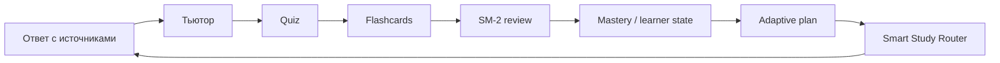

# hometutor — персональный AI-тьютор на ваших материалах

## Полный учебный цикл, local-first, построенный AI-фабрикой разработки

> **Проект:** hometutor · персональный учебный ассистент на основе ваших материалов
> **Дата:** июнь 2026
> **Формат:** 15 слайдов · Markdown-презентация (+ HTML-дек `defense_presentation_v5.html`)
> **Версия:** 5.0 — переписана после миграции `home-rag_v2` → `hometutor` (продукт) + `hometutor-studio` (фабрика)


---

## Главный тезис

> **hometutor — это не Q&A по документам.**
> Это инструмент, который ведёт пользователя по всему учебному циклу:
> вопрос → объяснение → проверка → запоминание → план — на ваших собственных
> материалах, с возможностью работать полностью локально.
>
> **И второй тезис, новый в версии 5.0:** продукт построен и продолжает
> развиваться **AI-фабрикой разработки** — воспроизводимым процессом, где
> документ — закон, скрипт — движок, агент — руль.

Три ключевых свойства продукта:

- **Local-first** — может работать без облака; данные остаются на машине пользователя
- **Полный цикл** — от ответа до интервального повторения в одном инструменте
- **Управляемость** — система предлагает следующий шаг, а не оставляет пользователя перед пустым чатом

---

## Слайд 1 — Сильный ход: миграция «монолит → продукт + фабрика»

> Главное изменение с прошлой защиты: репозиторий `home-rag_v2` разделён на
> два независимых, чистых дерева. Это не косметика — это смена уровня зрелости.

```
            home-rag_v2  (один смешанный репозиторий)
                          │
        ┌─────────────────┴─────────────────┐
        ▼                                     ▼
  hometutor                            hometutor-studio
  ПРОДУКТ (runtime)                    ФАБРИКА (dev factory)
  app/ · ingest.py · main.py           doc/ · tests/ · scripts/
  Docker · deploy/                     backlog · ADR · team-workflow
  93 endpoint                          3 011 тест-функций
  то, что запускает пользователь       то, что производит продукт
```

| Что дала миграция | Эффект |
|---|---|
| Чистый runtime-репозиторий | пользователь/деплой получают только продукт, без процессного шума |
| Отдельная «студия» | backlog, тесты, ADR, presentations, оркестрация — вне runtime |
| Независимые git-истории | baseline хранит `code_sha` + `docs_sha`, рассинхрон исключён |
| Актуализированные docs продукта | `docs/architecture.md`, `docs/technical_specification.md` пересобраны по коду на **2026-06-23** |

**Почему это «прорыв качества»:** продукт теперь можно показывать, деплоить и
аудировать независимо от того, как он делается. А процесс разработки —
самостоятельный артефакт, которым можно гордиться отдельно.

---

## Слайд 2 — Проблема и решение

### Проблема: куча документов → ценность?

| Что хочется | Что происходит сейчас |
|---|---|
| Быстро найти ответ по своим материалам | универсальный чат не знает ваших документов |
| Разобраться в сложной теме | поиск по файлам даёт фрагменты без контекста |
| Запомнить надолго | ручные Anki-карточки — долго и рутинно |
| Видеть прогресс | непонятно, что освоено, а что нет |

**Следствие:** переключение между несколькими инструментами и потеря контекста.

### Решение: один инструмент, полный цикл, local-first

```
Документы → Q&A → Тьютор → Квиз → Карточки → Mastery → Graduation
                                                  ↑
                                       Smart Study Router
                                    (подсказка следующего шага)
```


---

## Слайд 3 — Полный учебный цикл

> В типичной RAG-системе сценарий заканчивается на ответе. Здесь ответ — это первый шаг цикла.

| Шаг | Что делает система |
|---|---|
| 1. Ответ | RAG-ответ + источники + оценка confidence |
| 2. Тьютор | объяснение и наводящие вопросы вместо лекции |
| 3. Квиз | проверка понимания, а не только прочтения |
| 4. Карточка | перенос важного в SM-2 карточку без копипасты |
| 5. Повторение | интервальное повторение, мягкое восстановление после пропуска |
| 6. Mastery | recognition → recall → transfer → graduation |



**Идея:** не отдельный «RAG-чат» и не отдельная «SRS-система», а связка
источник → объяснение → проверка → запоминание → план.

---

## Слайд 4 — Архитектура продукта (актуализировано 2026-06-23)

### Четыре слоя

```
┌──────────────────────────────────────────────────────────────┐
│  UI       Streamlit · app/ui/main.py · ходит в API через      │
│           ui_client.py                                         │
├──────────────────────────────────────────────────────────────┤
│  API      FastAPI · main.py + app/api.py · 16 роутеров ·      │
│           93 endpoint · require_api_key для защищённых         │
├──────────────────────────────────────────────────────────────┤
│  Services RAG · Tutor · SSR · Quiz · Flashcards · Graph ·     │
│           Learner state                                        │
├──────────────────────────────────────────────────────────────┤
│  Storage  SQLite (user_state.db) · Chroma · BM25 ·            │
│           index_registry.json · graph_generations/            │
└──────────────────────────────────────────────────────────────┘
       LLM/Embeddings: OpenAI-совместимый провайдер
       llama.cpp / LM Studio (local) ↔ Cloud  — через app/provider.py
```

**Стек:** Python · FastAPI · Uvicorn · Streamlit · llama-index · Chroma ·
BM25/hybrid · pydantic-settings · aiogram (Telegram) · SQLite · OpenTelemetry (optional).

### Архитектурные правила (из `docs/architecture.md`)

- **Тонкий UI / тонкие роутеры** — бизнес-логика в сервисах
- **Конфиг только через** `get_settings()` / `get_retrieval_settings()`
- **Все LLM/embedding-клиенты — через** `app/provider.py` (единая точка Local↔Cloud)
- **Доступ к состоянию — через** `app/user_state*.py`, без ad-hoc SQL в UI/роутерах
- **Не плодить публичные retrieval-режимы**, если хватает bounded RAG-профиля

---

## Слайд 5 — RAG: ядро системы

### Пайплайн запроса


### Что заложено в RAG

- **Гибридный поиск** — BM25 + векторный (`hybrid`), плюс `vector_only`, `bm25_only`, `doc_then_chunk`
- **Публичные профили** (ADR-021) — `fast` / `quality` / `graph_aware`; raw retrieval mode остаётся config/debug-поверхностью, не публичным API
- **Multi-query expansion + lost-in-middle reorder** — расширение запроса переформулировками и переупорядочивание контекста против деградации на длинных окнах
- **Заземление** — каждый тезис с inline-цитатой `[N]`; при слабом контексте — честный отказ от ответа

**Измерено** (retrieval-only eval, demo-набор из 15 вопросов): recall@3 ≈ **86–87 %**
(hybrid) против 80 % (vector-only); средняя retrieve-латентность ≈ **0.57 с**.

---

## Слайд 6 — Smart Study Router и AI Vision L1–L5

> Проблема «много режимов — что делать дальше?» решается deterministic-first
> контуром: система считает локальные сигналы, выбирает `hint_kind` и
> следующий шаг, объясняет «почему сейчас» и предлагает безопасные альтернативы.

**Базовая маршрутизация объяснима и работает без облачного профиля пользователя.**
AI/ML подключается как gated enrichment/reranking — не как обязательная зависимость.

| Уровень | Что добавляет | Статус |
|---|---|---|
| L1 — локальная память | ML forgetting curve, reranking (целевой AUC-ROC ≥ 0.75) | доставлен; serving после накопления real samples |
| L2 — объяснения | LLM-объяснения с semantic caching (целевой p95 < 2 с) | доставлен |
| L3 — недельный план | rule-based weekly planner + telemetry | доставлен |
| L4 — граф prerequisites | prerequisite-aware routing | доставлен (за feature-flag) |
| L5 — обучение на отказах | misroute policy learning (offline, с decay) | доставлен |


---

## Слайд 7 — Доверие и заземление (Grounding Contract)

> Цель — чтобы каждый тезис ответа опирался на конкретный фрагмент источника.

### Механизмы

- **Inline-цитаты `[N]`** — факт ссылается на фрагмент контекста
- **Provenance ledger** — машинно-проверяемая связь факт → источник → chunk
- **Honest abstain** — при слабом контексте система отказывается, а не догадывается
- **Over-/under-citation tolerance** — лишние/недостающие ссылки локальной модели не ломают валидный ответ и не маскируют пробелы
- **Confidence-оценка** — пользователю видно, насколько ответ обоснован

### Трёхслойная оценка качества

```
Deterministic checks  →  LLM-as-Judge  →  Human Feedback
   (быстро, дёшево)      (faithfulness)    (реальная польза)
```

Дополнительно — RAGAS-метрики (context_precision@k, answer_correctness)
поверх существующего eval-harness.

---

## Слайд 8 — Локальная модель: qwopus3.6-35B на llama.cpp

### Benchmark 2026-06-20: 3 кандидата, 8 задач + real RAG-smoke

| Модель | rank | ток/с | quality | RAG smoke |
|---|---|---|---|---|
| **qwopus3.6-35B-A3B-MTP** | 99.55 | ~185 | 11.5/11.5 | PASS |
| qwopus3.6-27B-v2-MTP | 93.55 | ~46 | 11.5/11.5 | — |
| qwen3.6-27B | 93.21 | ~43 | 11.5/11.5 | — |

Принятая модель примерно **в 4 раза быстрее** предыдущих кандидатов при
сопоставимом качестве (≈185 против ≈43–46 ток/с).

### Local vs Cloud — выбор за пользователем, без изменения кода

| Критерий | Local (llama.cpp) | Cloud |
|---|---|---|
| Приватность | данные на машине пользователя | данные уходят провайдеру |
| Стоимость API | 0 ₽ | зависит от провайдера |
| Переключение | `.env` / overlay docker-compose | то же |

> Эволюция модели и backend (LM Studio → llama.cpp) проходит **без переписывания
> кода** — благодаря единой точке `app/provider.py` и OpenAI-совместимому API.

---

## Слайд 9 — AI-фабрика разработки (`hometutor-studio`)

> Это и есть «следующий уровень»: продукт делается не вручную, а воспроизводимым
> AI-конвейером. Миграция выделила фабрику в отдельный репозиторий.

### Принцип: «документ — закон, скрипт — движок, агент — руль»

| Компонент фабрики | Что даёт |
|---|---|
| **Backlog registry (SSoT)** | `backlog_registry.yaml` — единственный источник статусов; `tasklist.md` производный |
| **Командный конвейер** | PO → Analyst → Architect → Dev → Tester как воспроизводимый процесс |
| **Token-safety registry** | предсказуемый бюджет контекста для каждого LLM-вызова (≤12k) |
| **Умный роутер шагов** | `scripts/workflow.py --loop` запускает следующий пакет из реестра |
| **Локальный coding-trigger** | llama.cpp как controlled patch-executor: diff → WRITE_SET gate → `git apply` → targeted tests |
| **23 ADR** | значимые архитектурные решения задокументированы |

### Evidence-gated поставка

Каждый пакет закрывается только при пройденных DoD-тестах и обновлённых
документах. Защитные правила (kill-switches) блокируют поставку: filename-fallback
выдаётся за semantic-граф · связь без evidence · graph-aware без uplift-gate ·
скрытый cloud-вызов в local-профиле.

---

## Слайд 10 — Метрики (воспроизводимые числа)

| Метрика | Значение | Источник |
|---|---|---|
| User Stories закрыто | **96 / 96** | `user_stories_index.json` (v1, 2026-06-21) |
| CJM моменты истины | 13 / 13 | `cjm.md` |
| Пакетов закрыто | **242** | `backlog_registry.yaml` (`status: closed`) |
| Волн завершено | 87 | `backlog_registry.yaml` (`status: completed`) |
| Тест-функций pytest | **3 011** | `grep "def test_" tests/` |
| FastAPI endpoints | 93 | `app/routers/` |
| Architecture Decision Records | 23 | `adr.md` |
| Retrieval recall@3 (hybrid, demo) | ≈ 86–87 % · latency ≈ 0.57 с | `eval/` |
| Local LLM throughput | ≈ 185 ток/с (qwopus35B) | benchmark 2026-06-20 |
| Актуализация docs продукта | architecture / tech-spec по коду | 2026-06-23 |

> Числа воспроизводимы из репозиториев и логов. Часть eval-метрик получена на
> demo-наборе и помечена соответственно. **Изменения с v4:** US 87→96, тесты 3008→3011,
> архитектурные docs пересобраны после миграции.

---

## Слайд 11 — Конкурентный анализ

*Анализ выполнен AI-assisted: матрица по критериям → gap-анализ → позиционирование.*

| Критерий | hometutor | NotebookLM | Anki | ChatGPT+Files | Obsidian |
|---|---|---|---|---|---|
| Q&A по документам | RAG + источники | ✅ | ❌ | ✅ | частично |
| Автоквизы из ответов | ✅ | ❌ | ручные | ❌ | ❌ |
| SM-2 карточки | авто | ❌ | сильнейший | ❌ | частично |
| Mastery tracking | 3 уровня | ❌ | базово | ❌ | ❌ |
| AI-тьютор | ✅ | ❌ | ❌ | ручной | ❌ |
| Подсказка следующего шага | ✅ | ❌ | ❌ | ❌ | ❌ |
| Evidence-backed граф | ✅ | частично | ❌ | ❌ | ручной |
| Local-first | ✅ | cloud | ✅ | cloud | ✅ |
| Стоимость | 0 ₽ (local) | бесплатно | бесплатно | $20/мес | бесплатно |

> Сильная сторона hometutor — закрытие **полного** учебного цикла локально в одном
> инструменте. Перечисленные продукты сильны в отдельных частях цикла.

---

## Слайд 12 — Дорожная карта

### Закрыто (фундамент)

Миграция «продукт + фабрика» · Localhost Delight loop · SSR AI Vision L1–L5 ·
Course Graph Evidence · Grounding Contract · Flashcard fast-path ·
Golden E2E graduation · Local llama.cpp coding-trigger smoke ·
Advanced RAG (multi-query expansion + lost-in-middle reorder).

### Очередь кандидатов (`proposed`)

| Направление | Ценность |
|---|---|
| Measurement loop (RAGAS + Langfuse) | метрики качества + трассировка прогонов |
| Smart Notes (native generation) | авто-конспект из материалов |
| PII masking (redaction sink) | маскирование чувствительных данных |
| Skills Platform | тонкие skill-адаптеры workflow |
| Local Code Executor | первая реальная low-risk задача в trigger path |

### Дальний горизонт

Desktop installer · SSR serving promotion (после накопления real samples) ·
Learning Outcomes research · collaborative learning.

---

## Слайд 13 — Демо: «от вопроса до mastery за ~3 минуты»

| Время | Действие | Реплика |
|---:|---|---|
| 0:00 | Папка с обычными материалами + готовый индекс | «Это локальные конспекты, не размеченная база.» |
| 0:30 | Сложный вопрос (синтез из нескольких фрагментов) | «Нужен синтез, а не одно определение.» |
| 0:55 | Ответ + citations + confidence | «Видно, на чём стоит ответ, и можно проверить.» |
| 1:20 | «Учить эту тему» | «У многих RAG здесь конец, тут — переход в обучение.» |
| 1:45 | 1–2 шага tutor + quiz | «Проверяется понимание, а не формулировка.» |
| 2:25 | Создать flashcard | «Важное → карточка без копипасты.» |
| 2:45 | Mastery dashboard + adaptive plan | «Система обновляет модель знания и предлагает шаг.» |

**Демо-вопрос:**
> «Почему RAG-ответ сам по себе недостаточен для обучения, и как связка
> tutor → quiz → flashcards → mastery plan закрывает этот разрыв? Укажи, какие
> части ответа подтверждаются источниками.»


---

## Слайд 14 — Что показать живьём (чек-лист защиты)

- **Продукт:** запустить `scripts/local_start.ps1` → задать вопрос → пройти цикл до mastery
- **Local-first:** показать `.env` с локальным провайдером и нулевой стоимостью API
- **Заземление:** раскрыть источники, показать honest abstain на «вопросе вне базы»
- **Фабрика:** показать `backlog_registry.yaml` (SSoT) и `scripts/workflow.py` (роутер шагов)
- **Числа:** `grep "def test_" tests/` → 3 011; `git log` двух репозиториев → независимые истории

> Всё демонстрируемое воспроизводимо из репозиториев `hometutor` и `hometutor-studio`.

---

## Слайд 15 — Итоги

> **hometutor — персональная система обучения**, которая знает ваши материалы,
> отслеживает прогресс и предлагает следующий шаг — от первого вопроса до
> graduation, с возможностью работать полностью локально.

### Три довода

1. **Полный цикл** — источник → объяснение → проверка → запоминание → план → graduation в одном инструменте
2. **Подкреплено числами** — 96/96 US · 13/13 MoT · 3 011 тест-функций · 242 пакета · 93 endpoint · 23 ADR
3. **Зрелый процесс** — продукт и AI-фабрика разделены чисто; local-first ≈185 ток/с, 0 ₽ за API

**Local-first. Полный цикл. Доказуемое качество. Построено AI-фабрикой.**

---

<sub>Подготовлено для защиты проектной работы · июнь 2026 · Версия 5.0 ·
переписана после миграции `home-rag_v2` → `hometutor` + `hometutor-studio`.
Сопутствующий визуальный дек: `defense_presentation_v5.html`.</sub>
