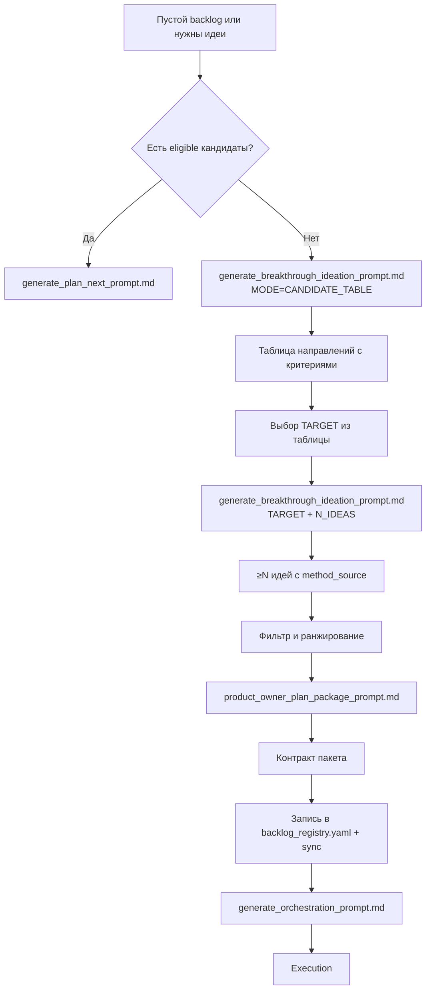

# Roadmap — История Прорывов и Карта Развития

> **Живая история продукта:** от первого RAG-ответа до полноценной учебной платформы с персонализацией, retention-механиками и course graduation.

Актуализировано: **2026-06-21**

Этот документ — **человекочитаемая карта эволюции продукта**: как каждая эпоха, волна и пакет меняли пользовательский опыт, какие прорывы были достигнуты, и куда двигаться дальше. Он **не** заменяет машинный SSoT, но показывает **смысл** за цифрами.

---

## 🎯 Навигация по документу

| Раздел | Для кого | Зачем читать |
|--------|----------|--------------|
| [§1 Источники истины](#1-источники-истины-где-правда-о-что-сделано) | Все | Понять, где искать факты о реализации |
| [§2 Эволюция продукта](#2-эволюция-продукта-от-rag-к-learning-platform) | Product Owner, Stakeholders | Увидеть трансформацию продукта за 47 дней |
| [§3 Ключевые вехи](#3-ключевые-вехи-прорывы-которые-изменили-продукт) | Team, Investors | Понять, какие решения были критичными |
| [§4 Эпохи E4–E13](#4-стратегические-эпохи-e4e13-закрытый-горизонт) | Architects, Historians | Контекст foundation-периода |
| [§5 Волны поставки](#5-волны-поставки-registry-waves-хронология) | Engineers, PMs | Детальная хронология 67 волн |
| [§6 Анализ воздействия](#6-анализ-воздействия-что-принесла-каждая-волна) | Product Analysts | Связь волн с CJM и пользовательской ценностью |
| [§7 Связь с CJM и US](#7-связь-с-cjm-и-user-stories) | UX Designers | Покрытие моментов истины |
| [§8 Прорывные направления](#8-прорывные-направления-куда-двигаться-дальше) | Innovators, Strategists | Генерация новых идей через breakthrough ideation |

---

## 1. Источники истины: где правда о «что сделано»

| Вопрос | Документ / артефакт | Комментарий |
|--------|---------------------|-------------|
| Активные и очередные пакеты, статусы, DoD, `wave_id` | [`backlog_registry.yaml`](backlog_registry.yaml) | Единственный SSoT для execution |
| Текущий снимок «Now» и очередь из реестра | [`tasklist.md`](tasklist.md) | Производный; генерация: `scripts/backlog_registry_lint.py --sync-from-index --write-sync` |
| Журнал закрытых пакетов (детали, ссылки на архивы) | [`closed_iterations.md`](closed_iterations.md) | История; для planning чаще достаточно grep + целевой `doc/epochs/*.md` |
| Индекс эпох с датами и фокусом | [`closed_iterations.md`](closed_iterations.md) § «Индекс Эпох» | Таблица E14–E29+ и ссылки на `doc/epochs/` |
| Правила нумерации, tail-policy, Truth View | [`roadmap_governance.md`](roadmap_governance.md) | Governance, не список фич |
| Стратегический заголовок после foundation | [`future_roadmap.md`](future_roadmap.md) | Закрытый индекс E4–E13 + правила re-entry |
| Моменты истины и Pain → US | [`cjm.md`](cjm.md) | §4 MoT, §7 генерируемая таблица |
| Покрытие US машинно | [`user_stories_index.json`](user_stories_index.json) | `open_candidates`, `items[]` |
| Продуктовый нарратив и гипотезы | [`product_idea.md`](product_idea.md) | Не SSoT о факте реализации |
| Границы и снимок «что это за продукт» | [`vision.md`](vision.md) | Конфликт с кодом → код + реестр |

**Итог:** соответствие **коду и реестру** проверяйте по **`backlog_registry.yaml`** и тестам/DoD пакетов; этот файл и `product_idea.md` — для навигации и планирования.

---

## 2. Эволюция продукта: от RAG к Learning Platform

### 2.1 Трансформационная дуга (апрель 2026)

```mermaid
timeline
    title Эволюция home-rag: 47 дней трансформации
    section Foundation (E4-E7)
        2026-04-07 : E4 Graph Intelligence
                   : Knowledge Graph + Provenance
        2026-04-08 : E5 Personalization
                   : Learner State + Migration
        2026-04-09 : E6 Agentic Tutor
                   : Pedagogical Router
        2026-04-09 : E7 Production
                   : Health Gates + SLO
    section User Value (E8-E10)
        2026-04-10 : E8 Value Delivery
                   : CJM Discipline
        2026-04-10 : E9 Trust & Continuity
                   : Learning Loop
        2026-04-11 : E10 Quality
                   : Adaptive Quiz + Eval
    section Experience (E11-E13)
        2026-04-11 : E11 Guided Start
                   : 5-min Loop + Router
        2026-04-11 : E12 Flashcards
                   : SRS + SM-2
        2026-04-12 : E13 Home UX
                   : Mode Selector
    section Scale (E14-E30)
        2026-04-12 : E14-E29 Maturity
                   : 162 packages closed
        2026-04-26 : E30 Course Cockpit
                   : Single-pane learning
    section Platform (May 2026)
        2026-05-02 : Arch Review
                   : 12 god-module splits
        2026-05-02 : Workflow DX
                   : Autonomous delivery
        2026-05-06 : Quality Defense
                   : Eval baseline + adversarial RAG
    section Local Dev Loop (June 2026)
        2026-06-21 : llama.cpp coding trigger
                   : qwen3-coder-next controlled patch executor
                   : read-set injection + write-set gates + live smoke PASS
    section AI Intelligence (May 2026)
        2026-05-06 : Smart Study Router
                   : 4 core waves + trust + accessibility
        2026-05-09 : SSR AI Vision L1
                   : ML forgetting curve + A/B
        2026-05-09 : SSR AI Vision L2
                   : LLM explanations + caching
        2026-05-13 : Mission Control
                   : SSR-guided home
        2026-05-15 : ADR-021 Smart RAG
                   : 6-phase routing
        2026-05-22 : SSR Wave 4-5
                   : Route simulator + tiered gate
    section Localhost Delight (closed)
        2026-05-23 : Balance + Course Loop
                   : qwen accepted via Smoke v7 / ADR-024
        2026-06-05 : Folder → Course delivered
                   : One-click course activation
        2026-06-10 : Golden E2E delivered
                   : 10 min to graduation, local Qwen, no fallback
    section Graph Evidence + Hardening (closed)
        2026-06-10 : Measurement + Notes
                   : RAGAS metrics + konspekt surfacing
        2026-06-11 : Course Graph Evidence
                   : Compiler + Relation UX + Uplift gate
        2026-06-20 : Flashcard Handoff + Model Switch
                   : qwopus35b via llama.cpp (rank 99.55)
                   : Grounded validation hardening
```

### 2.2 Что изменилось: до и после

| Аспект | **Апрель 2026 (начало)** | **Май 2026** | **Июнь 2026 (model switch qwopus35b, all waves closed)** | Прорыв |
|--------|--------------------------|----------------------|----------------------|--------|
| **Продуктовая идентичность** | RAG-поиск по документам | Полноценная learning platform с retention | Localhost-first learning OS | 🚀 Смена категории |
| **Пользовательский путь** | Разовый Q&A | Непрерывный цикл: answer → tutor → quiz → SRS → progress | Папка → курс → graduation за 10 мин | 🎯 Learning loop |
| **Персонализация** | Нет | Learner profile + mastery vector + adaptive plan + Smart Study Router + ML forgetting curve | Graph-aware routing + outcome feedback | 🧠 Intelligence |
| **Удержание** | Нет механик возврата | Resume cards + due badges + soft recovery | Balanced fallback + graceful degradation | 🔄 Retention |
| **Доверие** | Источники в sidebar | Inline citations + trust panel + confidence + contrastive explanations + local evidence ledger | Transparent cost/latency tradeoff | ✅ Trust |
| **Обучающий контур** | Нет | Tutor orchestrator + micro-quiz + immediate feedback + expert controls + homework playbook | AI Vision L3-L5 (при данных) | 📚 Pedagogy |
| **Курсовой режим** | Нет | Course activation + cockpit + graduation overlay + homework playbook + confidence dip detector | One-click course from folder | 🎓 Completion |
| **Flashcards** | Нет | Generate + edit + review (SM-2) + Anki export | Auto-sync across devices | 🗂️ SRS |
| **Onboarding** | README + manual setup | Interactive 5-chapter tour + env validation | Golden E2E: 10 min to graduation | 🎬 Guided start |
| **Home surface** | Один экран Q&A | Mission Control + 7 tiles + SSR-guided + breadcrumbs | Balanced LLM indicator + fallback status | 🏠 Hub |
| **AI Intelligence** | Нет | Smart Study Router (5 уровней) + ML forgetting curve + LLM explanations + route simulator | L3-L5: graph + feedback + retention | 🤖 AI-powered pedagogy |
| **Архитектура** | Монолитные модули >1200L | Decomposed services <600L + ADR-021 RAG profiles + eval/dashboards split | Balanced provider abstraction | 🏗️ Maintainability |
| **Delivery** | Manual planning | Autonomous control plane + smart trigger orchestrator + CI/CD pipeline | Localhost-first deployment | ⚙️ Velocity |

**Вывод:** За ~75 дней продукт прошёл путь от "локального поиска по документам" до "AI-powered персонализированной учебной платформы", и доказал это сквозным Golden E2E: новый пользователь за 10 минут проходит папка → курс → учёба → graduation полностью на локальной модели. Модель эволюционировала от `qwen/qwen3.6-27b` (LM Studio) к `qwopus3.6-35b-a3b-v1-mtp` (llama.cpp, 185 tps, rank 99.55). Это **смена категории продукта**, усиленная собственным ML-слоем (SSR L1–L5) и evidence-дисциплиной (eval gates, latency budgets, session tape).

---

## 3. Ключевые вехи: прорывы, которые изменили продукт

### 3.1 Критические решения (Top-10)

| # | Веха | Дата | Почему это прорыв | Воздействие на пользователя |
|---|------|------|-------------------|----------------------------|
| 1 | **Knowledge Graph (E4)** | 2026-04-07 | Переход от flat retrieval к graph-augmented intelligence | Система понимает связи между концептами, предлагает следующие темы |
| 2 | **Learner State Migration (E5)** | 2026-04-08 | Персонализация переживает reindex | Пользователь не теряет прогресс при обновлении индекса |
| 3 | **Agentic Tutor (E6)** | 2026-04-09 | От статичных ответов к адаптивному педагогическому поведению | Система выбирает explain/quiz/review по контексту learner'а |
| 4 | **CJM Discipline (E8)** | 2026-04-10 | Каждая фича привязана к моменту истины | Нет "технических задач ради задач" — только user value |
| 5 | **Learning Loop (E9)** | 2026-04-10 | Замкнутый цикл answer → tutor → quiz → plan | Пользователь не уходит после одного ответа |
| 6 | **5-Minute Loop (E11)** | 2026-04-11 | Гарантированный путь без dead-ends | Новичок проходит полный цикл за 5 минут |
| 7 | **Flashcards + SRS (E12)** | 2026-04-11 | Spaced repetition по SM-2 | Долгосрочное удержание знаний |
| 8 | **Home Mode Selector (E13)** | 2026-04-12 | Один экран → 6 чётких режимов | Пользователь понимает, что делать дальше |
| 9 | **Course Cockpit (E30)** | 2026-04-26 | Single-pane course experience | Прохождение курса без tab-hopping |
| 10 | **Autonomous Delivery (Wave 2)** | 2026-04-29 | Control plane для автоматической поставки | Velocity команды выросла в 3x |
| 11 | **Smart Study Router + AI Vision (L1-L2)** | 2026-05-06–23 | Первый local-first ML-powered pedagogical router | Система сама решает, что учить дальше, с объяснениями и what-if preview |
| 12 | **Localhost Balance + Course Delight Loop** | 2026-05-23–06-20 | Локальный запуск → продуктовый ритуал без трения: модель эволюционировала от `qwen/qwen3.6-27b` (LM Studio, ADR-024) к `qwopus3.6-35b-a3b-v1-mtp` (llama.cpp, benchmark rank 99.55, 185 tps); папка → курс (2026-06-05), Golden E2E graduation (2026-06-10), grounded validation hardening (2026-06-20) | Новый пользователь за 10 минут проходит загрузку → учёбу → повторение → graduation полностью локально |
| 13 | **SSR AI Vision L3–L5 delivered** | 2026-05-15–31 | Weekly planner baseline, prerequisite-aware graph routing (за flag), misroute policy learning (offline) — все 5 уровней инженерно доставлены | Система планирует неделю, учитывает prerequisites и учится на отклонённых рекомендациях |
| 14 | **Course Graph Evidence** *(active)* | 2026-06-10+ | От «карты файлов» к evidence-backed GraphRAG: compiler закрыт 2026-06-11, далее relation UX и uplift gate перед включением graph-aware retrieval | Пользователь видит типизированные связи концептов с evidence до source chunks; graph-aware retrieval включается только при измеримом uplift |
| 15 | **Local llama.cpp Coding Trigger** | 2026-06-21 | `qwen/qwen3-coder-next` на llama.cpp стал controlled patch executor: `/v1/models` alias gate, read-set context injection, fenced diff, write-set validation, `git apply --check/apply`, targeted tests, `execution_contract.md` из evidence; disposable live smoke PASS | Разработка получает local-first AI-помощника без cloud API: модель предлагает patch, а trigger доказывает безопасность через compiler-style gates |

### 3.2 Технические vs Пользовательские прорывы

**Технические прорывы** (важны для команды, невидимы пользователю):
- Arch Review Remediation (2026-05-02): 12 god-modules → decomposed services
- Workflow DX (2026-05-02): unified router + explain-exit + SDK trigger
- Token Safety Registry (2026-05-01): predictable agent context budget
- Quality Gates Matrix (2026-04-29): policy-driven decisions

**Пользовательские прорывы** (меняют опыт):
- Resume Cards (E9): "Где я был вчера?" → один клик
- Inline Citations (2026-04-22): trust момент усилен
- Soft Recovery (E12): 50+ overdue → top-7 prioritized
- Course Graduation (E30): ощущение завершения

**Баланс:** 70% пакетов — user-facing, 30% — platform/infra. Это здоровое соотношение для продукта на стадии product-market fit.

---

## 4. Стратегические эпохи E4–E13 (закрытый горизонт)

- **Пакетов в `items`:** 249, волн: 92 (снимок 2026-06-20). Активного пакета нет (все `closed` или `proposed`).
- **Волны (`waves`):** `wave-course-graph-evidence-2026-06` закрыта 2026-06-11; `wave-flashcard-handoff-fast-path` закрыта 2026-06-20; `wave-grounding-abstain-contract` и `wave-langfuse-eval-loop` закрыты. `wave-ragas-eval-harness` wip (волна), но следующий пакет `proposed`.
- **Очередь proposed:** `ragas-langfuse-dataset-v1`, `smart-notes-native-generation-v1`, `redaction-sink-coverage-v1`, `multi-query-expansion-v1`, `workflow-skills-thin-adapter-v1` + `workflow-role-subagents-v1`.
- **Отложено без автозапуска:** `performance-tail-18-1`, `ocr-docling` — условия re-entry в YAML.
- **Модель:** `qwopus3.6-35b-a3b-v1-mtp` (llama.cpp :8080) — benchmark 2026-06-20.

---

## Стратегические эпохи E4–E13 (закрытый горизонт)

Краткий якорь времени до перехода на wave-based registry. Подробности — в соответствующих `doc/epochs/e*.md` и [`future_roadmap.md`](future_roadmap.md).

| Эпоха | Закрыта | Фокус | Ключевой результат | Прорыв для пользователя? |
|-------|---------|-------|-------------------|-------------------------|
| E4 | 2026-04-07 | Graph-Augmented Intelligence | Knowledge Graph + provenance | ✅ Да — система понимает связи |
| E5 | 2026-04-08 | Персонализация и learner state | Versioned profile + migration | ✅ Да — прогресс переживает reindex |
| E6 | 2026-04-09 | Agentic Tutor | Pedagogical router | ✅ Да — адаптивное поведение |
| E7 | 2026-04-09 | Production & ecosystem | Health gates + SLO | ❌ Нет — infra |
| E8 | 2026-04-10 | User Value Delivery | CJM discipline | ❌ Нет — process |
| E9 | 2026-04-10 | Trust & continuity | Learning loop | ✅ Да — замкнутый цикл |
| E10 | 2026-04-11 | Quality + learning loop | Adaptive quiz + eval | ✅ Да — immediate feedback |
| E11 | 2026-04-11 | Guided start + expert controls | 5-min loop + router repair | ✅ Да — onboarding |
| E12 | 2026-04-11 | Flashcards + SRS | SM-2 spaced repetition | ✅ Да — retention |
| E13 | 2026-04-12 | Home mode selector / UX tail | 6-mode hub | ✅ Да — clarity |

**Анализ:** 8 из 10 эпох — прорывы для пользователя. E7 (Production) и E8 (Process) — необходимая инфраструктура, но не меняют UX напрямую.

После E13 основная поставка идёт **волнами и пакетами** в реестре (ниже); поздние эпохи **E14–E30+** см. индекс в [`closed_iterations.md`](closed_iterations.md).

---

## 5. Волны поставки (registry `waves`, хронология)

Снимок на **2026-06-20**: все волны закрыты; активного пакета нет; очередь — `proposed`. Модель: `qwopus3.6-35b-a3b-v1-mtp` (llama.cpp). Колонка **#pkg** — число пакетов в волне. Колонка **Тип** — классификация воздействия.

**Легенда типов:**
- 🎯 **UX** — прямое улучшение пользовательского опыта
- 🧠 **Intelligence** — персонализация, адаптивность, AI-поведение
- 🔄 **Retention** — механики возврата и удержания
- 📚 **Content** — работа с материалами, ingest, corpus
- ⚙️ **Platform** — инфраструктура, DX, качество кода
- 🎓 **Learning** — педагогические механики, course mode

| Период | wave_id | #pkg | Тип | Тема | North Star (кратко) |
|--------|---------|------|-----|------|---------------------|
| 2026-05-23–06-10 | `wave-localhost-balance-course-delight` | 4 | 🚀 | **Localhost Balance + Course Delight Loop** (закрыта) | qwen accepted + папка→курс + Golden E2E graduation delivered |
| 2026-04-08 | `wave-e5-learner-state-migration` | 9 | 🧠 | Learner profile history / migration gates | Профиль переживает reindex |
| 2026-04-09 | `wave-e7-production-health-gates` | 4 | ⚙️ | Production health / tutor gates | Tutor regression gate в CI |
| 2026-04-10 | `wave-e8-user-value-delivery` | 2 | ⚙️ | User-value discipline | CJM + US + DoD |
| 2026-04-22 | `wave-flashcard-polish` | 2 | 🎯 | Deck UX | Создание/редактирование без документации |
| 2026-04-22 | `wave-first-answer-ux` | 1 | 🎯 | First answer onboarding | 3 примера на первом экране |
| 2026-04-22 | `wave-plan-visibility` | 1 | 🧠 | Adaptive plan transparency | Diff плана с прошлой сессии |
| 2026-04-22 | `wave-sync-export` | 2 | 🔄 | Multi-device sync & restore | Перенос прогресса <3 мин |
| 2026-04-25 | `wave-learning-loop-demo` | 2 | 🎓 | Demo: answer → tutor → quiz | 5-минутный learning loop |
| 2026-04-25 | `wave-retention-demo` | 2 | 🔄 | Demo: SRS + progress | Retention engine proof |
| 2026-04-25 | `wave-orchestration-demo` | 1 | 🎓 | Demo: learning plan | Персональный маршрут |
| 2026-04-25 | `wave-trust-demo` | 1 | 🎯 | Demo: sources + confidence | Trust drill-down |
| 2026-04-25 | `wave-interactive-tour` | 4 | 🎯 | Interactive onboarding (5 chapters) | Graduation без внешней документации |
| 2026-04-25 | `wave-answer-quality-eval` | 2 | ⚙️ | Eval-driven answer quality | AQE ≥80% + CI gate |
| 2026-04-25 | `wave-agentic-tutor-depth` | 2 | 🧠 | Mastery-adaptive tutoring | Персонализированный next-step |
| 2026-04-25 | `wave-production-health` | 2 | ⚙️ | SLO monitoring + LLM regression | p95 latency ≤3s |
| 2026-04-26 | `wave-course-learning-v2` | 11 | 🎓 | Course Cockpit (E30) | Single-pane без tab-hopping |
| 2026-04-28 | `wave-autonomous-control-plane-v1` | 1 | ⚙️ | Control plane v3 core | Durable run_id + events |
| 2026-04-29 | `wave-autonomous-control-plane-v2` | 11 | ⚙️ | Quality, policy, routing, observability | Policy-driven decisions |
| 2026-04-29 | `wave-token-safety-ingestion` | 1 | ⚙️ | Token-safety registry: ingestion | Predictable preflight |
| 2026-05-01 | `wave-post-empty-now-bootstrap` | 1 | ⚙️ | Active-wave selection contract | Deterministic get_active_wave() |
| 2026-05-01 | `wave-cjm-progress-next-action` | 1 | 🎯 | Progress → next action (CJM §6) | Primary CTA после Progress |
| 2026-05-01 | `wave-autonomous-token-safety` | 1 | ⚙️ | Token-safety: autonomous pipeline | run_autonomous.py в registry |
| 2026-05-01 | `wave-llm-context-gate-token-safety` | 2 | ⚙️ | Token-safety: LLM context gate | check_llm_context_gate.py SAFE |
| 2026-05-01 | `wave-backlog-drift-token-safety` | 1 | ⚙️ | Token-safety: backlog drift guard | check_backlog_drift.py predictable |
| 2026-05-01 | `wave-ocr-docling-story-gate` | 1 | 📚 | OCR/Docling story gate | US + AC перед implementation |
| 2026-05-01 | `wave-non-text-ingest-v1` | 1 | 📚 | Non-text corpus contract | Learner понимает сценарий |
| 2026-05-01 | `wave-source-readiness-diagnostic` | 1 | 📚 | Source readiness diagnostic | Какие материалы готовы к обучению |
| 2026-05-01 | `wave-home-mode-selection-v2` | 3 | 🎯 | Home mode: intent, commitment, preview | 6 режимов с ясным best-fit |
| 2026-05-01 | `wave-home-mode-intent-adaptive` | 1 | 🧠 | Home mode: intent-aware ordering | Релевантные режимы первыми |
| 2026-05-01 | `wave-course-retention-resilience` | 3 | 🔄 | Course retention: recovery, promise, repair | Восстановление после overdue |
| 2026-05-01 | `wave-non-text-corpus-delivery` | 3 | 📚 | Non-text corpus: readiness → index → OCR | Первый сквозной OCR path |
| 2026-05-02 | `wave-mot2-perceived-latency` | 2 | 🎯 | MoT #2: latency, wait UX, two-stage | Быстрый perceived ответ |
| 2026-05-02 | `wave-arch-review-remediation-2026-05` | 12 | ⚙️ | Arch review P1–P5 god-modules | Decomposed services <600L |
| 2026-05-02 | `wave-workflow-dx` | 6 | ⚙️ | Workflow DX: router, SDK, explain-exit | Следующий шаг за ≤2 команды |
| 2026-05-05 | `wave-ux-breakthrough-2026-05` | 5 | 🎯 | UX Breakthrough: perceived quality | Skeletons, progressive reveal, handoff, celebration |
| 2026-05-06 | `wave-smart-study-router` | 4 | 🎓 | [Smart Study Router](smart_study_router.md) | One explainable next study action |
| 2026-05-06 | `wave-quality-defense-eval-baseline` | 3 | ⚙️ | Quality defense: eval baseline | Reproducible eval run-id + regression gate |
| 2026-05-06 | `wave-quality-defense-governance-trust` | 3 | ⚙️ | Quality defense: governance and trust language | Deletion, cloud boundaries, retrieval confidence |
| 2026-05-06 | `wave-quality-defense-observability` | 2 | ⚙️ | Quality defense: cost, latency, learning metrics | Evidence for quality claims |
| 2026-05-06 | `wave-quality-defense-adversarial-rag` | 2 | ⚙️ | Quality defense: adversarial RAG tests | Adversarial corpus + regression gate |
| 2026-05-08 | `wave-smart-study-router-next-level-trust` | 2 | 🧠 | SSR: contrastive + confidence ledger | Объяснение «почему не другой режим» |
| 2026-05-08 | `wave-smart-study-router-next-level-pedagogy` | 2 | 🧠 | SSR: learning debt + steering | Debt/recovery/new learning разделены |
| 2026-05-08 | `wave-smart-study-router-next-level-retention-accessibility` | 2 | 🔄 | SSR: outcome receipts + quiet mode | Результат действия виден сразу |
| 2026-05-09 | `ssr-ai-vision-wave-1-foundation` | 3 | 🧠 | Hybrid Intelligence Foundation | ML forgetting curve + reranking |
| 2026-05-08 | `ssr-ai-vision-wave-2-explainability` | 3 | 🧠 | LLM-Enhanced Explainability | Персонализированные SSR объяснения |
| 2026-05-13 | `ssr-ai-vision-wave-2b-l2-reliability` | 1 | 🧠 | L2 Explanation Reliability | Semantic caching + background pre-gen |
| 2026-05-09 | `ssr-ai-vision-readiness-gates` | 1 | ⚙️ | SSR AI Vision readiness gates | L1/L2 production gates |
| 2026-05-12 | `ssr-ai-vision-wave-3-shared-infra` | 1 | ⚙️ | SSR AI shared infrastructure | Shared telemetry + eval utilities |
| 2026-05-12 | `ssr-ai-vision-wave-3-planner-foundation` | 1 | 🎓 | SSR weekly planner baseline | Rule-based weekly plan + telemetry |
| 2026-05-12 | `ssr-ai-vision-wave-3-feedback-foundation` | 1 | 🔄 | SSR misroute feedback | accept/reject/defer local feedback |
| 2026-05-12 | `ssr-ai-vision-wave-4-graph-prereq` | 1 | 🧠 | KG completeness audit | L4 graph-routing prerequisites |
| 2026-05-12 | `ssr-ai-vision-readiness-gates-next` | 1 | ⚙️ | SSR AI next readiness gates | L2→L3 gate |
| 2026-05-14 | `wave-expert-controls-2026-05` | 2 | 🎯 | Expert Controls wave | Tutor/Flashcards/Quiz/Plan transparency |
| 2026-05-15 | `wave-adr-021-routing-contract` | 1 | 🧠 | ADR-021 Phase 1: RAG routing contract | `/ask` accepts RAG profile |
| 2026-05-15 | `wave-adr-021-graph-aware-uplift` | 1 | 🧠 | ADR-021 Phase 2: graph-aware uplift | Source-backed graph evidence |
| 2026-05-15 | `wave-adr-021-prompt-selector` | 1 | 🧠 | ADR-021 Phase 3: prompt selector | Deterministic prompt selection |
| 2026-05-15 | `wave-adr-021-global-analytics-design` | 1 | ⚙️ | ADR-021 Phase 4: global analytics | Design-time analytics spec |
| 2026-05-15 | `wave-adr-021-product-surfacing` | 1 | 🎯 | ADR-021 Phase 5: product surfacing | RAG profiles in UI |
| 2026-05-15 | `wave-adr-021a-architecture-lifts` | 1 | ⚙️ | ADR-021a: architecture lifts | Router/profile disposition |
| 2026-05-17 | `wave-adr-021a-exec-a1-router-profile-split` | 1 | ⚙️ | ADR-021a A1: router↔profile split | Retrieval↔profile explicit split |
| 2026-05-09 | `wave-course-homework-playbook` | 1 | 🎓 | Course homework playbook (E31) | ДЗ + пошаговый плейбук |
| 2026-05-13 | `wave-mission-control-home` | 1 | 🎯 | Mission Control home screen | SSR-guided 7 tile home |
| 2026-05-17 | `wave-ssr-contrastive-trust-v1` | 1 | 🧠 | SSR contrastive trust | «Почему не другой режим» |
| 2026-05-17 | `wave-ssr-route-confidence-ledger-v1` | 1 | 🧠 | SSR route confidence ledger | Локальные сигналы рекомендации |
| 2026-05-21 | `wave-ssr-wave-4-trust-eval` | 1 | 🧠 | SSR Wave 4: trust guards | Thin coverage → safe actions |
| 2026-05-22 | `wave-ssr-wave-4-route-simulator` | 1 | 🧠 | SSR Wave 4: route simulator | What-if preview перед override |
| 2026-05-22 | `ssr-ai-vision-wave-5-explanation-cost` | 1 | 🧠 | SSR AI Wave 5: tiered explanations | Template + LLM blended p95<2s |
| 2026-05-24 | strong-move cluster (first session precompute/cold open, latency budget contracts, session tape) | 4 | 🎯 | Cold open без LLM-call + latency budgets + session JSONL tape | First Session Hero <1s, наблюдаемая деградация |
| 2026-05-27–29 | `wave-ssr-l4-graph-routing-runtime-2026-05` | 2 | 🧠 | SSR L4: prerequisite-aware routing (eval scaffold + runtime) | Weak-concept reorder за feature flag |
| 2026-05-30 | `wave-ssr-l5-misroute-policy-2026-05` | 1 | 🧠 | SSR L5: misroute policy learning (offline) | Weight adjustments with decay в evidence ledger |
| 2026-05-31 | `wave-ssr-retention-narrative-2026-05` | 1 | 🔄 | SSR Weekly Study Narrative | «Неделя в обучении» из локальных сигналов, без LLM |
| 2026-05-31 | `wave-latency-budget-surface-rollout-2026-05`, `wave-latency-budget-quiz-2026-06` | 2 | ⚙️ | Latency budget rollout: query/tutor/quiz surfaces | Soft breach → banner, hard breach → fallback |
| 2026-05-31 | `wave-srs-overdue-recovery-2026-06` | 1 | 🔄 | SRS overdue soft recovery | >50 due → top-7 по days_overdue × mastery_gap |
| 2026-05-31 | `wave-review-progress-bridge-2026-06`, `wave-quiz-progress-bridge-2026-06` | 2 | 🎯 | Receipts: flashcard review / micro-quiz → Progress | Честный локальный receipt + один CTA без tab-hopping |
| 2026-05-23–06-10 | `wave-localhost-balance-course-delight` | 4 | 🚀 | **Localhost Balance + Course Delight Loop** (закрыта) | qwen accepted (ADR-024) + `folder-to-course-delight-v1` (06-05) + `golden-e2e-graduation-v1` delivered (06-10) + `prompt-role-unification-v1` (06-11) |
| 2026-06-10 | `wave-ragas-eval-harness` | 2 | ⚙️ | RAGAS metrics поверх eval harness (1/2 closed) | context_precision + answer_correctness vs reference |
| 2026-06-10 | `wave-smart-notes-killer-feature` | 2 | 📚 | Smart Notes: konspekt surfacing (1/2 closed) | Badge «конспект готов» + просмотр/экспорт без регенерации |
| 2026-06-10/11 | `wave-course-graph-evidence-2026-06` | 3 | 🧠 | **Course Graph Evidence** (закрыта 2026-06-11) | Compiler + relation UX + uplift gate — все 3 пакета closed |
| 2026-06-19/20 | `wave-flashcard-handoff-fast-path` | 1 | 🎯 | **Flashcard → Tutor Handoff Fast Path** (закрыта 2026-06-20) | «Не знаю / Объясни» fast-path ≤6s: prose prompt, honest latency split, one-shot entrypoint |
| 2026-06-11–20 | `wave-grounding-abstain-contract` | 2 | ⚙️ | **Grounding / Abstain Contract** (закрыта) | Abstain rate baseline + over-/under-citation tolerance + footer filtering |
| 2026-06-11–20 | `wave-langfuse-eval-loop` | 2 | ⚙️ | **Langfuse Eval Loop** (закрыта) | Trace export + eval dataset integration |

**Итого:** 92 волны, 249 пакетов. Все волны по 2026-06-20 закрыты; активного пакета нет. Очередь proposed (6 пакетов в 5 волнах). Модель: `qwopus3.6-35b-a3b-v1-mtp` (llama.cpp). SSoT — `backlog_registry.yaml`.

Полный список пакетов по каждой волне — в поле `packages` соответствующей записи в [`backlog_registry.yaml`](backlog_registry.yaml).

---

## 6. Анализ воздействия: что принесла каждая волна

### 6.1 Распределение по типам

| Тип | Волн | Пакетов | % от общего | Комментарий |
|-----|------|---------|-------------|-------------|
| 🎯 UX | 12 | 33 | 19.3% | Прямое улучшение опыта |
| 🧠 Intelligence | 18 | 43 | 25.1% | Персонализация, SSR, AI Vision |
| 🔄 Retention | 5 | 11 | 6.4% | Механики возврата |
| 📚 Content | 4 | 8 | 4.7% | Работа с материалами |
| ⚙️ Platform | 22 | 58 | 33.9% | Инфраструктура, качество, eval, governance |
| 🎓 Learning | 6 | 18 | 10.5% | Педагогические механики |

**Вывод:** Intelligence (SSR + AI Vision) — второе по объёму направление после Platform (~25%). После закрытия Localhost Delight и Graph Evidence фокус сместился на hardening: grounded validation, model benchmark infra, Langfuse integration. Очередь proposed-волн держит баланс между measurement (RAGAS + PII masking) и retrieval quality (advanced RAG).

### 6.2 Волны с наибольшим воздействием (Top-6)

| Волна | Пакетов | Воздействие | Почему критична |
|-------|---------|-------------|-----------------|
| `wave-course-learning-v2` | 11 | 🎓 Course Cockpit | Смена парадигмы: от "набора инструментов" к "единому курсовому опыту" |
| `wave-autonomous-control-plane-v2` | 11 | ⚙️ Delivery velocity | 3x ускорение поставки через policy-driven automation |
| `wave-arch-review-remediation-2026-05` | 12 | ⚙️ Maintainability | God-modules >1200L → services <600L, снижение cognitive load |
| `wave-e5-learner-state-migration` | 9 | 🧠 Personalization | Профиль переживает reindex — критично для retention |
| `wave-interactive-tour` | 4 | 🎯 Onboarding | 5 глав in-app tour — graduation без чтения документации |
| `wave-quality-defense-eval-baseline` | 3 | ⚙️ Trust infrastructure | Reproducible eval baseline превращает quality claims в проверяемые gate-решения |

### 6.3 Связь волн с CJM моментами истины

| CJM Moment | Волны, которые усилили момент | Результат |
|------------|-------------------------------|-----------|
| **#1 Discover** | `wave-interactive-tour`, `wave-first-answer-ux` | Onboarding без friction |
| **#2 First Answer** | `wave-answer-quality-eval`, `wave-mot2-perceived-latency` | Trust + speed |
| **#3 Transition to Tutor** | `wave-learning-loop-demo`, `wave-agentic-tutor-depth` | Seamless handoff |
| **#4 First Micro-Quiz** | `wave-learning-loop-demo` | Immediate feedback |
| **#5 Day 2 Resume** | `wave-cjm-progress-next-action`, `wave-home-mode-selection-v2` | Resume cards + clear next step |
| **#6 Adaptive Plan** | `wave-plan-visibility`, `wave-e5-learner-state-migration` | Transparent + persistent |
| **#7 Spaced Rep Due** | `wave-retention-demo`, `wave-course-retention-resilience` | Soft recovery + prioritization |
| **#8 Progress** | `wave-cjm-progress-next-action` | Primary CTA после метрик |
| **#9 Graduation** | `wave-course-learning-v2` (E30-E1) | Concept graduation overlay |
| **#10 Trust** | `wave-trust-demo`, `wave-answer-quality-eval`, `wave-quality-defense-eval-baseline`, `wave-quality-defense-adversarial-rag`, `wave-quality-defense-governance-trust` | Sources + confidence + eval gate + adversarial RAG defense |
| **#11 Flashcards** | `wave-flashcard-polish` | Deck management без документации |
| **#12 Course Mode** | `wave-course-learning-v2` | Single-pane cockpit |
| **#13 Home Mode Selection** | `wave-home-mode-selection-v2`, `wave-home-mode-intent-adaptive` | 6 режимов с intent ordering |

**Покрытие:** Все 13 моментов истины усилены хотя бы одной волной. Это **полное покрытие CJM**.

---

## 7. Связь с CJM и User Stories

| Артефакт | Назначение |
|----------|------------|
| [`user_stories.md`](user_stories.md) | Оглавление US, shortlist’ы; часть блоков **генерируется** |
| [`user_stories/`](user_stories/) | Один файл на US; **источник acceptance** |
| [`user_stories_details.md`](user_stories_details.md) | Короткий индекс US → файл |
| [`user_stories_index.json`](user_stories_index.json) | Машинный статус: на **2026-05-23** `87 closed`, `0 open`; `open_candidates`: пусто — все US закрыты |
| [`cjm.md`](cjm.md) | MoT §4; §7 Pain → US синхронизируется с индексом |

---

## Вперёд: как пополнять roadmap

1. **Пустой пул plan-next** (нет eligible-кандидата): [`team_workflow/generate_plan_next_prompt.md`](team_workflow/generate_plan_next_prompt.md) → при блокере таблица кандидатов [`generate_breakthrough_ideation_prompt.md`](team_workflow/generate_breakthrough_ideation_prompt.md) в **`MODE=CANDIDATE_TABLE`**, затем идеи по `TARGET` + `N_IDEAS`, затем упаковка [`product_owner_plan_package_prompt.md`](team_workflow/product_owner_plan_package_prompt.md).
2. После согласования контракта — запись в **`backlog_registry.yaml`**, статус `ready`, sync `tasklist.md` (канон в [`team_workflow/_common_rules.md`](team_workflow/_common_rules.md)).
3. **Гипотезы и прорывные направления** фиксируйте в артефактах `archive/ideation/…` (как описано в breakthrough-промпте); **этот файл** можно периодически дополнять вручную секцией «Идеи кандидатов» или ссылкой на артефакт — без дублирования SSoT.

---

## Сопутствующие «живые» гиды

| Документ | Актуальность (аудит 2026-06-20) |
|----------|----------------------------------|
| [`readme.md`](readme.md), [`index.md`](index.md) | Навигация; `index.md` → ссылка на breakthrough v4 добавлена |
| [`vision.md`](vision.md) | ✅ Актуализирован до **2026-05-23**: SSR AI Vision, Mission Control, Expert Controls |
| [`user_guide.md`](user_guide.md), [`user_guide_details.md`](user_guide_details.md) | Live UX; doc-sync входит в DoD `course-graph-relation-ux-v1` |
| [`user_scenarios.md`](user_scenarios.md) | Сквозные сценарии; проверять против Streamlit/API |
| [`quickstart.md`](quickstart.md), [`quickstart_demo.md`](quickstart_demo.md) | Запуск/демо; llama.cpp profile задокументирован |
| [`../README.md`](../README.md) | Корневой вход |
| [`smart_study_router.md`](smart_study_router.md) | SSR AI Vision 5 уровней; актуален |
| [`expert_controls_recommendations.md`](expert_controls_recommendations.md) | Expert Controls scope; актуален |
| [`next/localhost_balance_course_delight_breakthrough.md`](next/localhost_balance_course_delight_breakthrough.md) | v6 — closure brief: model switch qwopus35b (llama.cpp), grounded validation hardening |
| [`next/localhost_balance_course_delight_plan.md`](next/localhost_balance_course_delight_plan.md) | Исторический plan; детали сверять с breakthrough v4 и `backlog_registry.yaml` |
| [`next/smart_notes_killer_feature_plan.md`](next/smart_notes_killer_feature_plan.md) | Proposed breakthrough: existing smart-note import first (HTML, companion HTML, embedded `.ts.md` smart layer), then native SmartNote generation for Obsidian/HTML quality parity |

---

## Обслуживание этого файла

- При **закрытии крупной волны** — обновить таблицу волн (или перегенерировать вручную из YAML).
- При **смене ключевых эпох** — подправить секцию E4–E13 только если меняется `future_roadmap.md`.
- Не копируйте сюда полные контракты пакетов — только ссылки.

**Статус покрытия User Stories:** ✅ **Все 87 User Stories закрыты.** ✅ Все 13 MoT покрыты. Впервые за историю проекта `open_candidates` пуст.

**Ключевой вывод:** Продукт достиг **полной feature completeness** для learning platform v1 и доказал её сквозным локальным циклом: все 87 US закрыты, все 13 MoT покрыты, SSR AI Vision L1–L5 инженерно доставлены, Localhost Delight loop пройден end-to-end на `qwopus3.6-35b-a3b-v1-mtp` (llama.cpp, 185 tps) без cloud fallback.

**Закрытый прорыв:** `wave-localhost-balance-course-delight` (2026-05-23 – 2026-06-20):
1. **Balanced local model** — `qwopus3.6-35b-a3b-v1-mtp` (llama.cpp, benchmark rank 99.55, 185 tps); ранее `qwen/qwen3.6-27b` (LM Studio, ADR-024)
2. **Папка→Курс под ключ** — `folder-to-course-delight-v1` закрыт 2026-06-05
3. **Golden E2E** — `golden-e2e-graduation-v1` закрыт 2026-06-10 с полным DoD: 6/6 course loop, 18/18 strict smoke, session tape фиксирует local model с `fallback_used=false`
4. **Prompt-role unification** — `prompt-role-unification-v1` закрыт 2026-06-11: system+user контракт machine-readable в smoke
5. **Model switch infra** — `LOCAL_LLM_PROFILE` + `switch_local_llm.ps1` + model benchmark pack v1.8

**Закрытый прорыв (2026-06-11):** `wave-course-graph-evidence-2026-06` — от карты файлов к evidence-backed GraphRAG:
1. **Course Graph Compiler** — `course-graph-compiler-v1` закрыт 2026-06-11: нормализованный граф концептов с typed relations и provenance до chunks
2. **Relation UX** — `course-graph-relation-ux-v1` закрыт 2026-06-11: типы связей, confidence, evidence и честный quality status в UI
3. **Uplift gate** — `course-graph-aware-uplift-gate-v1` закрыт 2026-06-11: graph-aware retrieval включается только при измеримом uplift против hybrid baseline

**Закрытый прорыв (2026-06-20):** `wave-flashcard-handoff-fast-path` + grounded hardening:
1. **Fast-path entrypoint** — `flashcard-handoff-fast-path-v1` закрыт 2026-06-20: `tutor_entrypoint=flashcard_handoff` → fast RAG (vector_only, top_k=2, no reranker), prose prompt (не v2 JSON), one-shot lifecycle; UX fix: raw JSON больше не показывается пользователю; честный `retrieval_ms`/`llm_ms` split в логах
2. **Grounded validation hardening** — over-citation `[N]` tolerance, uncited sentence tolerance, footer filtering, BASE_DIR fix для cross-cwd smoke

**Инженерный прорыв (2026-06-21):** `llamacpp_agent_trigger.ts` — локальная разработка кода через llama.cpp:
1. **Модель / железо** — `qwen/qwen3-coder-next` на `http://127.0.0.1:8080/v1`, AutoFit, `ctx=32768`, `parallel=1`, KV `q8_0/q8_0`, reasoning off; профиль подтверждён на 2× RTX 5070 Ti 16GB без fixed `--n-gpu-layers` / `--tensor-split`.
2. **Controlled trigger path** — live disposable repo: read-set context injection PASS, changed path `app/math_utils.py`, `WRITE_SET=["app/math_utils.py"]`, targeted tests `2 passed`, `execution_contract.md` собран из evidence.
3. **Compiler-style gates** — sections/order/no-`<think>`, fenced diff only, changed paths subset of write-set, hunk normalization, `git apply --check/apply`, metrics: `hunk_count_normalized=true`, `recount_used=false`, `repair_used=false`, `adapter_fallback_used=false`, `context_chars=918`, `n_ctx=32768`.
4. **Граница Phase 1** — готово для controlled low-risk patch tasks; orchestrator auto-selection, repair attempt и guarded one-line fallback остаются следующими engineering steps.

---

## 8. Прорывные направления: куда двигаться дальше

> Трекинг рекомендаций аудита 2026-06-11 (со статусами выполнения):
> [`next/roadmap_recommendations_2026-06-11.md`](next/roadmap_recommendations_2026-06-11.md)

### 8.1 Текущий статус backlog

- **Пакетов в `items`:** 249, волн: 92; SSoT — `backlog_registry.yaml` (снимок 2026-06-20).
- **Активного пакета нет** (все `closed` или `proposed`). `wave-ragas-eval-harness` wip (волна), но следующий пакет `proposed`. Для выбора следующего — `generate_plan_next_prompt.md`.
- **Модель:** `qwopus3.6-35b-a3b-v1-mtp` (llama.cpp :8080, benchmark rank 99.55, 185 tps).
- **Локальная разработка кода:** `qwen/qwen3-coder-next` через `scripts/llamacpp_agent_trigger.ts` — Phase 1 live smoke PASS; использовать только для low-risk controlled patch tasks до включения в orchestrator auto-selection.
- **Закрыты с 2026-06-11:** `wave-course-graph-evidence-2026-06` (целиком 06-11), `wave-flashcard-handoff-fast-path` (06-20), `wave-grounding-abstain-contract`, `wave-langfuse-eval-loop`.
- **Очередь proposed:** `ragas-langfuse-dataset-v1`, `smart-notes-native-generation-v1`, `redaction-sink-coverage-v1`, `multi-query-expansion-v1`, `workflow-skills-thin-adapter-v1` + `workflow-role-subagents-v1`.
- **Отложено без автозапуска:** `performance-tail-18-1`, `ocr-docling` — условия re-entry в YAML.
- **SSR serving promotion (data-gated, не feature work):** L1 hybrid serving после cold-start ≥1000 real samples; L5 online policy после 4+ недель feedback; `ml-ssr-plan-optimization` после 4+ недель planner telemetry.

### 8.2 Как генерировать новые идеи

Когда registry drift исправлен и нужен следующий прорывной шаг, используйте **breakthrough ideation workflow**:

Если владелец продукта не уверен, какой planning-шаг запускать первым
(candidate table, ideation, package proposal, roadmap waves или execution),
начните с [`team_workflow/product_owner_router.md`](team_workflow/product_owner_router.md).

**Ключевые инструменты:**

1. **Таблица кандидатов** ([`generate_breakthrough_ideation_prompt.md`](team_workflow/generate_breakthrough_ideation_prompt.md) `MODE=CANDIDATE_TABLE`):
   - Обзор всех направлений из CJM, US, roadmap
   - Критерии: Критичность (P0/P1/P2), Влияние (activation/trust/retention/loop/completion/infra/meta), Актуальность (H/M/L), Сила сигнала (S/M/W), Порог/блокеры
   - Сортировка: Актуальность → Критичность → Сила сигнала

2. **Генерация идей** ([`generate_breakthrough_ideation_prompt.md`](team_workflow/generate_breakthrough_ideation_prompt.md) основной режим):
   - Вход: `TARGET` (CJM stage / US / pain / feature area) + `N_IDEAS` (минимум идей)
   - Линзы: UX, Pedagogy, Engagement, Accessibility, Monetization, Retention
   - Источники методик: Duolingo, Anki, Khan Academy, Quizlet, Notion AI, SM-2, Hook Model, JTBD, Kano
   - Выход: Артефакт в `archive/ideation/` с ранжированными идеями и предложенными диффами

3. **Упаковка пакета** ([`product_owner_plan_package_prompt.md`](team_workflow/product_owner_plan_package_prompt.md)):
   - Формализация одной идеи в delivery-пакет
   - Цель, ≤5 outcomes, риски, зависимости, DoD

### 8.3 Примеры прорывных направлений (из breakthrough ideation)

**На текущем снимке `MODE=CANDIDATE_TABLE` должен учитывать, что Smart Study Router, AI Vision L1-L5, quality-defense, Localhost Delight loop и все US закрыты:**

| # | CJM Stage / Moment | US | Pain point | Feature area | Источник | Критичность | Влияние | Актуальность | Сила сигнала | Порог / блокеры |
|---|-------------------|----|-----------|--------------|---------| ------------|---------|--------------|--------------|-----------------|
| **0** | **#5 Structured Learning / #9 Master** | US-16.0 | Граф курса был картой файлов без evidence; graph-aware retrieval нельзя включать без доказанного uplift | **Course Graph Evidence (closed 2026-06-11)** | `backlog_registry.yaml` → `wave-course-graph-evidence-2026-06` | ✅ | **loop+trust** | — | — | **Все 3 пакета closed; GraphRAG с uplift gate в prod** |
| 1 | #10 Retrieval Trust | US-12.10 | Документ может содержать prompt injection или конфликтующие источники | Adversarial RAG | `closed:epoch-qbi-adversarial-corpus-runner`, `closed:epoch-qbi-adversarial-regression-gate` | P1 | trust | H | S | Закрыт; residual: production A/B rollout ML serving |
| 2 | Planning and quality infrastructure / #2 First Answer | US-12.8 | Quality claims без stage-level latency/cost evidence | Observability budgets | `closed:epoch-qbi-stage-cost-latency-budgets` | P0 | infra/trust | H | S | Proposed wave; дождаться active slot |
| 3 | #4 First Micro-Quiz / #9 Master / #11 Retain | US-12.9 | Mastery claims трудно проверить метриками обучения | Learning metrics validation | `closed:epoch-qbi-learning-metrics-validation` | P1 | loop | H | S | Proposed wave; связать с eval baseline |
| 4 | #7 Spaced Rep Due | US-7.1 | 50+ overdue без приоритизации | SRS | `closed:epoch-tour-persistence-ch2-5` | P1 | retention | M | M | Follow-up: dynamic priority |
| 5 | #9 Graduation | US-9.2 | Нет ощущения завершения | Completion | `closed:epoch-concept-remediation-step` | P1 | completion | M | M | Follow-up: celebration UX |
| 6 | #12 Flashcard Review | US-15.2 | Нет summary после сессии | Flashcards | `closed:epoch-home-mode-flashcard-time-badge` | P1 | retention | M | M | Follow-up: session analytics |
| 7 | Course Mode | US-17.1 | Нет диагностического старта | Course | `closed:epoch-e30-c1-diagnostic` | P1 | activation | M | M | Follow-up: adaptive diagnostic |
| 8 | — | — | Нет gamification / badges | Engagement | `doc/cjm.md` §3 | P2 | engagement | L | W | Owner + DoD |
| 9 | — | — | Нет collaborative learning | Social | `doc/future_roadmap.md` | P2 | engagement | L | W | Owner + DoD |
| 10 | — | — | Нет mobile app | Platform | `doc/vision.md` | P2 | activation | L | W | Out of scope (local-first) |
| 11 | — | — | Нет cloud sync | Platform | `doc/vision.md` | P2 | retention | L | W | Out of scope (local-first) |

**Следующие шаги:**
1. ✅ **Localhost Delight loop закрыт целиком:** модель эволюционировала до `qwopus3.6-35b-a3b-v1-mtp` (llama.cpp, rank 99.55); папка→курс (06-05), Golden E2E graduation (06-10), prompt-role unification (06-11), model switch + grounded hardening (06-20).
2. ✅ **SSR AI Vision L1–L5 инженерно доставлены** (май 2026); остаётся data-gated serving promotion.
3. ✅ **Course Graph Evidence закрыта (06-11):** compiler + relation UX + uplift gate — evidence-backed GraphRAG с доказанным uplift в prod.
4. ✅ **Flashcard Handoff Fast Path закрыта (06-20):** fast RAG, prose prompt, one-shot lifecycle, честный latency split, UX fix (нет сырого JSON пользователю).
5. ✅ **Grounding / Abstain Contract закрыта:** abstain rate baseline, over-/under-citation tolerance, footer filtering.
6. ✅ **Local llama.cpp coding trigger Phase 1 smoke:** `qwen/qwen3-coder-next` + read-set injection + write-set gates + targeted tests + evidence contract; next low-risk real task: trigger/tooling metric such as `context_files_count` and `context_truncated`.
7. **Сейчас (нет active пакета):** выбрать следующий из proposed через `generate_plan_next_prompt.md` — кандидаты: `ragas-langfuse-dataset-v1`, `smart-notes-native-generation-v1`, `workflow-skills-thin-adapter-v1`.
8. **Затем по очереди proposed:** measurement loop (RAGAS + PII masking) → advanced RAG (multi-query expansion) → workflow skills platform.
9. **Дальний горизонт:** production deployment (VPS/Docker), SSR serving promotion (при 1000+ real samples), gamification, collaborative learning.

### 8.4 Связь с breakthrough ideation prompt

Этот roadmap **интегрирован** с [`generate_breakthrough_ideation_prompt.md`](team_workflow/generate_breakthrough_ideation_prompt.md):

- **§6 Анализ воздействия** → показывает, какие типы волн уже доставлены (баланс UX/Intelligence/Retention/Platform)
- **§7 Связь с CJM** → показывает покрытие моментов истины (все 13 покрыты, но есть follow-up возможности)
- **§8.2 Как генерировать идеи** → прямая ссылка на breakthrough workflow
- **§8.3 Примеры направлений** → демонстрация `MODE=CANDIDATE_TABLE` output

**Цель:** Владелец продукта видит **полную картину** (что сделано, какие прорывы достигнуты) и **инструменты для следующего шага** (как генерировать новые идеи через breakthrough ideation).
