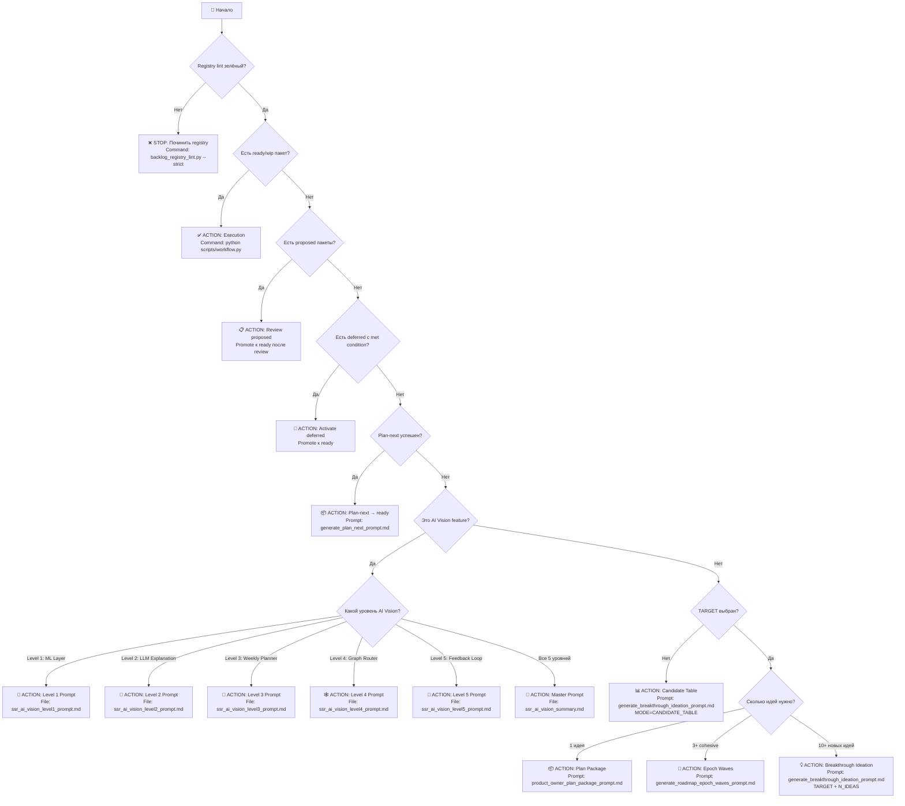

# Product Owner Router — Interactive Decision Tree

**Дата:** 2026-05-08  
**Версия:** 1.0  
**Цель:** Автоматически определить правильный prompt для текущей ситуации

---

## 🎯 Как использовать

Ответьте на вопросы ниже **последовательно**. Каждый ответ ведёт к следующему вопросу или финальному действию.

---

## 📊 Decision Tree



---

## 🔍 Детальные вопросы

### Q0: Registry lint зелёный?

**Команда:**
```powershell
.\.venv\Scripts\python.exe scripts\backlog_registry_lint.py --strict
```

**Ответы:**
- ✅ **Зелёный** (no errors) → Переход к Q1
- ❌ **Красный** (errors) → **STOP**, починить registry

**Если красный:**
```powershell
# Починить registry
.\.venv\Scripts\python.exe scripts\backlog_registry_lint.py --sync-from-index --write-sync

# Проверить снова
.\.venv\Scripts\python.exe scripts\backlog_registry_lint.py --strict
```

---

### Q1: Есть ready/wip пакет?

**Команда:**
```powershell
Select-String -Path doc/backlog_registry.yaml -Pattern "status: ready|status: wip"
```

**Ответы:**
- ✅ **Да** → **ACTION: Execution** (`python scripts/workflow.py`)
- ❌ **Нет** → Переход к Q2

---

### Q2: Есть proposed пакеты?

**Команда:**
```powershell
Select-String -Path doc/backlog_registry.yaml -Pattern "status: proposed"
```

**Ответы:**
- ✅ **Да** → **ACTION: Review proposed** (promote к ready после review)
- ❌ **Нет** → Переход к Q3

**Если да:**
1. Прочитать proposed packages в `backlog_registry.yaml`
2. Review каждый package (цель, outcomes, risks)
3. Promote к `ready` если согласен
4. Sync: `backlog_registry_lint.py --sync-from-index --write-sync`

---

### Q3: Есть deferred с met condition?

**Команда:**
```powershell
Select-String -Path doc/backlog_registry.yaml -Pattern "status: deferred" -Context 5,5
```

**Ответы:**
- ✅ **Да** (re_entry_condition выполнено) → **ACTION: Activate deferred**
- ❌ **Нет** → Переход к Q4

**Если да:**
1. Проверить `re_entry_condition` для каждого deferred package
2. Если condition met → promote к `ready`
3. Sync: `backlog_registry_lint.py --sync-from-index --write-sync`

---

### Q4: Plan-next успешен?

**Команда:**
```powershell
# Запустить plan-next
# (Прочитать generate_plan_next_prompt.md и выполнить)
```

**Ответы:**
- ✅ **Да** (plan-next создал package) → **ACTION: Plan-next → ready**
- ❌ **Нет** (blocker: no eligible candidate) → Переход к Q5

**Если blocker:**
- Причина: нет eligible candidates по правилам реестра
- Решение: переход к breakthrough ideation или AI Vision

---

### Q5: Это AI Vision feature?

**Вопрос:** Вы хотите реализовать один из 5 уровней SSR AI Vision?

**Ответы:**
- ✅ **Да** → Переход к Q6
- ❌ **Нет** → Переход к Q7

**Подсказка:** AI Vision = Level 1-5 из `smart_study_router.md` § Next Level

---

### Q6: Какой уровень AI Vision?

**Вопрос:** Какой уровень AI Vision вы хотите реализовать?

**Ответы:**
- **Level 1: Local ML Layer** → `ssr_ai_vision_level1_prompt.md`
- **Level 2: LLM-Enhanced Explanation** → `ssr_ai_vision_level2_prompt.md`
- **Level 3: Proactive Study Planner** → `ssr_ai_vision_level3_prompt.md`
- **Level 4: Concept Graph Router** → `ssr_ai_vision_level4_prompt.md`
- **Level 5: Misroute Feedback Loop** → `ssr_ai_vision_level5_prompt.md`
- **Все 5 уровней сразу** → `ssr_ai_vision_summary.md` (Master Prompt)

**Подсказка:** Рекомендуется Sequential path (Level 1 → 2 → 3 → 4 → 5)

---

### Q7: TARGET выбран?

**Вопрос:** Вы уже выбрали TARGET (CJM stage / US / pain point / feature area)?

**Ответы:**
- ✅ **Да** → Переход к Q8
- ❌ **Нет** → **ACTION: Candidate Table** (`MODE=CANDIDATE_TABLE`)

**Если нет:**
```text
Прочитай doc/team_workflow/generate_breakthrough_ideation_prompt.md
и выполни ТОЛЬКО режим CANDIDATE_TABLE.

Вывод: таблица направлений с критериями приоритизации.
Затем выбери строку → TARGET.
```

---

### Q8: Сколько идей нужно?

**Вопрос:** Сколько идей вы хотите сгенерировать?

**Ответы:**
- **1 идея** (уже выбрана) → `product_owner_plan_package_prompt.md`
- **3+ cohesive идеи** (wave/horizon) → `generate_roadmap_epoch_waves_prompt.md`
- **10+ новых идей** (brainstorming) → `generate_breakthrough_ideation_prompt.md` (TARGET + N_IDEAS)

**Подсказка:**
- 1 идея = быстрый delivery (1-2 недели)
- 3+ cohesive = wave (4-8 недель)
- 10+ идей = exploration (затем фильтр → 1 или 3+)

---

## 🎯 Quick Actions (Copy-Paste)

### Action 1: Execution (ready/wip пакет)

```powershell
# Запустить workflow router
python scripts/workflow.py
```

### Action 2: Review Proposed

```powershell
# Прочитать proposed packages
Select-String -Path doc/backlog_registry.yaml -Pattern "status: proposed" -Context 10,10

# После review: promote к ready (вручную в YAML)
# Затем sync
.\.venv\Scripts\python.exe scripts\backlog_registry_lint.py --sync-from-index --write-sync
```

### Action 3: Activate Deferred

```powershell
# Прочитать deferred packages
Select-String -Path doc/backlog_registry.yaml -Pattern "status: deferred" -Context 10,10

# Проверить re_entry_condition
# Если met: promote к ready (вручную в YAML)
# Затем sync
.\.venv\Scripts\python.exe scripts\backlog_registry_lint.py --sync-from-index --write-sync
```

### Action 4: Plan-Next

```text
Прочитай doc/team_workflow/generate_plan_next_prompt.md
и выполни инструкции.

Вывод: package contract в backlog_registry.yaml + sync tasklist.md
```

### Action 5-9: AI Vision Levels 1-5

```text
# Level 1: Local ML Layer
Прочитай doc/team_workflow/ssr_ai_vision/ssr_ai_vision_level1_prompt.md
и выполни Copy-Paste Prompt.

# Level 2: LLM-Enhanced Explanation
Прочитай doc/team_workflow/ssr_ai_vision/ssr_ai_vision_level2_prompt.md
и выполни Copy-Paste Prompt.

# Level 3: Proactive Study Planner
Прочитай doc/team_workflow/ssr_ai_vision/ssr_ai_vision_level3_prompt.md
и выполни Copy-Paste Prompt.

# Level 4: Concept Graph Router
Прочитай doc/team_workflow/ssr_ai_vision/ssr_ai_vision_level4_prompt.md
и выполни Copy-Paste Prompt.

# Level 5: Misroute Feedback Loop
Прочитай doc/team_workflow/ssr_ai_vision/ssr_ai_vision_level5_prompt.md
и выполни Copy-Paste Prompt.
```

### Action 10: AI Vision Master Prompt (все 5 уровней)

```text
Прочитай doc/team_workflow/ssr_ai_vision/ssr_ai_vision_summary.md
и выполни Master Prompt (все 5 уровней).

Execution Path: [Sequential | Parallel | MVP-First]

Вывод:
- 5 evaluation contracts
- 15 packages в backlog_registry.yaml
- 5 waves
- Roadmap timeline (22 weeks)
```

### Action 11: Candidate Table

```text
Прочитай doc/team_workflow/generate_breakthrough_ideation_prompt.md
и выполни ТОЛЬКО режим CANDIDATE_TABLE.

Вывод: таблица направлений (10-25 строк) с критериями приоритизации.
Затем выбери строку → TARGET.
```

### Action 12: Plan Package (1 идея)

```text
Прочитай doc/team_workflow/product_owner_plan_package_prompt.md
и создай package contract для одной идеи.

Вывод: package в backlog_registry.yaml + sync tasklist.md
```

### Action 13: Epoch Waves (3+ cohesive)

```text
Прочитай doc/team_workflow/generate_roadmap_epoch_waves_prompt.md
и создай wave structure для 3+ cohesive идей.

Вывод: wave в backlog_registry.yaml + epoch file + sync tasklist.md
```

### Action 14: Breakthrough Ideation (10+ идей)

```text
Прочитай doc/team_workflow/generate_breakthrough_ideation_prompt.md
и выполни основной режим.

Параметры:
  TARGET: <CJM stage / US / pain / feature>
  N_IDEAS: 10
  ANGLES: <UX, Pedagogy, Engagement, ...>
  CONSTRAINTS: <optional>

Вывод: артефакт в archive/ideation/ с 10+ идеями + ranking + diffs
```

---

## 🔗 Related Documents

- [`product_owner_router.md`](product_owner_router.md) — Базовый PO Router
- [`ssr_ai_vision_summary.md`](ssr_ai_vision/ssr_ai_vision_summary.md) — AI Vision roadmap
- [`generate_breakthrough_ideation_prompt.md`](generate_breakthrough_ideation_prompt.md) — Breakthrough ideation
- [`product_owner_plan_package_prompt.md`](product_owner_plan_package_prompt.md) — Plan package
- [`generate_roadmap_epoch_waves_prompt.md`](generate_roadmap_epoch_waves_prompt.md) — Epoch waves

---

**Версия:** 1.0  
**Дата:** 2026-05-08  
**Статус:** Production-ready
