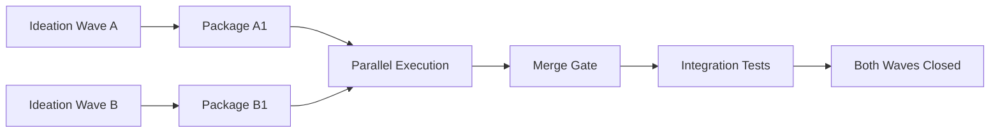

# PO Router — Parallel Waves Strategy

Модуль роутера продуктового планирования.  
Основной файл: [`product_owner_router.md`](product_owner_router.md).

Актуализировано: **2026-05-08**

---

## Когда использовать параллельные волны

Параллельные волны подходят, если:

- ✅ Две волны имеют **zero overlap** в `write_set`
- ✅ Разные команды или агенты (capacity есть)
- ✅ Разные CJM moments
- ✅ Нет dependency между волнами
- ✅ DoD tests не пересекаются
- ✅ Owner capacity для review двух волн

---

## Правила безопасности

### 1. Write-set Isolation Check

> ⚠️ Скрипт `check_write_set_conflict.py` не реализован. Manual check:

```powershell
# Для каждого package прочитать write_set:
Select-String -Path doc/backlog_registry.yaml -Pattern "write_set" -Context 0,2 |
  Where-Object { $_.Line -match "epoch-<name>" }
# Найти пересечения вручную
```

### 2. Dependency Check

Оба `depends_on` в registry должны быть `[]`.

### 3. DoD Independence

Test files двух волн не должны пересекаться.

---

## Процесс



**Шаги:**

1. **Planning Phase** (sequential): ideation для обеих, owner decision, conflict check
2. **Execution Phase** (parallel): независимые ветки
3. **Merge Gate** (sequential): первая closes → merge → вторая rebases → integration

---

## Merge Gate Checklist

- [ ] Full regression suite прошёл
- [ ] No silent conflicts
- [ ] Integration smoke test
- [ ] Owner explicit approval для merge order
- [ ] Documentation sync

---

## Когда НЕ использовать

❌ Волны касаются одного модуля  
❌ Одна волна — foundation для другой  
❌ Недостаточно test coverage (<80%)  
❌ Только один developer  
❌ Owner не может review две волны  
❌ Высокий risk (security, schema changes)
