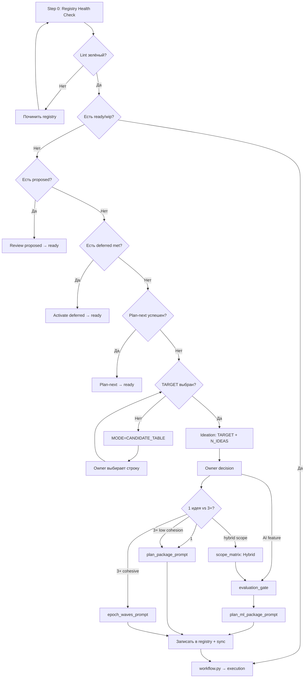

# Product Owner Router v2.1

Актуализировано: **2026-05-08**  
Версия: **v2.1** (модульная)

Единая точка входа для владельца продукта. Снимает вопрос:  
**"Какой prompt сейчас правильный?"**

---

## 📋 Содержание

- [Step 0: Registry Health Check](#step-0-registry-health-check)
- [Decision Table](#decision-table)
- [Flow](#flow)
- [Smart Study Router Path](#smart-study-router-path)
- [Модули (deep-dive)](#модули)
- [Copy-Paste Prompt](#copy-paste-prompt-для-product-owner)
- [Связанные файлы](#связанные-файлы)

---

## Step 0: Registry Health Check

> ⚠️ **Всегда выполнять перед любым решением.** Без этого Decision Table работает на битых данных.

```powershell
# 1. Lint + sync:
.\.venv\Scripts\python.exe scripts\backlog_registry_lint.py --sync-from-index --write-sync
.\.venv\Scripts\python.exe scripts\backlog_registry_lint.py --strict

# 2. Проверить active_package_id drift:
Select-String -Path doc/backlog_registry.yaml -Pattern "active_package_id:"
# Если указывает на closed пакет → обнулить или исправить

# 3. Проверить proposed/deferred:
Select-String -Path doc/backlog_registry.yaml -Pattern "status: proposed|status: deferred"
```

Если lint не зелёный → починить перед продолжением.

---

## Decision Table

| # | Состояние | Что это значит | Следующий шаг | Зачем |
|---|-----------|----------------|---------------|-------|
| 0 | Registry drift / lint errors | SSoT повреждена | **Step 0**: lint + sync + repair | Фундамент |
| 1 | Есть `ready` / `wip` пакет | Контракт уже принят | `python scripts/workflow.py` | Исполнить работу |
| 2 | Работа начиналась | `archive/team_artifacts/<ID>/` | `generate_resume_prompt.md` | Продолжить |
| 3 | Есть `proposed` packages | Кандидаты ждут review | Review → promote к `ready` | Не дублировать |
| 4 | Есть `deferred` с met condition | Re-entry condition выполнено | Activate deferred → `ready` | Не терять контекст |
| 5 | Backlog пуст, есть open US | Есть кандидаты | `generate_plan_next_prompt.md` | Автовыбор package |
| 6 | Plan-next: blocker | Нет eligible | См. [Conflicts](po_router_conflicts.md) | Owner judgement |
| 7 | Есть сырая идея | Нужна инвентаризация | `generate_breakthrough_ideation_prompt.md` `MODE=CANDIDATE_TABLE` | Таблица направлений |
| 8 | Выбран TARGET | Направление определено | `generate_breakthrough_ideation_prompt.md` `TARGET + N_IDEAS` | 10+ сильных идей |
| 9 | Есть ideation artifact | Идеи ранжированы | Owner review + decision | Выбрать 1-3 идеи |
| 10 | Выбрана 1 идея | Нужен delivery package | `product_owner_plan_package_prompt.md` | Упаковать |
| 11 | Выбрано 3+ cohesive | Wave/horizon | См. [Scope Matrix](po_router_scope_matrix.md) | Оценить cohesion |
| 12 | Package в registry | SSoT обновлён, sync OK | `python scripts/workflow.py` | Перейти к execution |
| 13 | AI feature proposed | Idea needs ML/LLM or learned policy | `po_router_evaluation_gate.md` | Eval contract before implementation; this is a precondition for Row 15 |
| 14 | Eval contract ready | Metrics, test harness, fallback are defined | `product_owner_plan_ml_package_prompt.md` | Data/model/eval/integration package |
| 15 | Hybrid scope detected | Row 13 passed and the scope combines a rule baseline with ML/LLM enhancement | `po_router_scope_matrix.md` Hybrid Intelligence | Produce the 3-phase hybrid structure artifact |

---

## Flow



---

## Smart Study Router Path

> **Текущий статус:** Smart Study Router Next Level **полностью поставлен** (US-20.1–20.12).  
> Baseline: US-20.1–20.6 closed (`epoch-smart-study-router-surface-parity`, 2026-05-06).  
> Next Level: US-20.7–20.12 closed (3 waves × 2 packages, все closed).

### Закрытые волны

| Wave | Theme | Packages | Primary US | Status |
|------|-------|----------|------------|--------|
| **1: Trust** | Understandable route evidence | contrastive-explanations, confidence-ledger | US-20.7, US-20.8 | ✅ closed |
| **2: Pedagogy** | Learner-steered pedagogy | learning-debt-queue, steering-toggles | US-20.9, US-20.10 | ✅ closed |
| **3: Retention** | Outcome receipts + quiet access | outcome-receipts, quiet-mode | US-20.11, US-20.12 | ✅ closed |

### Следующий горизонт (Wave 4 — Evaluation Harness)

Из идеационного артефакта `smart_study_router_next_level_2026-05-08.md`, 5 идей остаются **parked**:

| ID | Title | Score | Status |
|----|-------|-------|--------|
| 07 | Misroute Feedback Loop | 4.5 | Parked: combine with steering |
| 10 | Local Route Simulator | 4.5 | Parked: platform wave |
| 12 | Source-Coverage Route Guard | 4.5 | Parked: overlaps trust-control |
| 08 | Concept Recovery Ladder | 3.0 | Parked: large integration wave |
| 11 | Weekly Study Narrative | 2.0 | Parked: later retention storytelling |

**Рекомендуемый следующий шаг:**
1. Запустить `MODE=CANDIDATE_TABLE` для инвентаризации направлений
2. Или взять parked идеи из SSR: Route Simulator + Misroute Feedback (evaluation)
3. Или переключиться на другой CJM moment (см. Decision Table)

---

## Scoring Formula (единая)

Формула для всех идеационных артефактов:

```text
score = (impact × cjm_criticality) / effort

impact: Low = 1, Med = 2, High = 3
effort: S = 1, M = 2, L = 3
cjm_criticality: 1.0 для P0, 0.7 для P1, 0.4 для P2
```

> ⚠️ **Не** использовать альтернативные формулы (`×3 multiplier`). Scores между артефактами должны быть сравнимы.

---

## Модули

Детальная документация разнесена по модулям для token-safety:

| Модуль | Файл | Содержание |
|--------|------|------------|
| **Conflicts** | [`po_router_conflicts.md`](po_router_conflicts.md) | Правила разрешения конфликтов |
| **Scope Matrix** | [`po_router_scope_matrix.md`](po_router_scope_matrix.md) | 1 idea vs wave, cohesion signals |
| **Evaluation Gate** | [`po_router_evaluation_gate.md`](po_router_evaluation_gate.md) | AI/ML/LLM eval contract before package planning |
| **ML Package Planning** | [`product_owner_plan_ml_package_prompt.md`](product_owner_plan_ml_package_prompt.md) | Data -> model -> eval -> integration package contract |
| **Escape Hatches** | [`po_router_escape_hatches.md`](po_router_escape_hatches.md) | 0 viable ideas, paralysis, scope explosion |
| **Anti-Patterns** | [`po_router_anti_patterns.md`](po_router_anti_patterns.md) | 7 anti-patterns + red flags |
| **Handoffs** | [`po_router_handoffs.md`](po_router_handoffs.md) | PO ↔ Analyst ↔ Architect, execution link |
| **Parallel Waves** | [`po_router_parallel_waves.md`](po_router_parallel_waves.md) | Write-set isolation, merge gate |
| **Retrospectives** | [`po_router_retrospectives.md`](po_router_retrospectives.md) | Feedback loop, health metrics, cadence |

---

## Copy-Paste Prompt для Product Owner

```text
Прочитай doc/team_workflow/product_owner_router.md
и выбери следующий product-planning шаг.

Контекст (заполнить):
- Registry lint:
  .\.venv\Scripts\python.exe scripts\backlog_registry_lint.py --strict
  Результат: <зелёный / ошибки>

- Active package:
  Select-String -Path doc/backlog_registry.yaml -Pattern "active_package_id:"
  Результат: <id или null>

- Proposed/deferred:
  Select-String -Path doc/backlog_registry.yaml -Pattern "status: proposed|status: deferred"
  Результат: <N proposed, M deferred>

- Свежий ideation artifact:
  Get-ChildItem archive/ideation/ -Filter "*.md" | Sort-Object LastWriteTime -Descending | Select-Object -First 3
  Результат: <файлы или пусто>

- Ready/wip package:
  Select-String -Path doc/backlog_registry.yaml -Pattern "status: ready|status: wip"
  Результат: <да/нет>

Вывод:
1. Текущее состояние (из Decision Table, строка #)
2. Следующий prompt/command (copy-paste ready)
3. Почему именно он
4. Что НЕ запускать сейчас
5. Expected timing
```

---

## Связанные файлы

### Planning & Ideation
- [`generate_breakthrough_ideation_prompt.md`](generate_breakthrough_ideation_prompt.md) — candidate table и генерация идей
- [`product_owner_plan_package_prompt.md`](product_owner_plan_package_prompt.md) — упаковка одной идеи
- [`po_router_evaluation_gate.md`](po_router_evaluation_gate.md) - AI/ML/LLM evaluation contract gate
- [`product_owner_plan_ml_package_prompt.md`](product_owner_plan_ml_package_prompt.md) - ML/LLM package planning
- [`generate_roadmap_epoch_waves_prompt.md`](generate_roadmap_epoch_waves_prompt.md) — multi-wave horizon → registry

### AI Vision (SSR Next Level)
- [`product_owner_router_ai_vision_enhancement.md`](archive/product_owner_router_ai_vision_enhancement.md) — AI Vision enhancement plan
- [`ssr_ai_vision_summary.md`](ssr_ai_vision/ssr_ai_vision_summary.md) — Complete roadmap (все 5 уровней)
- [`ssr_ai_vision_level1_prompt.md`](ssr_ai_vision/ssr_ai_vision_level1_prompt.md) — Level 1: Local ML Layer
- [`ssr_ai_vision_level2_prompt.md`](ssr_ai_vision/ssr_ai_vision_level2_prompt.md) — Level 2: LLM-Enhanced Explanation
- [`ssr_ai_vision_level3_prompt.md`](ssr_ai_vision/ssr_ai_vision_level3_prompt.md) — Level 3: Proactive Study Planner
- [`ssr_ai_vision_level4_prompt.md`](ssr_ai_vision/ssr_ai_vision_level4_prompt.md) — Level 4: Concept Graph Router
- [`ssr_ai_vision_level5_prompt.md`](ssr_ai_vision/ssr_ai_vision_level5_prompt.md) — Level 5: Misroute Feedback Loop

### Execution & SSoT
- [`workflow_router.md`](workflow_router.md) — execution router после ready
- [`../roadmap.md`](../roadmap.md) — стратегический roadmap
- [`../backlog_registry.yaml`](../backlog_registry.yaml) — SSoT для packages/waves
- [`../cjm.md`](../cjm.md) — Customer Journey Map
- [`../user_stories_index.json`](../user_stories_index.json) — индекс user stories

---

## Changelog

### v2.1 (2026-05-08) — Modular Release

- Added AI Vision routing rows 13-15: evaluation gate, ML package planning, and hybrid scope.
- 🏗️ Разбит 82KB монолит на 7 модулей < 300 строк каждый
- 🔴 Добавлен **Step 0: Registry Health Check** (BUG-9 fix)
- 🔴 Актуализирован **Smart Study Router Path** (US-20.1 closed → US-20.7+ target, BUG-2 fix)
- 🟡 Добавлена **единая scoring формула** (BUG-8 fix)
- 🟡 Все команды переведены на **PowerShell** (BUG-7 fix)
- 🟡 Все нереализованные скрипты помечены **⚠️** (BUG-4 fix)
- 🟡 Удалены мусорные файлы v2_part1, v2_draft (BUG-6 fix)

### v2.0 (2026-05-06) — Production-Ready Release

См. [`product_owner_router_v2.md`](../../archive/team_artifacts/_archive/product_owner_router_v2.md) для полного v2.0 changelog (архив).

### v1.0 (2026-05-02) — Initial Release

Decision Table, flow diagram, breakthrough ideation link.

---

**Версия:** 2.1  
**Последнее обновление:** 2026-05-08  
**Следующий review:** 2026-06-08
