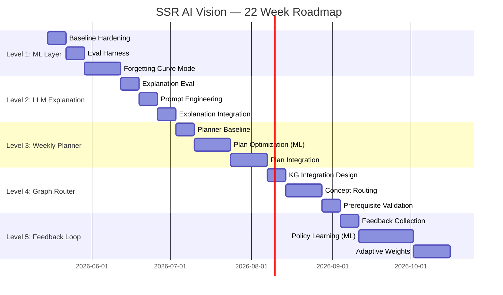
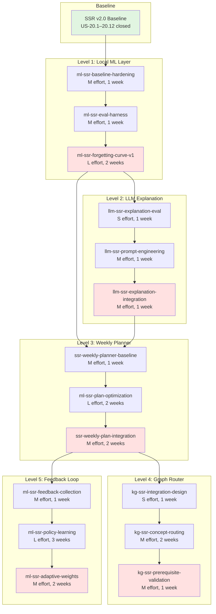
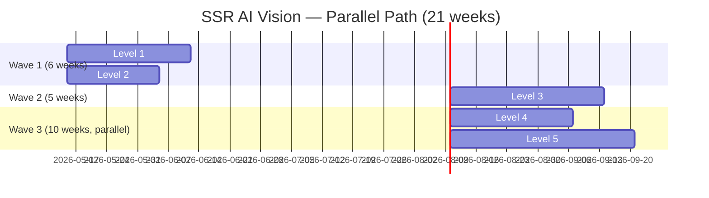
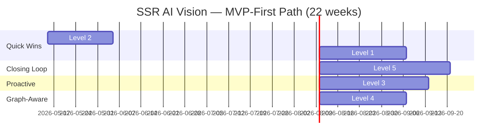
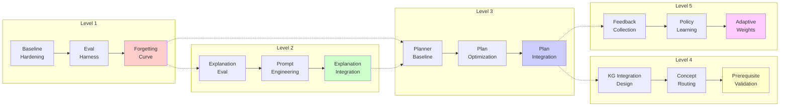
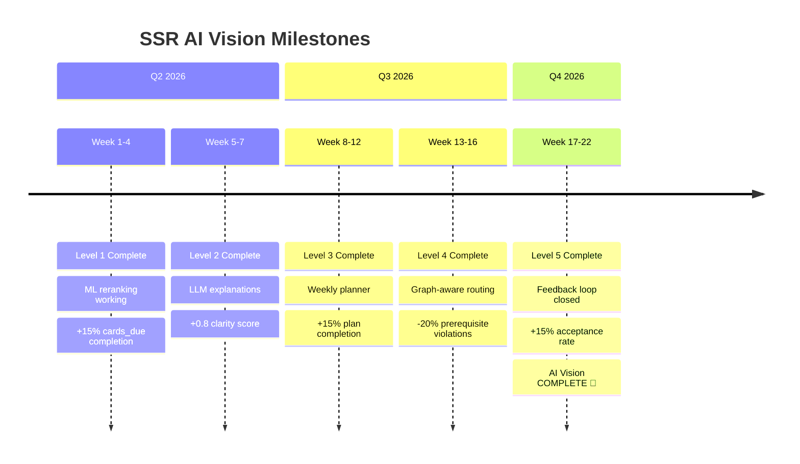
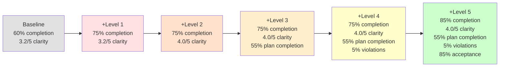
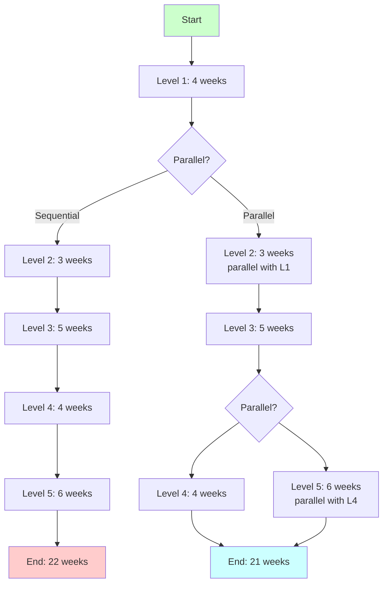

# SSR AI Vision — Visual Roadmap

**Дата:** 2026-05-08  
**Версия:** 1.0  
**Цель:** Визуализация всех 5 уровней AI Vision с зависимостями и timeline

---

## 🗺️ Complete Roadmap (All 5 Levels)



---

## 📊 Dependency Graph (All Levels)



---

## 🔄 Parallel Execution Path



**Преимущества:**
- ✅ Быстрее на 1 неделю (21 vs 22)
- ✅ Level 1 и Level 2 параллельно (нет зависимости)
- ✅ Level 4 и Level 5 параллельно (оба зависят от Level 3)

**Недостатки:**
- ⚠️ Требует 2 команды одновременно (Wave 1, Wave 3)
- ⚠️ Сложнее координация

---

## 🎯 MVP-First Path



**Приоритет по impact/effort:**
1. **Level 2** (3 weeks, M effort) — Быстрый win, высокая user satisfaction
2. **Level 1** (4 weeks, L effort) — Персонализация, +15% completion
3. **Level 5** (6 weeks, L effort) — Замыкает feedback loop
4. **Level 3** (5 weeks, L effort) — Проактивное планирование
5. **Level 4** (4 weeks, M effort) — Prerequisite-aware routing

**Преимущества:**
- ✅ Быстрая value delivery (Level 2 за 3 недели)
- ✅ Feedback loop закрыт раньше (13 недель vs 22)
- ✅ Проще приоритизация (по impact)

**Недостатки:**
- ⚠️ Level 3 и Level 4 в конце (не критично)

---

## 📦 Package Dependencies (Detailed)



**Legend:**
- Solid arrows (→) = Hard dependency (must complete before)
- Dotted arrows (-.→) = Soft dependency (recommended before)
- Red = ML package
- Green = Standard package
- Blue = Hybrid package

---

## 🎯 Milestone Timeline



---

## 📊 Cumulative Impact Over Time



---

## 🔗 Critical Path Analysis



**Critical Path (Sequential):** L1 → L2 → L3 → L4 → L5 = **22 weeks**

**Critical Path (Parallel):** L1 || L2 → L3 → (L4 || L5) = **21 weeks**

**Bottleneck:** Level 3 (5 weeks) — cannot parallelize

---

## 🚀 Quick Start Paths

### Path A: Full Sequential (Safest)

```
Week 1-4:   Level 1 (ML Layer)
Week 5-7:   Level 2 (LLM Explanation)
Week 8-12:  Level 3 (Weekly Planner)
Week 13-16: Level 4 (Graph Router)
Week 17-22: Level 5 (Feedback Loop)

Total: 22 weeks
Risk: Low (no parallel coordination)
```

### Path B: Parallel Waves (Fastest)

```
Week 1-4:   Level 1 (ML Layer) || Level 2 (LLM Explanation)
Week 5-9:   Level 3 (Weekly Planner)
Week 10-15: Level 4 (Graph Router) || Level 5 (Feedback Loop)

Total: 21 weeks
Risk: Medium (requires 2 teams in Wave 1 and Wave 3)
```

### Path C: MVP-First (Best ROI)

```
Week 1-3:   Level 2 (LLM Explanation) — Quick win
Week 4-7:   Level 1 (ML Layer) — Personalization
Week 8-13:  Level 5 (Feedback Loop) — Close the loop
Week 14-18: Level 3 (Weekly Planner) — Proactive
Week 19-22: Level 4 (Graph Router) — Graph-aware

Total: 22 weeks
Risk: Low (sequential, prioritized by impact)
```

---

## 🔗 Related Documents

- [`ssr_ai_vision_summary.md`](ssr_ai_vision_summary.md) — Complete roadmap summary
- [`product_owner_router.md`](product_owner_router.md) — PO Router
- [`smart_study_router.md`](../smart_study_router.md) — SSR vision

---

**Версия:** 1.0  
**Дата:** 2026-05-08  
**Статус:** Production-ready
