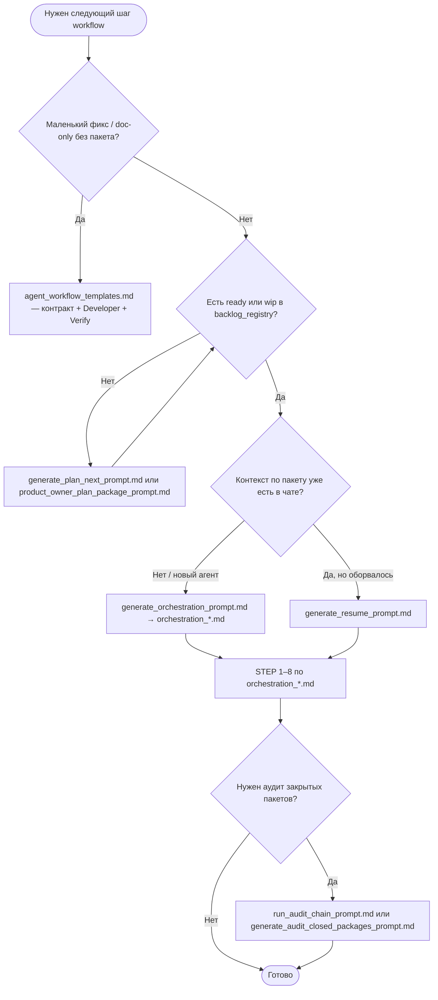

# Workflow — дерево решений «что запускать сейчас»

Актуализировано: **2026-05-03**

Одна страница для выбора входа без перебора таблиц. Детали ролей: [`process.md`](process.md). Навигатор промптов: [`doc/prompts_usage_guide.md`](../prompts_usage_guide.md).

---

## TL;DR — запустить прямо сейчас

```bash
# Узнать что делать сейчас + готовая команда:
python scripts/workflow.py

# Выполнить следующий шаг автоматически:
python scripts/workflow.py --exec

# Для конкретного агента:
python scripts/workflow.py --agent claude_code

# Планирование (needs_plan) без паузы на ревью контракта — затем сразу оркестрация:
python scripts/workflow.py --skip-review --agent claude_code

# Детальный дашборд (DoD, метрики):
python scripts/pipeline_status.py

# Кондуктор до closed (паузы: принять контракт в plan-next + выполнить current_task в IDE):
python scripts/workflow.py --loop --skip-review --watch-contract --agent cursor_ai
```

Полная документация роутера: [`workflow_router.md`](workflow_router.md). Пауза **`ready_executing`** / **`[PAUSE]`** (ожидание `execution_contract.md`): раздел [«Ручной шаг»](workflow_router.md#manual-ready-executing).

**Инвариант:** при выборе следующего шага через `workflow.py` не использовать `doc/tasklist.md` в read-set и не трактовать его как SSoT — только `doc/backlog_registry.yaml`.

---

## Лёгкий путь vs полный конвейер

| Режим | Когда использовать | Типичная цепочка |
|--------|-------------------|------------------|
| **Лёгкий** | Один баг, узкая правка, doc-sync без нового пакета в реестре | Execution Contract / Planning из [`agent_workflow_templates.md`](../agent_workflow_templates.md) → Developer → Verify ([`developer.md`](developer.md), [`tester.md`](tester.md)) |
| **Полный** | Новая фича, несколько модулей, UI+API, нужен handoff ролей | [`generate_plan_next_prompt.md`](generate_plan_next_prompt.md) или пакет уже в реестре → [`generate_orchestration_prompt.md`](generate_orchestration_prompt.md) → STEP 1–8 |

Если сомневаетесь — начните с полного конвейера; лёгкий путь только когда write-set очевидно из контракта и нет новых US/CJM. В `workflow.py` это зафиксировано как lifecycle rule: ready-пакет с `user_stories` или `cjm_moments` идёт через orchestration-first даже при low mechanical complexity.

---

## Логика (текст)

1. **Нужно только починить баг или маленькая правка доков** без нового пакета → не полный конвейер: контракт из [`doc/agent_workflow_templates.md`](../agent_workflow_templates.md) (Execution Contract / Planning) + роль Developer напрямую; затем Verify.
2. **В реестре нет пакета `ready` / `wip`, нужен новый контракт** → [`generate_plan_next_prompt.md`](generate_plan_next_prompt.md) (или ручное планирование: [`product_owner_plan_package_prompt.md`](product_owner_plan_package_prompt.md)).
3. **Пакет `ready` / `wip`, стартуем командный пайплайн** → [`generate_orchestration_prompt.md`](generate_orchestration_prompt.md), затем выполняете STEP 1–8 из `archive/team_artifacts/<PACKAGE_ID>/orchestration_<agent>.md`.
4. **Пакет уже в работе, контекст потерян** → [`generate_resume_prompt.md`](generate_resume_prompt.md).
5. **После закрытия эпохи — аудит SSoT / покрытия** → [`run_audit_chain_prompt.md`](run_audit_chain_prompt.md) или только [`generate_audit_closed_packages_prompt.md`](generate_audit_closed_packages_prompt.md).
6. **`check_readset.py` вернул BLOCK на планировании** → сузить `read_set_hint` в реестре / задаче; см. [`doc/token_safety.md`](../token_safety.md); затем снова plan-next с меньшим scope.

**После каждого сохранённого артефакта шага оркестратора** (по желанию, перед следующим STEP):

```bash
.\.venv\Scripts\python.exe scripts/validate_team_artifact.py --artifacts-dir archive/team_artifacts/<PACKAGE_ID>
# или: npm run validate:team-artifacts -- --artifacts-dir archive/team_artifacts/<PACKAGE_ID>
```

Перед **`close_package.py`**: если в каталоге пакета есть канонические `*.md` шагов, закрытие по умолчанию прогоняет тот же скрипт (обход — `--skip-team-artifacts-check`).

---

## Диаграмма (Mermaid)



Редакторы с поддержкой Mermaid отрисуют диаграмму; иначе используйте текстовую логику выше.
