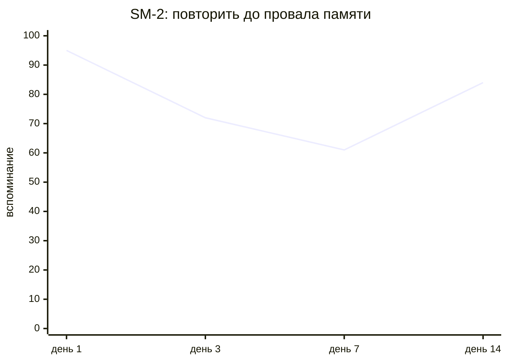

# home-rag — учебный центр из твоей папки

> **Положи конспекты в `data/` → получи ответы с источниками, тьютора, квизы, карточки, план на сегодня, Умный Маршрутизатор и память о прогрессе. Локально. Без аккаунта. Без облака.**

Этот гайд — главная карта продукта. Если [quickstart.md](quickstart.md) ведёт тебя по 10 шагам, то здесь ответ на вопрос: **что умеет home-rag, куда нажимать и когда какая часть особенно полезна**.

Актуализировано на **2026-06-21**.

## Быстрая развилка

| Ты хочешь | Иди сюда |
|---|---|
| пройти первый учебный цикл руками | [quickstart.md](quickstart.md) |
| увидеть реальные кадры UI | [quickstart_demo.md](quickstart_demo.md) |
| показать killer-demo про Умный Маршрутизатор | [quickstart_demo.md#scenario-21-умный-маршрутизатор-один-лучший-следующий-шаг](quickstart_demo.md#scenario-21-умный-маршрутизатор-один-лучший-следующий-шаг) |
| выбрать сценарий для демо / видео | [user_scenarios.md](user_scenarios.md) |
| понять раздел «Мой прогресс» | [personalized_learner_model.md](personalized_learner_model.md) |
| поднять публичный demo или VPS | [Публичный demo и деплой](#публичный-demo-и-деплой) → [user_guide_details.md — деплой](user_guide_details.md#публичный-demo-и-деплой) |
| настроить env, API-ключ REST, Telegram, troubleshooting | [user_guide_details.md](user_guide_details.md) |
| разобраться с промптами | [prompts_catalog.md](prompts_catalog.md) и [prompts_usage_guide.md](prompts_usage_guide.md) |

---

## Для кого это

У тебя есть PDF-лекции, `.md`-заметки, статьи, курсы, распечатки или Obsidian vault. Обычно дальше выбор плохой:

| Вариант | Что хорошо | Где ломается |
|---|---|---|
| ChatGPT | быстро объясняет | не знает твои файлы по-настоящему, не помнит прогресс, данные уходят наружу |
| NotebookLM | отвечает по источникам | не строит учебный цикл с quiz, SRS и mastery |
| Anki | отлично повторяет | карточки нужно готовить вручную, нет тьютора |
| Obsidian | порядок в знаниях | нет проверки понимания и адаптивного плана |
| **home-rag** | объединяет поиск, тьютора, квизы, карточки, прогресс | требует локальной установки |

Коротко:

```text
папка с материалами
      ↓
ответы с источниками
      ↓
тьютор + мини-квиз
      ↓
flashcards + SM-2
      ↓
adaptive plan + mastery + graduation
      ↓
умный следующий шаг
```

---

## Что ты получаешь

### 1. Ответы по своим материалам

Нажми **«Быстрый ответ»**, задай вопрос обычным языком и получи:

- ответ с опорой на твои документы;
- бейдж **уверенности поиска** (качество найденных источников, не «вероятность правильности» ответа — подсказка есть в UI);
- компактный блок **«Почему этот маршрут»** с пояснением, какой профиль ответа был выбран и был ли безопасный fallback (например, если профиль «ответ с учётом связей» временно снижен до «точный ответ» из‑за отсутствия подтверждённого uplift, gate качества или превышения бюджета времени);
- список источников с фрагментами;
- кнопку **«Учить эту тему 5 минут»**.

Это режим для момента: «мне нужно понять сейчас».

Важно: **маршрут ответа** здесь относится только к поиску и сборке ответа по твоим материалам. Он не равен подсказке **«что учить дальше»** из Умного Маршрутизатора: следующий учебный шаг по-прежнему показывается отдельно на Mission Control и в учебных разделах.

### 2. Тьютор, который не начинает с нуля

Кнопка **«Учить эту тему 5 минут»** переносит вопрос, тему и источники в tutor-сессию. Тьютор не говорит «чем могу помочь?», а продолжает с места, где ты остановился.

Он умеет:

- объяснить проще;
- дать пример;
- проверить тебя мини-квизом;
- выбрать следующий шаг по policy.

Внизу tutor-сессии есть **«Расширенное управление (эксперт)»**. Оно показывает session id, активную тему, источник контекста и безопасные действия вроде экспорта. Это слой прозрачности: он объясняет состояние маршрута, но не заставляет вручную настраивать policy.

### 3. Flashcards без ручного копипаста

Открой **Flashcards** → **«Создать новые»**:

1. выбери документ или активный курс;
2. укажи число карточек;
3. сгенерируй preview;
4. отредактируй плохие карточки;
5. сохрани колоду.

Главное отличие: LLM не кладёт мусор в память за твоей спиной. Ты видишь карточки до сохранения.

### 4. Повторение по SM-2

Вкладка **«Повторение»** показывает due-очередь. На каждой карточке четыре оценки: **Снова / Трудно / Хорошо / Легко**.

Если due-очередь пуста, интерфейс показывает дату и размер ближайшей запланированной группы. После действия **«Разнести хвост очереди на 5 дней»** доступна отмена: она возвращает в очередь только ещё не повторённые карточки и не перезаписывает результаты уже пройденных карточек.

SM-2 — это простой алгоритм интервального повторения: чем увереннее ответ, тем дальше следующая проверка; если ответ не вспомнился, карточка возвращается ближе. Цель не «завалить карточками», а поймать момент до забывания.



Killer-move: если не знаешь ответ, нажми **«Не знаю, объясни»**. Карточка отправит тебя в тьютора, а потом вернёт обратно в очередь.

В режиме повторения блок **«Расширенное управление (эксперт)»** показывает выбранную колоду, теги, due-очередь, прогресс сессии, оценки **Again / Hard / Good / Easy** и текущие SM-2 сигналы карточки. На первом уровне доступны только безопасные действия: обновить очередь, сбросить фильтр, разнести большой хвост или уйти к тьютору. Настройки алгоритма SM-2 не вынесены в UI намеренно: сначала прозрачность и доверие, потом точечные действия, и только затем настоящие настройки.

### 5. «Мой прогресс» как навигатор

Раздел **«Мой прогресс»** отвечает на вопрос: **что учить сегодня?**

На **главной** и во вкладке **«Прогресс обучения»** карточка **«Умный следующий шаг»** предлагает действие из локальных очередей. Главная теперь открывается как **Mission Control**: сверху показан прогресс учебного цикла **Q&A → Tutor → Quiz → Card → Review → Graduation**, затем SSR-подсказка с основной кнопкой и семь плиток — Тьютор, Quiz, Flashcards, Быстрый ответ, Темы, Курс и Адаптивный план. Рекомендованная плитка подсвечивается тем же сигналом `hint_kind`, а вторичные инструменты вроде Knowledge Graph, истории, поиска, метрик, объяснения файла и печати живут в боковой панели. Плитка «Курс» открывает выбор папки, показывает документы будущего курса и после активации ведёт в course-scope сценарии. Текст «Почему сейчас» объясняет выбор; если доступна отдельная SSR-модель, объяснение может быть кратко персонализировано под локальные сигналы и кэшируется около часа. При сбое, таймауте или нехватке данных показывается прежняя шаблонная формулировка, а маршрут и кнопки не зависят от ответа модели. Под блоком объяснения — три реакции (**Принять** / **Не то** / **Позже**): они пишутся только в локальную SQLite-базу (структура рекомендации, без свободного текста объяснения) и **не** меняют правила маршрутизации; это сбор данных для будущих уровней SSR.

В Mission Critical разделах **Tutor**, **Quiz** и **Flashcards** появился единый экспертный слой **«Расширенное управление (эксперт)»**. Он всегда свёрнут по умолчанию и работает по лестнице: сначала показывает прозрачное состояние и сигналы доверия, затем предлагает безопасные действия, а raw JSON/debug прячет ещё на один уровень глубже. В Quiz этот блок объясняет режим генерации, типы вопросов, текущий score и связь с графом знаний. В **Adaptive Plan** вместо тяжёлого expert-пульта есть компактный блок **«Почему такой порядок»**: он показывает баланс review/gap/new, время, первый шаг и сигналы маршрута без ручной настройки весов планировщика.

При желании включите **«Тихий режим карточки умного следующего шага»** — визуальный шум ниже: те же главное действие, блок «Почему сейчас» и дополнительные кнопки. После клика по основной или дополнительной кнопке роутера и возврата на этот экран может появиться короткий чек «до/после» по тем же метрикам (например, сколько карточек и повторений SM-2 по графу было и стало). Если измеримого сдвига нет, текст об этом говорит прямо, без имитации прогресса; сводка **«Повторения (SM-2)»** на вкладке использует ту же логику очереди, что и карточка роутера над дашбордом.

Если вы настраиваете отдельную модель для этого блока (переменные `SSR_LLM_*` в `.env`, например локальный LM Studio), приложение может **писать технические профили вызовов** в каталог `logs/ssr_llm_profiles/` и строить **сводку из консоли** — см. [ssr_llm_profiling.md](ssr_llm_profiling.md). Отключить запись: `ENABLE_SSR_LLM_PROFILING=false`. На сами кнопки и маршрутизацию карточки это не влияет.

**Операторский минимум под LM Studio** вынесен в детали: задайте `SSR_LLM_API_BASE=http://127.0.0.1:8787` и `SSR_LLM_MODEL=<id модели в LM Studio>`, если хотите отдельную локальную модель только для SSR-объяснений. Типичные сбои, fallback на основной `LLM_MODEL`, права на каталог профилей и отличие от `cost_logs` — в [user_guide_details.md — SSR / LM Studio](user_guide_details.md#ssr-lm-studio-profiles).

| Блок | Зачем нужен |
|---|---|
| **Adaptive Daily Plan** | что повторить, какой gap закрыть, что новое взять |
| **Mastery vector** | карта сильных и слабых концептов |
| **Graduated** | темы, которые стабильно освоены и больше не забивают план |
| **Knowledge Graph** | почему система предлагает именно этот следующий шаг; легенда типов связей, панель evidence по ребру, индикатор качества компиляции в диагностике |
| **Профиль обучения (AI)** | нагрузка, эмоциональный фон, оптимальная глубина объяснения |

Подробнее про логику профиля: [personalized_learner_model.md](personalized_learner_model.md).

### 6. Умный Маршрутизатор: один лучший следующий шаг

Умный Маршрутизатор закрывает главный разрыв в учебном продукте: функций много, но в каждый момент нужен **один понятный следующий шаг**.


Он смотрит на локальное состояние:

- есть ли карточки к повторению;
- есть ли просроченные темы SM-2;
- была ли ошибка в квизе;
- есть ли свежий ответ с источниками;
- какой концепт самый слабый;
- есть ли незавершённая tutor-сессия;
- какой блок стоит первым в плане.

На выходе пользователь видит не меню, а подсказку:

```text
следующее действие + почему сейчас + главная кнопка + безопасные альтернативы
```

Типичные состояния:

| Сигнал | Что предложит |
|---|---|
| карточки к повторению | повторить N карточек сегодня |
| ошибка в квизе | разобрать слабое место с тьютором |
| свежий ответ с источниками | учить эту тему 5 минут |
| устаревшее освоение | проверить запоминание мини-квизом |
| есть данные по прогрессу | открыть адаптивный план |
| незавершённый tutor | продолжить с последнего шага |

Смотри реальный кадр: [scenario_21 — Умный Маршрутизатор](quickstart_demo.md#scenario-21-умный-маршрутизатор-один-лучший-следующий-шаг).

### 7. Умный Маршрутизатор с ИИ: следующий уровень

Текущая версия маршрутизатора объяснимая и надёжная: её ядро — жёсткие правила поверх локального состояния. Следующий уровень — **гибридный учебный помощник**: правила остаются страховочной сеткой, а ML/LLM-компоненты делают подсказку персональнее.

Пять уровней AI Vision:

| Уровень | Статус | Что добавляет | Пользовательский эффект |
|---|---|---|---|
| 1. Локальное МО | **Now, gated** | модель кривой забывания; сейчас serving остаётся `rule_based`, пока cold-start не набрал 1000 samples | лучшее время повторения для конкретного человека, когда накопится достаточно локальных данных |
| 2. LLM-объяснения | **Now** | живое «почему сейчас» с template fallback | меньше ощущения шаблонной подсказки |
| 3. Недельный планировщик | **Roadmap** | план с учётом времени и целей | видно, что делать дальше всю неделю |
| 4. Маршрут через граф | **Roadmap** | prerequisite-aware routing | сложная тема не появляется раньше базовой |
| 5. Feedback loop | **Roadmap** | обучение на действиях пользователя | система меняет стратегию, если рекомендации игнорируют |

Важно: уровни независимы. Можно включить только МО-персонализацию, только LLM-объяснения или полный набор; при проблемах система откатывается к базовой версии с правилами. Термины вроде SSR, mastery vector и graduated собраны в [глоссарии](glossary.md).

### 8. Course Workspace

Если в `data/ML-Course/` лежит курс из 20 лекций, home-rag может превратить папку в учебное пространство:

```text
папка курса → synthesis → learning plan → flashcards → progress by course
```

Это режим для долгого обучения, а не разового вопроса.

**Важно — границы scope:** Активация курса работает в рамках Streamlit-сессии. Следующие функции полностью ограничиваются выбранной папкой: каталог тем, синтез, план обучения, quiz по теме, флеш-карточки (режим «Из курса»), тьютор. Деактивировать курс можно кнопкой «× Деактивировать курс» в боковой панели или в карточке темы.

### 9. Trust-панель: ответ можно проверить

В хорошем RAG мало сказать «я нашёл ответ». Нужно показать, **почему этому можно доверять**:

- уверенность поиска рядом с ответом (с пояснением в подсказке);
- список источников;
- preview фрагмента;
- связь ответа с конкретным документом;
- guardrails для опасных или пустых запросов.

Если модель что-то утверждает, ты должен иметь возможность открыть фрагмент и проверить её.

---

## Быстрый запуск

Файлы контейнера: корневой [`Dockerfile`](../Dockerfile), [`docker-compose.yml`](../docker-compose.yml), точка входа [`scripts/docker_entrypoint.sh`](../scripts/docker_entrypoint.sh). Локальный сценарий: [`scripts/run_local_stack.ps1`](../scripts/run_local_stack.ps1).

### Путь A — Docker

Нужны **Docker Engine** и **Docker Compose v2** (входит в Docker Desktop).

1. Клонируй репозиторий и перейди в каталог проекта.
2. Скопируй и заполни `.env` (обязательно `OPENAI_API_KEY`, см. [.env.example](../.env.example)).
3. Собери и подними сервис:

```powershell
copy .env.example .env
docker compose up --build
```

**Тома (хост → контейнер):** см. таблицу в [`docker-compose.yml`](../docker-compose.yml):

| Локальная папка | В контейнере | Назначение |
|-----------------|--------------|------------|
| `./data` | `/app/data` | Ваши документы, `user_state.db` |
| `./chroma_db` | `/app/chroma_db` | Векторный индекс |
| `./logs` | `/app/logs` | Логи SSR, cost |
| `./.env` | `/app/.env` | Настройки (read-only) |

После старта:

- UI: http://127.0.0.1:8501
- API: http://127.0.0.1:8000/docs
- Health: http://127.0.0.1:8000/health

Индексация (файлы уже в `./data` на хосте):

```powershell
docker compose exec home-rag python ingest.py
```

**LM Studio на хосте (`127.0.0.1:1234`):** из контейнера `127.0.0.1` — не ваш ПК. Два варианта:

1. В `.env` заменить на `host.docker.internal` — шаблон [`deploy/docker/env.docker.example`](../deploy/docker/env.docker.example).
2. Мост портов (в `.env` можно оставить `http://127.0.0.1:1234/v1`):

```powershell
docker compose -f docker-compose.yml -f docker-compose.lmstudio.yml up --build
```

Файл [`docker-compose.lmstudio.yml`](../docker-compose.lmstudio.yml) поднимает socat: **внутри контейнера** `127.0.0.1:1234` → **на хосте** LM Studio `:1234`.

### Путь B — Python локально

В PowerShell из корня репозитория:

```powershell
python -m venv .venv
.\.venv\Scripts\Activate.ps1
pip install -r requirements.txt
copy .env.example .env
python scripts\bootstrap.py
python ingest.py
.\scripts\run_local_stack.ps1
```

Скрипт `run_local_stack.ps1` поднимает **сначала** API (`uvicorn` на порту 8000), **затем** Streamlit (`app/ui/main.py`, порт 8501). После остановки Streamlit (Ctrl+C) процесс API завершается автоматически. Повторный `pip install` можно отключить: `.\scripts\run_local_stack.ps1 -SkipPip`.

#### Переключение между llama.cpp и LM Studio

Для локального запуска не нужно вручную редактировать несколько связанных переменных. Из корня репозитория выберите профиль:

```powershell
# llama.cpp
.\scripts\switch_local_llm.ps1 -Profile llama-cpp

# LM Studio
.\scripts\switch_local_llm.ps1 -Profile lm-studio
```

Профиль `llama-cpp` задаёт `LLM_API_BASE=http://127.0.0.1:8080/v1` и модель **`qwopus3.6-35b-a3b-v1-mtp`** (benchmark llama.cpp, 2026-06-20). Профиль `lm-studio` задаёт `LLM_API_BASE=http://127.0.0.1:1234/v1` и модель `qwen/qwen3.6-27b`.

Другой alias на том же endpoint (например, baseline `qwen3.6-27b`):

```powershell
.\scripts\switch_local_llm.ps1 -Profile llama-cpp -Model qwen3.6-27b -ValidateEndpoint
```

Переключатель синхронно обновляет в `config.env` основной LLM, quiz, graph/concept extraction и SSR (`LLM_*`, `QUIZ_LLM_MODEL`, `GRAPH_*`, `SSR_LLM_*`). Перед изменением создаётся timestamp-backup в `logs/config_backups/`. `OPENAI_API_KEY` и другие секреты в `.env` скрипт не меняет. После переключения перезапустите API/Streamlit, чтобы процессы перечитали конфигурацию.

Дополнительные безопасные режимы:

```powershell
# Показать будущие изменения без записи и backup
.\scripts\switch_local_llm.ps1 -Profile lm-studio -DryRun

# Переключить и проверить, что /v1/models содержит нужную модель
.\scripts\switch_local_llm.ps1 -Profile llama-cpp -ValidateEndpoint

# Переключить main/quiz/SSR, сохранив отдельный GRAPH endpoint/model
.\scripts\switch_local_llm.ps1 -Profile lm-studio -SkipGraph
```

`LOCAL_LLM_PROFILE` в `config.env` — диагностический маркер выбранного профиля; приложение не использует его вместо фактических URL и model id. Итог скрипта показывает профиль, API base, модель, режим GRAPH, backup и статус endpoint.

#### Production smoke llama.cpp

После запуска llama.cpp выполните из корня проекта:

```powershell
.\scripts\Smoke-HomeRag-LlamaCpp.ps1
```

Gate проверяет `/v1/models`, grammar exact-output, затем запускает настоящий `quality → hybrid → reranker → llama.cpp` запрос с process-only `SIMILARITY_TOP_K=2`. По умолчанию ожидается модель **`qwopus3.6-35b-a3b-v1-mtp`** (как в `config.env`); другой alias — параметр `-Model`. Скрипт временно выставляет `LLM_MODEL`/`QUIZ_LLM_MODEL` под `-Model`, чтобы smoke совпадал с загруженной на сервере моделью. Требуются минимум один источник, `fallback_used=false`, отсутствие `<think>`, успешный grounded provenance contract и неизменность `config.env`. Результат сохраняется в `logs/ask_llama_cpp_smoke.jsonl`.

```powershell
# дефолт (qwopus из config.env / smoke-скрипта)
.\scripts\Smoke-HomeRag-LlamaCpp.ps1

# явный alias
.\scripts\Smoke-HomeRag-LlamaCpp.ps1 -Model qwen3.6-27b
```

Первый cold-прогон часто >8 s из‑за инициализации reranker и query engine; это не провал gate. Повторный запрос быстрее за счёт кэша.

#### Прогрев RAG после старта API

Чтобы первый вопрос в UI не ждал cold init reranker/query engine (~10–15 s), прогрейте retrieval внутри процесса API:

```powershell
# вместе со стеком (после поднятия uvicorn, до Streamlit)
.\scripts\run_local_stack.ps1 -WarmupRag

# или отдельно, если API уже слушает :8000
.\scripts\Warmup-HomeRagRag.ps1
```

Скрипт делает один `POST /ask` (`profile=quality`) и выводит `WARMUP_RAG=PASS` с таймингами. Это не заменяет `Smoke-HomeRag-LlamaCpp.ps1`, но снимает cold tax с первого пользовательского запроса.

**llama.cpp / MTP (опционально):** предупреждение `no implementations specified for speculative decoding` в логах сервера не блокирует работу (~190 t/s на qwopus35b без spec-decoding). Настройка draft-модели — на стороне вашего `llama-server` launch script, не home_rag.

`ask.py` также поддерживает one-shot режим без stdin:

```powershell
.\.venv\Scripts\python.exe .\ask.py `
  --profile quality `
  --brief `
  --question "Что говорится в уроке про AI-агентов?" `
  --file-name "урок_1 Введение в концепцию AI-агентов.md" `
  --non-interactive `
  --log .\logs\ask.jsonl
```

Доступные фильтры: `--folder`, `--folder-rel`, `--file-name`, `--relative-path`. Флаг `--exit-after-one` завершает обычный интерактивный режим после первого обработанного вопроса.

Ручной запуск без скрипта (два терминала):

```powershell
python main.py
streamlit run app/ui/main.py
```

### Путь C — полностью офлайн через Ollama

```bash
ollama serve
ollama pull qwen2.5:7b-instruct
ollama pull nomic-embed-text
```

В `.env`:

```env
OPENAI_API_KEY=local
OPENAI_API_BASE=http://127.0.0.1:11434/v1
LLM_API_BASE=http://127.0.0.1:11434/v1
EMBED_API_BASE=http://127.0.0.1:11434/v1
LLM_MODEL=qwen2.5:7b-instruct
EMBED_MODEL=nomic-embed-text
EMBED_DIMENSIONS=768
```

Дальше запускай как в Python-пути. Интернет можно отключить.

### Публичный demo и деплой

Для **жюри / онлайн-демо** без своего VPS есть отдельный контур — не замена local-first, а витрина:

| Вариант | Что получаешь | Где инструкция |
|---|---|---|
| **Hugging Face Spaces** | Streamlit UI + cloud LLM + фиксированный корпус `demo_data/` и индекс `demo_chroma_db/` | [deploy/hf-spaces/README.md](../deploy/hf-spaces/README.md) |
| **Docker / localhost** | полный стек, свои файлы в `data/` | пути A–C выше |
| **VPS (RUVDS / Hetzner)** | UI + FastAPI за Nginx, HTTPS, опционально CI deploy | [deploy/nginx/home-rag.conf.example](../deploy/nginx/home-rag.conf.example), [presentations/defense_deploy_plan.md](presentations/defense_deploy_plan.md) |

Подготовка demo-индекса на машине разработчика:

```powershell
.\.venv\Scripts\python.exe scripts\build_demo_chroma.py
```

Секреты для Space — в `deploy/hf-spaces/.env.spaces.example` (ключ OpenRouter в HF Settings). Для REST на VPS задай `HOME_RAG_API_KEY` в `.env` — см. [user_guide_details.md — FastAPI](user_guide_details.md#1-fastapi).

### Разделение моделей в `.env`

Один и тот же OpenAI-совместимый провайдер (`LLM_API_BASE`, `OPENAI_API_KEY`) обычно обслуживает **основной чат** (`LLM_MODEL`). Остальные переменные — *опциональные* переопределения для узких задач: если строку не задать, используется **`LLM_MODEL`**. Эмбеддинги идут через **`EMBED_MODEL`** и при необходимости отдельный **`EMBED_API_BASE`** (если не указан — берётся `OPENAI_API_BASE`). Размерность вектора задаёт **`EMBED_DIMENSIONS`** (`0` — оставить значение по умолчанию провайдера).

Блок **«Почему сейчас»** у карточки умного следующего шага может ходить в **отдельный** endpoint и модель (**`SSR_LLM_*`**): удобно вывести на локальный LM Studio или [`kilo_proxy_relay`](kilo_proxy_relay.md), не меняя основной `LLM_MODEL`. Подробности и типичные сбои — [user_guide_details.md — SSR / LM Studio](user_guide_details.md#ssr-lm-studio-profiles).

**Пример гибрида (облако для RAG + дешёвые вспомогательные модели + локальный SSR):**

```env
LLM_API_BASE=https://openrouter.ai/api/v1
OPENAI_API_KEY=sk-...

LLM_MODEL=gpt-5-mini
QUIZ_LLM_MODEL=gpt-4o
EVAL_JUDGE_LLM=gpt-4o-mini     # дешёвый независимый judge для eval-прогонов
REWRITE_MODEL=gpt-4o-mini     # перефразирование запроса перед retrieval
CLASSIFIER_MODEL=gpt-4o-mini  # классификация intent (json-вывод)
INGESTION_MODEL=gpt-4o-mini   # обогащение метаданных при индексации
EVALUATE_MODEL=gpt-4o-mini    # оценка свободного ответа в inline-quiz

EMBED_MODEL=perplexity/pplx-embed-v1-0.6b
EMBED_DIMENSIONS=1024         # ожидаемый размер вектора (0 — дефолт провайдера)

SSR_LLM_API_BASE=http://127.0.0.1:8787
SSR_LLM_MODEL=qwen2.5-coder-7b-instruct   # по умолчанию как LLM_MODEL; для LM Studio — id загруженной модели
```

Для **полностью локального** стека подставь базы и имена моделей, как в пути C (Ollama): тот же набор переменных работает, меняются только URL и строки моделей. Перефраз и классификатор в пайплайне запроса включаются флагами **`ENABLE_REWRITE`** и **`ENABLE_CLASSIFIER`** (см. [.env.example](../.env.example)). Полный перечень имён и комментарии — в [.env.example](../.env.example) и `app/config.py`.

---

## Первые 5 минут

1. Положи `.pdf`, `.docx`, `.md`, `.html` или `.txt` в `data/`.
2. Запусти `python ingest.py`.
3. Открой http://localhost:8501.
4. Нажми **«Быстрый ответ»** и задай вопрос по своим материалам.
5. Раскрой источники: убедись, что ответ привязан к фрагментам.
6. Нажми **«Учить эту тему 5 минут»**.
7. Пройди мини-квиз.
8. Открой **«Мой прогресс»** и посмотри первый пункт плана.
9. Вернись на главную и проверь карточку **«Умный следующий шаг»**: она должна объяснить, почему именно сейчас предлагает этот маршрут.

Ориентиры по UI:


Если что-то ломается:

| Симптом | Что проверить |
|---|---|
| Ответ пустой или нет источников | Индекс создан после `python ingest.py`, а файлы лежат именно в `data/`. |
| Flashcards не показывают очередь | Сначала создай или импортируй колоду; due-очередь появляется после сохранения карточек и первых оценок. |
| SSR-карточка выглядит шаблонно | Это нормальный fallback: персональное LLM-объяснение включается только при рабочей SSR-модели и достаточных данных. |
| Нужно заменить весь корпус документов | Полный сброс: `python scripts/fresh_start.py --confirm-token DELETE-ALL-LOCAL-HOME-RAG-DATA`. Подробности — в [user_guide_details.md § Полный сброс](user_guide_details.md#полный-сброс-и-загрузка-с-нуля). |

Если хочешь пройти всё как квест: [quickstart.md](quickstart.md). Если хочешь увидеть реальные кадры: [quickstart_demo.md](quickstart_demo.md).

---

## Как выбирать режим

| Если ты хочешь... | Открой |
|---|---|
| быстро получить ответ по файлам | **Быстрый ответ** |
| понять тему глубже | **Чат с тьютором** |
| пройти папку как курс | **Темы / Course Workspace** |
| сделать карточки | **Flashcards → Создать новые** |
| закрепить материал | **Flashcards → Повторение** |
| понять, что учить сегодня | **Мой прогресс** |
| получить один лучший следующий шаг | **Главная → Умный следующий шаг** |
| проверить доверие к ответу | **Источники / Trust-панель** |

---

## Как устроен учебный цикл

```text
data/ (твои файлы)
   │
   ├─ ingest → Chroma + BM25 + doc summaries
   │
   ├─ Quick Answer ──► sources + confidence
   │          │
   │          └─► Tutor ──► mini-quiz ──► mastery
   │
   ├─ Flashcards ──► SM-2 review ──► due queue
   │
   └─ Topics / Course ──► learning plan

mastery + due + graph + learner profile
   ↓
Adaptive Daily Plan
   ↓
Smart Study Router → next action + why now + CTA
```

Каждый шаг пишет локальное состояние в `data/user_state.db`. Streamlit, Telegram, CLI и API работают с одной памятью.

---

## Каналы

| Канал | Когда использовать | Команда |
|---|---|---|
| **Streamlit UI** | основной путь, весь UX | `streamlit run app/ui/main.py` |
| **FastAPI** | интеграции и автоматизация; при `HOME_RAG_API_KEY` — заголовок `X-API-Key` | `python main.py` → `/docs` |
| **Telegram** | быстрый доступ с телефона | `python telegram_bot.py` |
| **CLI** | скрипты и быстрые проверки | `python ask.py --profile fast` |

Telegram — удобный второй клиент. Полный учебный cockpit всё равно в Streamlit.

---

## Приватность, backup и перенос

home-rag local-first:

- материалы лежат в `data/`;
- индекс — в `chroma_db/`;
- прогресс — в `data/user_state.db`;
- backup можно скачать JSON-дампом;
- офлайн-режим работает через Ollama.

В Streamlit открой сайдбар → **«Перенос прогресса (backup / восстановление)»**. Через API доступны `GET /sync/export` и `POST /sync/import`.

После переиндексации прогресс не должен обнуляться. Если профиль был восстановлен из истории, в UI появится бейдж **«Профиль обновлён после переиндексации»**.

---

## Что читать дальше

| Цель | Документ |
|---|---|
| пройти продукт как квест | [quickstart.md](quickstart.md) |
| посмотреть реальные GIF/скриншоты | [quickstart_demo.md](quickstart_demo.md) |
| увидеть новый кадр Умного Маршрутизатора | [quickstart_demo.md#scenario-21-умный-маршрутизатор-один-лучший-следующий-шаг](quickstart_demo.md#scenario-21-умный-маршрутизатор-один-лучший-следующий-шаг) |
| выбрать сценарий обучения или демо | [user_scenarios.md](user_scenarios.md) |
| понять модель ученика | [personalized_learner_model.md](personalized_learner_model.md) |
| настроить env, API-ключ REST, Telegram, troubleshooting | [user_guide_details.md](user_guide_details.md) |
| посмотреть HTTP API (в т.ч. опциональный `X-API-Key`) | [api_reference.md](api_reference.md) |
| план онлайн-деплоя для защиты / CI | [presentations/defense_deploy_plan.md](presentations/defense_deploy_plan.md) |
| подготовить pitch | [pitch.md](pitch.md) и [presenter_script.md](presenter_script.md) |

---

## Для разработчиков

CI на каждый push в `main`: ruff, `tests/test_api.py` + `tests/test_provider.py`, сборка Docker-образа; SSH-deploy на VPS — при секретах `VPS_HOST` / `VPS_SSH_KEY` (см. [.github/workflows/ci.yml](../.github/workflows/ci.yml)).

### Локальный AI-trigger для разработки кода

Для controlled low-risk patch tasks есть экспериментальный локальный trigger:
`scripts/llamacpp_agent_trigger.ts`. Он работает с llama.cpp
OpenAI-compatible endpoint `http://127.0.0.1:8080/v1` и моделью
`qwen/qwen3-coder-next`, но не является общим автономным агентом.

Что доказано live smoke 2026-06-21:

- `/v1/models` alias gate: `qwen/qwen3-coder-next`, `n_ctx=32768`;
- AutoFit server profile: `parallel=1`, q8 KV, reasoning off;
- trigger injects `Read-set` context because local API model has no file tools;
- model returns fenced diff, trigger validates `WRITE_SET`, runs
  `git apply --check/apply`, targeted tests, and writes
  `execution_contract.md` only from evidence.

Direct debug command:

```powershell
npx tsx scripts/llamacpp_agent_trigger.ts doc/current_task.md
```

Use it only for small write-sets and targeted tests until orchestrator
auto-selection is separately enabled. Full operating contract:
[agent_adapter_llamacpp.md](team_workflow/guides/agent_adapter_llamacpp.md).

Eval и сравнение режимов поиска (demo-корпус):

```powershell
.\.venv\Scripts\python.exe scripts\build_demo_chroma.py
.\.venv\Scripts\python.exe scripts\run_defense_eval.py
```

Результат: `eval/eval_results_YYYY-MM-DD.json`; набор вопросов — `eval/eval_dataset.json`.

Общий eval-loop продукта:

```bash
python scripts/run_eval_loop.py --profile ci
python scripts/run_eval_loop.py --profile nightly --report-json logs/eval_report.json
```

Demo-документы и GIF:

```bash
npm run demo:build
npm run demo:kit
```

SLO-пороги и troubleshooting — в [user_guide_details.md](user_guide_details.md) и [eval_experimenter_runbook.md](eval_experimenter_runbook.md).

---

## Главное

home-rag нужен не для того, чтобы «поговорить с PDF». Он нужен, чтобы пройти полный учебный цикл:

> **нашёл ответ → понял тему → проверил себя → повторил → увидел прогресс → продолжил завтра с нужного места.**
